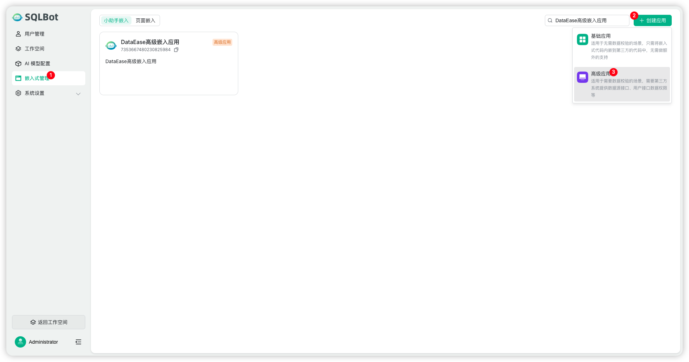
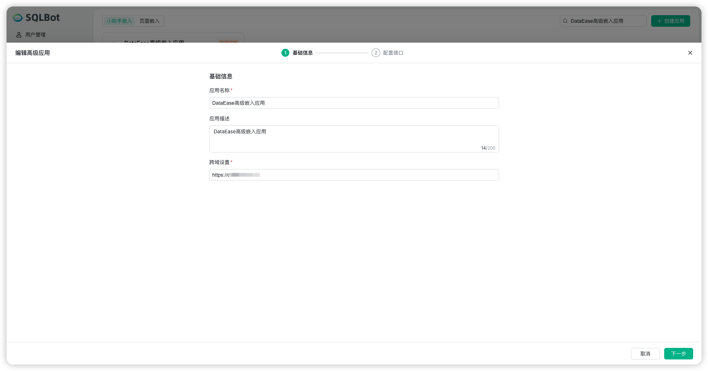
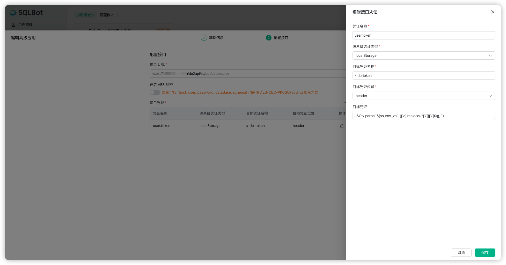
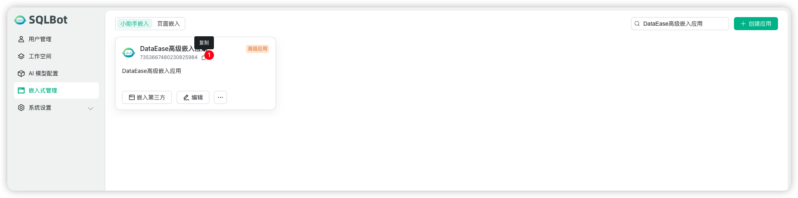
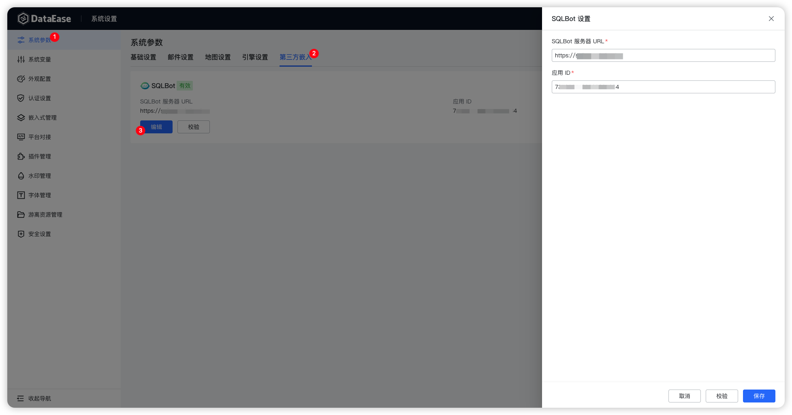
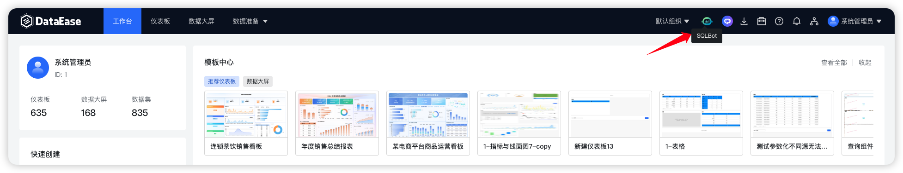

!!! Tip ""
    SQLBot v1.1.3 及以上版本支持配置接入到 DataEase 中，为 DataEase 提供智能问数功能。

## SQLBot 侧配置

### 新建高级应用
!!! Tip ""
    SQLBot 需要以嵌入式应用方式接入到 DataEase 中，所以需要先在 SQLBot 平台中先创建一个高级应用，如下图所示:
    

    设置基础信息。
    
    这里注意，跨域设置为 DataEase 服务的访问地址，例如 https://demo.dataease.cn
    

    进行接口配置。
    
    接口 URL 为 DataEase 服务的访问地址加上固定的 API 接口路径“de2api/sqlbot/datasource”，例如 https://demo.dataease.cn/de2api/sqlbot/datasource。
    
    添加调用所需的接口凭证，以下配置对于 DataEase 对接来说都是固定的：

    - 凭证名称: user.token
    - 源系统凭证类型: localStorage
    - 目标凭证名称: x-de-token
    - 目标凭证位置: header
    - 目标凭证: JSON.parse(`${source_val}`)['v'].replace(/^['\"]|['\"]$/g, '')

    

    保存好应用，记录好应用的 ID 号。
    

## DataEase 侧配置
!!! Tip ""
    以 admin 用户登录 DataEase，在「系统设置」>「系统参数」>「第三方嵌入」中，对 SQLBot 的接入项进行设置。

    输入 SQLBot 服务器 URL和前面步骤获取到的 SQLBot 高级应用的 ID 号，校验通过后保存即可。
    

    返回工作台后，即可在 DataEase 右上角的快捷工具栏看到 SQLBot。
    