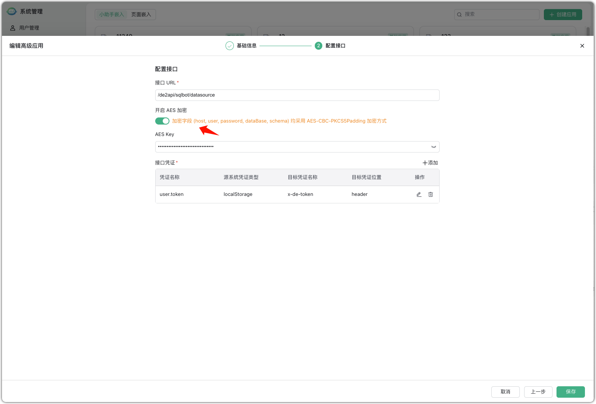

!!! Tip ""
    SQLBot v1.1.3 及以上版本支持配置接入到 DataEase 中，为 DataEase 提供智能问数功能。
    DataEase 版本为 v2.10.13 及以上版本。

## 1 SQLBot 侧配置

!!! Tip ""
    添加【新建高级应用】，SQLBot 需要以嵌入式应用方式接入到 DataEase 中，所以需要先在 SQLBot 平台中先创建一个高级应用，如下图所示:
    

    设置基础信息。
    
    **注意**：跨域设置为 DataEase 服务的访问地址，例如 https://demo.dataease.cn 。

    

    进行接口配置。
    
    接口 URL 为 DataEase 服务的访问地址加上固定的 API 接口路径“de2api/sqlbot/datasource”，例如 https://demo.dataease.cn/de2api/sqlbot/datasource。
    
    添加调用所需的接口凭证，以下配置对于 DataEase 对接来说都是固定的：

    - 凭证名称: user.token
    - 源系统凭证类型: localStorage
    - 目标凭证名称: x-de-token
    - 目标凭证位置: header
    - 目标凭证: 
    ```javascript
    JSON.parse(`${source_val}`)['v'].replace(/^['\"]|['\"]$/g, '')

    ```

    

    SQLBot 调用 DataEase 获取数据源的接口返回的信息开启 AES-Key 加密（32 位随机生成即可）。

    **注意**：后续 DataEase 配置中需要使用到 AES-Key 进行数据源加密配置。

     


    保存好应用，记录好应用的 ID 号。
    

## 2 DataEase 侧配置
!!! Tip ""
    以 admin 用户登录 DataEase，在「系统设置」>「系统参数」>「第三方嵌入」中，对 SQLBot 的接入项进行设置。

    输入 SQLBot 服务器 URL 和前面步骤获取到的 SQLBot 高级应用的 ID 号，校验通过后保存即可。
    

    返回工作台后，即可在 DataEase 右上角的快捷工具栏看到 SQLBot。
    

!!! Tip ""
    进入到 DataEase 的安装目录下，找到 DataEase 的配置文件，默认路径为 /opt/dataease2.0/conf/application.yml。在配置文件中添加 " aes-key" 配置，取值为 SQLBot 添加高级应用的值。配置文件修改后大致如下：

    ```yml
    dataease:
        sqlbot:
            encrypt:ture
            aes-key: X5iK8pL2oR9tY3vB6nM1cZ7xW4sV8hG2
    ```
    
    若包含 Excel 数据源或 API 数据源，还需要修改 DataEase 的配置文件。在配置文件中添加 "ds-host" 配置，取值为 DataEase 服务器的 ip。配置文件修改后大致如下：
    ```yml
    server:
        tomcat:
            connection-timeout: 70000
        servlet:
            context-path:
    spring:
        servlet:
            multipart:
                max-file-size: 500MB
                max-request-size: 500MB
        datasource:
            url: jdbc:mysql://mysql-de:3306/dataease?autoReconnect=false&useUnicode=true&characterEncoding=UTF-8&characterSetResults=UTF-8&zeroDateTimeBehavior=convertToNull&useSSL=false&allowPublicKeyRetrieval=true
            username: root
            password: Password123@mysql
    dataease:
        ds-host: 40.92.20.215
        apisix-api:
            domain: http://apisix:9180
            key: 7x1lZljpOvH5u9ednAg4wYRS9XPyGykpnHk3FKHKPzI=
        export:
            views:
                limit: 100000
            dataset:
                limit: 100000
        origin-list: http://localhost:8000
        login_timeout: 960
        selenium-server: http://de-selenium:4444/wd/hub
        dataease-servers: dataease
    task:
        executor:
            address: http://sync-task-actuator:9001
            log:
                path: /opt/dataease2.0/logs/sync-task/task-handler-log
    ```
    若使用的是 DataEase 内置的 MySQL，还需要将内置 MySQL 的运行端口暴露出来。修改 /opt/dataease2.0/docker-compose-mysql.yml，内容大致如下：
    ```yml
    version: '3'
    services:

    mysql-de:
        image: registry.cn-qingdao.aliyuncs.com/dataease/mysql:8.4.5
        container_name: ${DE_MYSQL_HOST}
        healthcheck:
            test: ["CMD", "mysqladmin" ,"ping", "-h", "localhost", "-u${DE_MYSQL_USER}", "-p${DE_MYSQL_PASSWORD}", "--protocol","tcp"]
            interval: 5s
            timeout: 3s
            retries: 10
        env_file:
            - ${DE_BASE}/dataease2.0/conf/mysql.env
        ports:
            - 3306:3306
        volumes:
            - ${DE_BASE}/dataease2.0/conf/my.cnf:/etc/mysql/conf.d/my.cnf
            - ${DE_BASE}/dataease2.0/bin/mysql:/docker-entrypoint-initdb.d/
            - ${DE_BASE}/dataease2.0/data/mysql:/var/lib/mysql
        networks:
            - dataease-network
    ```

    修改完成后，执行 service dataease restart，重启 DataEase 服务即可。