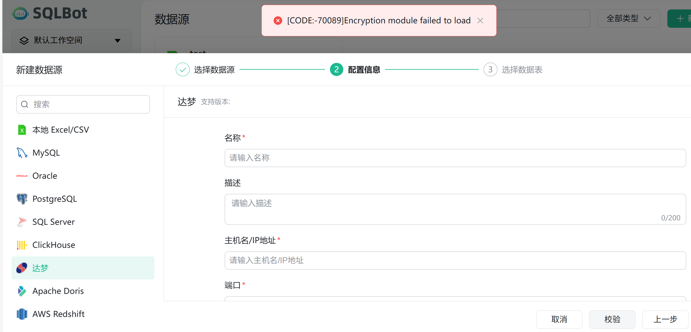
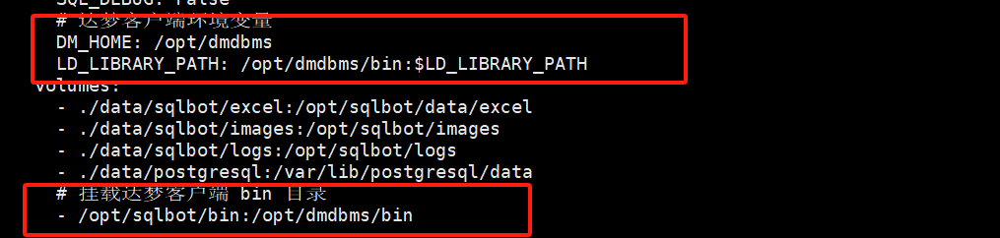

# 数据源问题

## 1 达梦数据源无法连接？

!!! Abstract ""
    达梦数据库在启用安全特性后，在添加 SQLBot 数据源时会遇到下面的错误：
    
    

    由于不同数据库版本、不同平台架构、不同操作系统的达梦处理方式不同，无法在 SQLBot 镜像里统一处理，所以需要用户根据达梦官方的方案来解决。

    可以参考达梦官方的解决方案处理：

    https://eco.dameng.com/community/question/ec52c8c5b36d5445db1ed8399728fb97

    docker-compose.yml文件修改示例：

    

