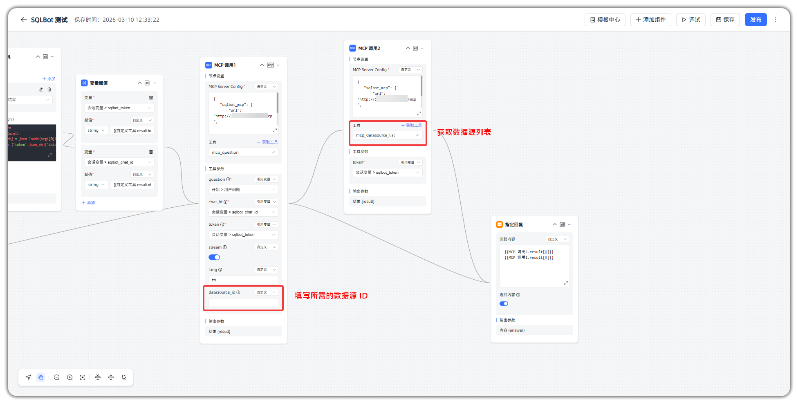
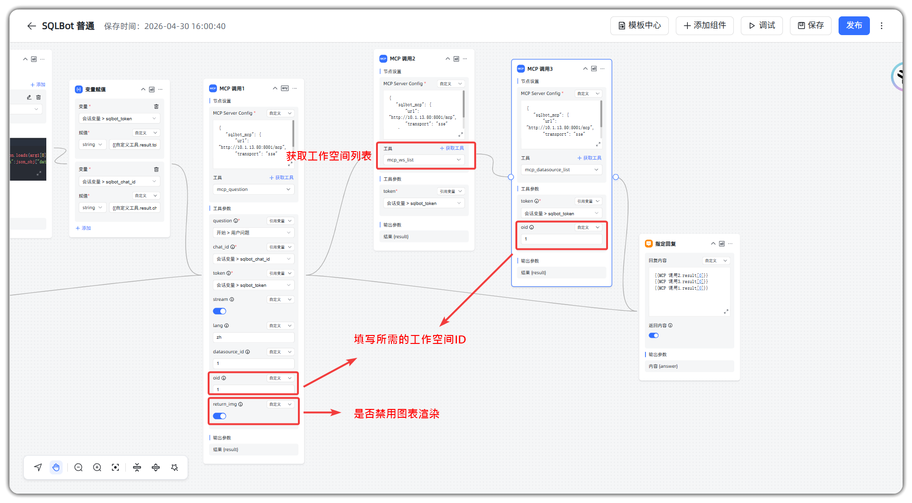

# MCP 常见问题

## 1 SQLBot 的 MCP 调用支持指定数据源吗？它是如何确定使用哪个数据源的？

!!! Abstract ""
    1.5.0 版本之前，MCP 方式不支持指定数据源，数据源是 SQLBot 根据问题去自动匹配的。SQLBot 的 MCP 接口调用，会根据以下几个方式来确定具体使用哪个数据源：
    
    - 问题中明确指定了使用哪个数据源
    - 在 SQLBot 数据源的描述信息中添加了与问题相关的信息，问数时会将问题与数据源描述信息进行相似度匹配，以此确定使用哪个数据源
    - SQLBot 中仅有一个数据源时无需确认，会默认使用该数据源

!!! Abstract ""
    1.6.0 版本及以后，新增 mcp_datasource_list 工具用于调取数据源列表，并返回数据源的 ID。 用户在调用 MCP 接口时，可在 question 的中 datasource_id 指定数据源 ID。

## 2 SQLBot 的 MCP 调用支持指定工作空间和禁用图表渲染吗？
!!! Abstract ""
    1.8.0 版本及以后，MCP 支持选择工作空间与禁用图表渲染：

    - **选择工作空间**：新增 `mcp_ws_list` 工具用于获取当前用户可访问的工作空间列表。
      在调用 `mcp_datasource_list` 或 `mcp_question` 时，可通过 `oid` 参数指定工作空间 ID。
    - **禁用图表渲染**：在调用 `mcp_question` 时，可通过 `return_img=false` 关闭图表图片渲染，仅返回 SQL、数据与图表配置结果，减少图片生成耗时。

