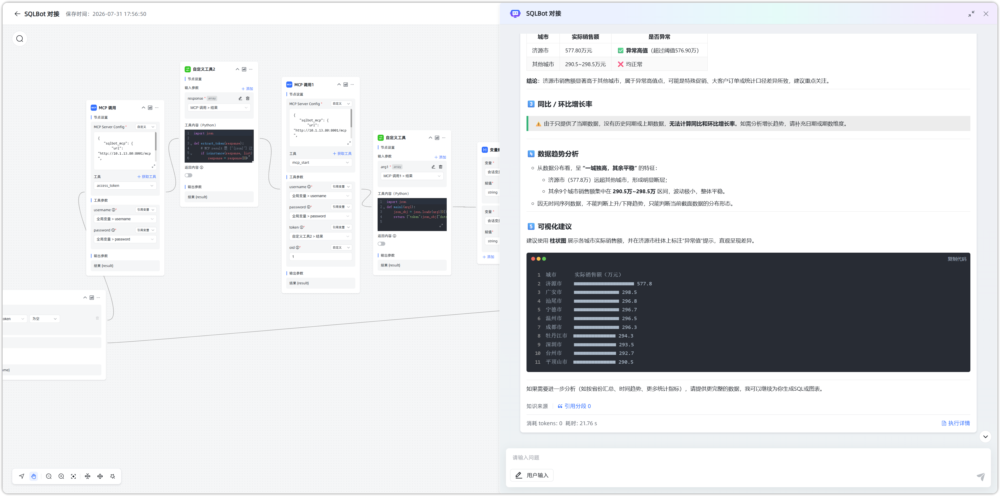
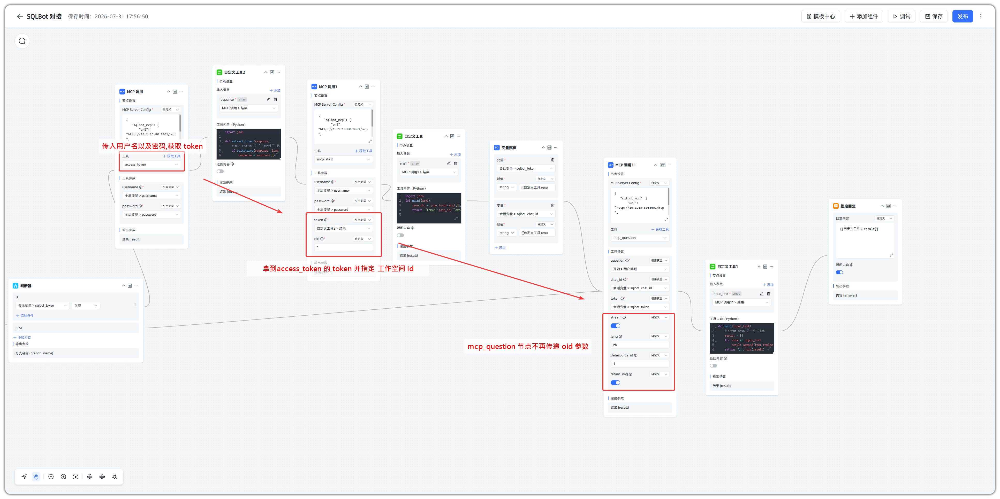

# MCP 常见问题

## 1 SQLBot 的 MCP 调用支持指定数据源吗？它是如何确定使用哪个数据源的？

!!! Abstract ""
    1.5.0 版本之前，MCP 方式不支持指定数据源，数据源是 SQLBot 根据问题去自动匹配的。SQLBot 的 MCP 接口调用，会根据以下几个方式来确定具体使用哪个数据源：
    
    - 问题中明确指定了使用哪个数据源
    - 在 SQLBot 数据源的描述信息中添加了与问题相关的信息，问数时会将问题与数据源描述信息进行相似度匹配，以此确定使用哪个数据源
    - SQLBot 中仅有一个数据源时无需确认，会默认使用该数据源

!!! Abstract ""
    1.6.0 版本及以后，新增 mcp_datasource_list 工具用于调取数据源列表，并返回数据源的 ID。 用户在调用 MCP 接口时，可在 question 的中 datasource_id 指定数据源 ID。

## 2 SQLBot 的 MCP 调用支持指定工作空间和禁用图表渲染吗？
!!! Abstract ""
    1.8.0 版本及以后，MCP 支持选择工作空间与禁用图表渲染：

    - **选择工作空间**：新增 `mcp_ws_list` 工具用于获取当前用户可访问的工作空间列表。
      在调用 `mcp_datasource_list` 或 `mcp_question` 时，可通过 `oid` 参数指定工作空间 ID。
    - **禁用图表渲染**：在调用 `mcp_question` 时，可通过 `return_img=false` 关闭图表图片渲染，仅返回 SQL、数据与图表配置结果，减少图片生成耗时。

## 3 SQLBot 的 MCP 中如何进行数据分析，数据预测？
!!! Abstract ""
    MCP 支持在 mcp_question 的 question 参数中使用快捷命令，对同一会话中已完成问数（且已生成图表）的记录进行数据分析与数据预测：

    - **数据分析**：在 `question` 中传入 `/analysis`。默认基于当前会话最近一条普通问数记录进行分析；
    - **数据预测**：在 `question` 中传入 `/predict`。默认基于当前会话最近一条普通问数记录进行预测；。

    使用说明：

    1. 先通过 `mcp_question` 完成一次正常问数，并确保该记录已生成图表结果。
    2. 再在同一 `chat_id` 下调用 `mcp_question`，将 `question` 设为 `/analysis` 或 `/predict`（可附带记录 ID）。
    3. 不可对「分析记录」「预测记录」再次执行分析/预测；目标记录必须已生成图表，否则会报错。
    4. 命令需作为独立词出现在 `question` 末尾（可带数字参数），且同一问题中不可混用多个命令。

## 4 SQLBot 的 MCP 指定工作空间失效？
!!! Abstract ""
    1.10.0 版本及以后，MCP 指定工作空间的参数从 mcp_question 更改至 mcp_start 节点：若仍按 1.8.x / 1.9.x 文档在 mcp_question 中传 oid，将不会生效。

    使用说明：

    - 先调用 `mcp_access_token` 获取当前用户 `token`。
    - 再调用 `mcp_start` 创建会话时传入 `oid` 与 `token`，该会话将归属到指定工作空间。
    - 后续同一会话中的 `mcp_question` 无需再传 `oid`；会话创建时确定的工作空间会持续生效。
    - `mcp_datasource_list` 仍可通过 `oid` 查询指定工作空间下的数据源列表。
     若指定工作空间后仍异常，请检查：用户是否属于该工作空间；`oid` 是否在 `mcp_start` 阶段传入；`chat_id` 是否来自该次 `mcp_start` 返回结果。

