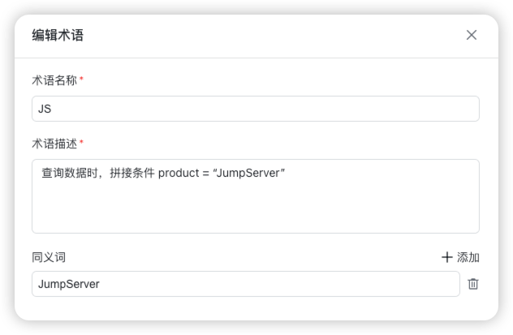
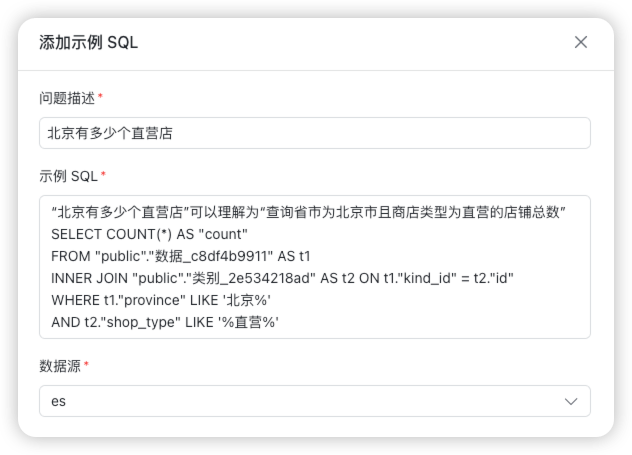

# 智能问数常见问题

## 1 是否支持多表关联查询？

!!! Abstract ""
    支持多表关联查询。建议将表之间的关联关系，在表备注中进行维护，有助于模型生成更符合预期的 SQL 语句。

## 2 术语怎么使用？

!!! Abstract ""
    当用户发起问数请求时，会根据发送的问题匹配术语，被匹配到的术语，会将「术语描述」和「用户问题」一起发送给大语言模型，辅助生成正确的 SQL 查询语句。

    术语示例如下图所示：

## 3 SQL 示例怎么使用？

!!! Abstract ""
    当用户发起问数请求时，将发送的问题与 SQL 示例库中的问题进行匹配，被匹配到的 SQL 示例，会将问题的「 示例 SQL」和「用户问题」一起发送给大语言模型，辅助生成正确的 SQL 查询语句。

    SQL 示例如下图所示：

