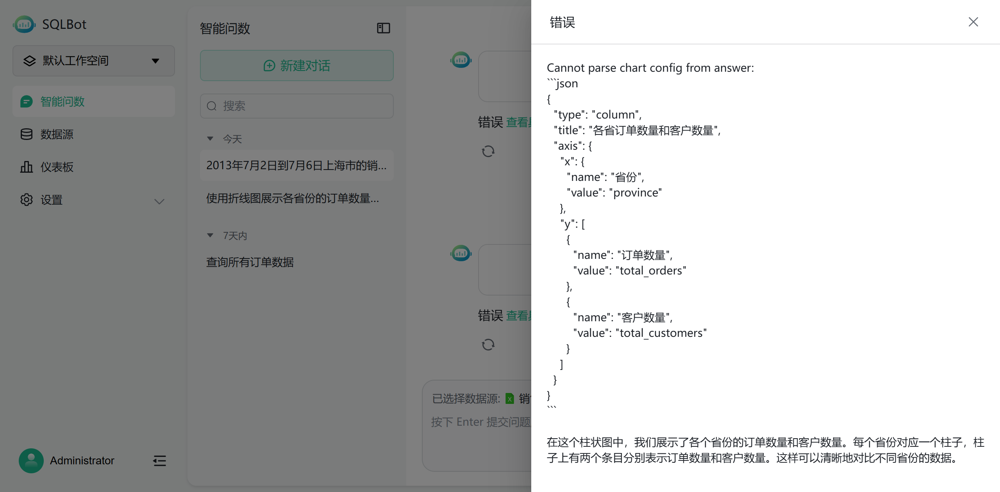

# 智能问数常见问题

## 1 是否支持多表关联查询？

!!! Abstract ""
    支持多表关联查询。建议在数据源中，维护数据表之间的关联关系，并维护表备注，有助于模型生成更符合预期的 SQL 语句。

## 2 术语怎么使用？

!!! Abstract ""
    当用户发起问数请求时，会根据发送的问题匹配术语，被匹配到的术语，会将「术语描述」和「用户问题」一起发送给大语言模型，辅助生成正确的 SQL 查询语句。

    术语示例如下图所示：

    

## 3 SQL 示例怎么使用？

!!! Abstract ""
    当用户发起问数请求时，将发送的问题与 SQL 示例库中的问题进行匹配，被匹配到的 SQL 示例，会将问题的「 示例 SQL」和「用户问题」一起发送给大语言模型，辅助生成正确的 SQL 查询语句。

    SQL 示例如下图所示：

    

## 4 SQLBot 在哪些方面会影响到对 token 的消耗？

!!! Abstract ""
    问数的时候对 token 的消耗主要有几个地方：
    
    - SQLBot 自身的提示词模板
    - 匹配到和问数相关的数据表结构，包括描述
    - 匹配到和问数相关的术语
    - 匹配到和问数相关的 SQL示例
    - 匹配到和问数相关的自定义提示词

    如果上面这几个地方内容多的话，对 token 的消耗会比较大，另外，在问数过程中的上下文也会有一定的 token 消耗。

## 5  如何提升 SQLBot 问数的准确率？

!!! Abstract ""
    可以通过以下几个方面的设置来提升 SQLBot 的问数准确率：
    
    - 调整问题的问法，表达意图更清晰一些
    - 在 SQLBot 中为数据源、数据表、数据字段添加和常见问题相关的描述信息
    - 在术语配置里将一些数据源中的业务概念添加为术语，让大模型更好的理解问题
    - 在 SQL 示例库中添加一些数据源常见的查询示例，让大模型可以学习如何正确生成 SQL
    - 在自定义提示词（商业版）中针对数据源添加一些和常见问题场景相关的约束
    - 若存在多表关联查询的场景，可以在数据源的表关系管理中，给关联表设置字段的关联关系
    - 试试其他的大模型，换个强一些的大模型，虽然简单粗暴，但效果明显

## 6 问数过程中大模型有响应，但 SQLBot 显示解析响应结果出错

!!! Abstract ""
    SQLBot 对大模型返回的问数结果的结构是有要求的，SQLBot 在提示词模板中对该格式有明确定义。在使用过程中，有些大模型由于理解能力问题，并未按要求返回相应格式的数据，会导致 SQLBot 无法解析返回结果，出现类似下图的错误： 
    

    此时建议更换其他模型试试。