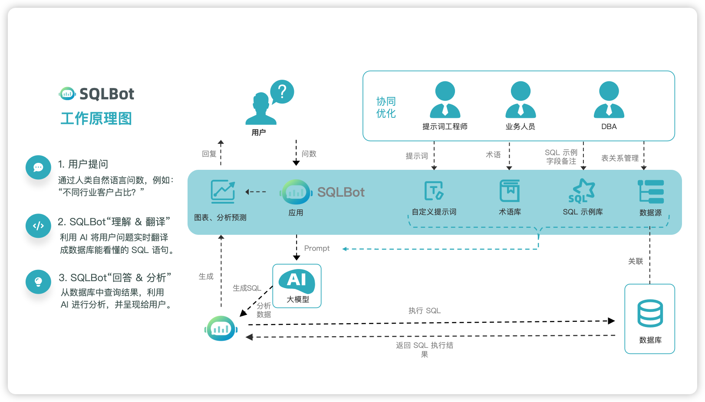

# 产品介绍

!!! Tip ""

    SQLBot 是一款基于大语言模型（Large Language Model，LLM）和 RAG（Retrieval Augmented Generation，检索增强生成）的智能问数系统。借助 SQLBot，用户可以实现数据的即问即答，快速提炼获取所需的数据信息及可视化图表，并且支持进一步开展智能分析。

    SQLBot 由飞致云的 [DataEase](https://dataease.cn/) 开源团队出品。

## 1 工作原理

## 2 产品优势 

!!! Tip "" 

    - **开箱即用**      
      仅需简单配置大模型与数据源，无需复杂开发，即可快速开启智能问数；依托大模型自然语言理解与 SQL 生成能力，结合 RAG 技术，实现高质量 Text-to-SQL 转换。

    - **安全可控**      
      提供工作空间级资源隔离机制，构建清晰数据边界，保障数据访问安全；支持细粒度数据权限配置，强化权限管控能力，确保使用过程合规可控。

    - **易于集成**    
      支持多种集成方式，提供 Web 嵌入、弹窗嵌入、MCP 调用等能力；能够快速嵌入到 n8n、Dify、MaxKB、DataEase 等应用，让各类应用快速拥有智能问数能力。

    - **越问越准**  
      支持自定义提示词、术语库配置，可维护 SQL 示例校准逻辑，精准匹配业务场景；高效运营，基于用户交互数据持续迭代优化，问数效果随使用逐步提升，越问越准。
      
## 3 界面展示

## 4 主要功能

!!! Tip ""

    - 提问分析：用户聊天对话方式提问，大模型解析问题意图，结合所选数据源生成图表与分析。
    - 深度探索：在获得基础图表结果后，进一步进行分析、解释、验证和预测，支持更强的业务决策支持。
    - 数据管理：支持用户配置、管理多种类型的数据源和数据表，支持按需配置和管理。
    - 看板搭建：将多个问数对话生成的图表统一布局，构建成适用于汇报、监控或展示的仪表板。

## 5  了解更多

!!! Tip ""

    - [了解飞致云](https://www.fit2cloud.com/) 
    - [飞致云开源社区论坛](https://bbs.fit2cloud.com/)

