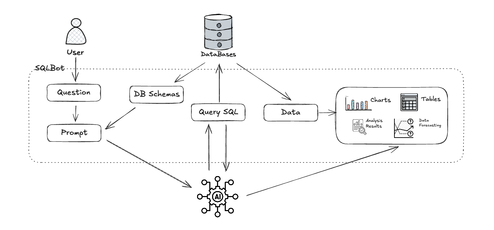
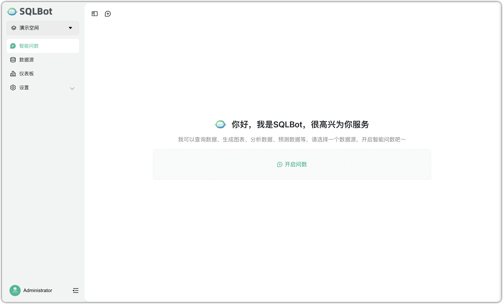

# 产品介绍

!!! Tip ""

    SQLBot 是一款基于大语言模型（Large Language Model，LLM）和 RAG（Retrieval Augmented Generation，检索增强生成）的智能问数系统。借助 SQLBot，用户可以实现数据的即问即答，快速提炼获取所需的数据信息及可视化图表，并且支持进一步开展智能分析。

## 1 界面展示

## 2 产品优势 

!!! Tip "" 

    - **开箱即用**      
      只需简单配置大模型和数据源即可开启问数之旅。SQLBot 充分发挥大语言模型强大的自然语言理解和 SQL 生成能力，结合 RAG 技术提升生成精度，实现高质量的 text-to-SQL 转换体验。

    - **易于集成**    
      支持多种集成方式，能够快速嵌入到 n8n、MaxKB、Dify、Coze 等 AI 应用开发平台，让各类应用快速拥有智能问数能力。

    - **安全可控**      
      提供基于工作空间的资源隔离机制，支持细粒度的数据权限配置，确保用户在使用过程中拥有清晰的数据边界与权限控制能力，保障数据访问的安全与合规。  

## 3 主要功能

!!! Tip ""

    - 提问分析：用户聊天对话方式提问，大模型解析问题意图，结合所选数据源生成图表与分析。
    - 深度探索：在获得基础图表结果后，进一步进行分析、解释、验证和预测，支持更强的业务决策支持。
    - 数据管理：支持用户配置、管理多种类型的数据源和数据表，支持按需配置和管理。
    - 看板搭建：将多个问数对话生成的图表统一布局，构建成适用于汇报、监控或展示的仪表板。

## 4  了解更多

!!! Tip ""

    - [了解飞致云](https://www.fit2cloud.com/) 
    - [飞致云开源社区论坛](https://bbs.fit2cloud.com/)

