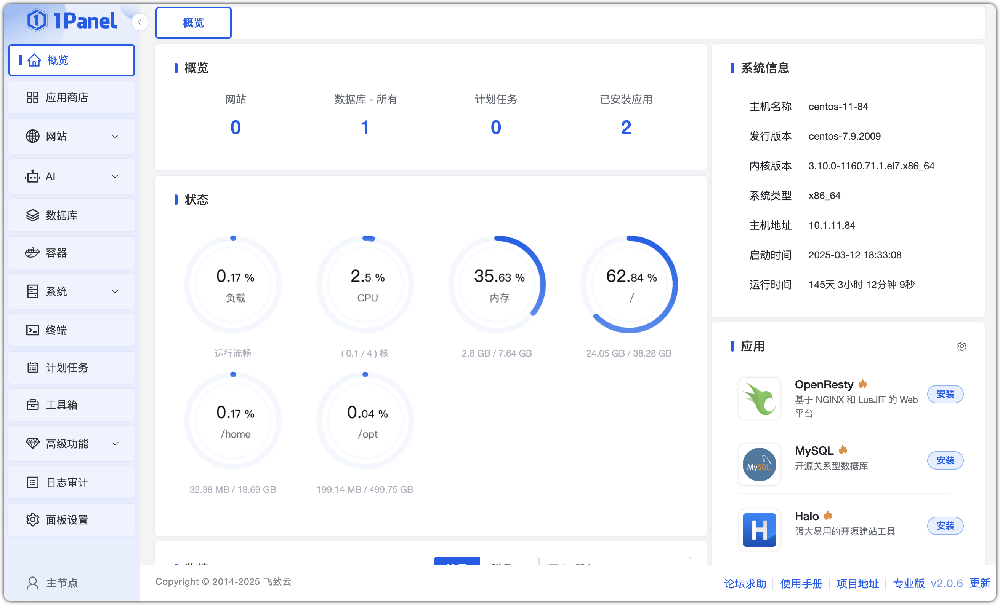
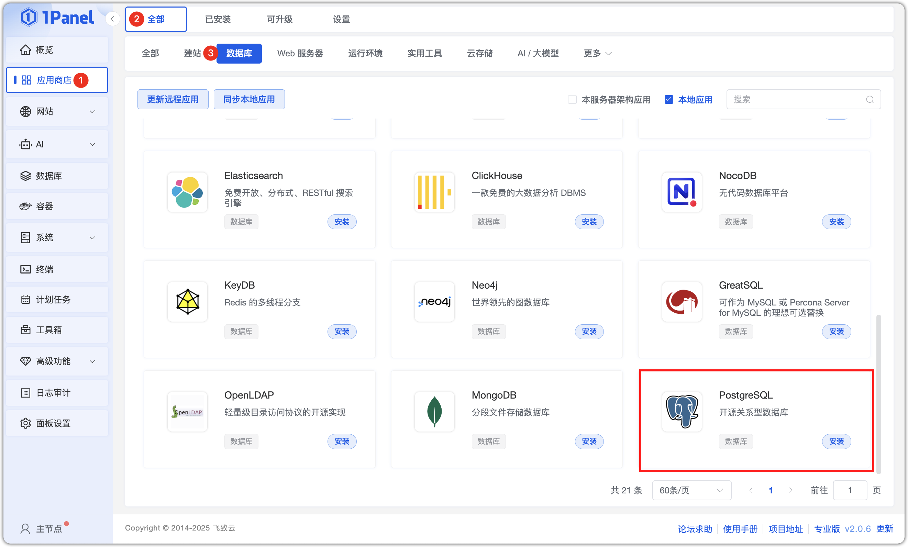
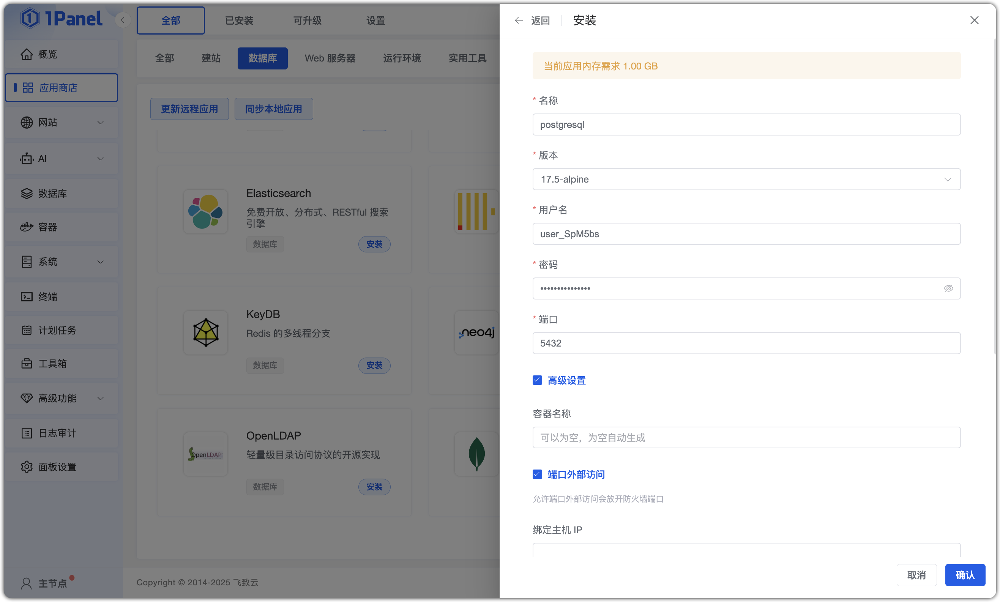
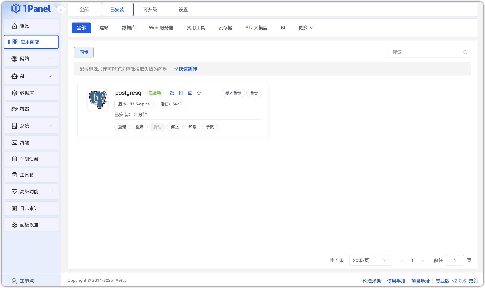
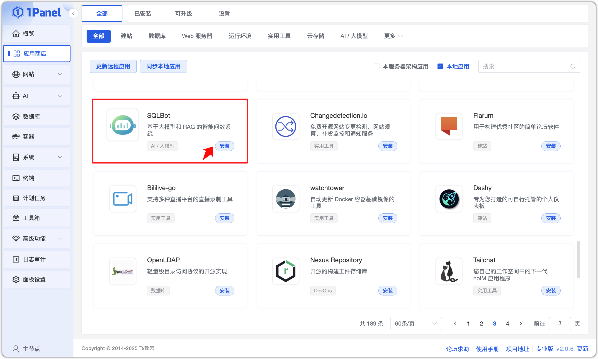
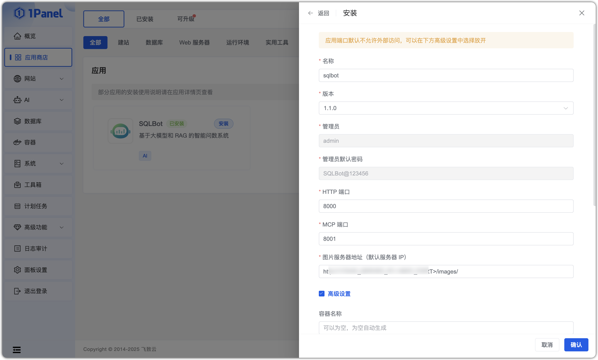
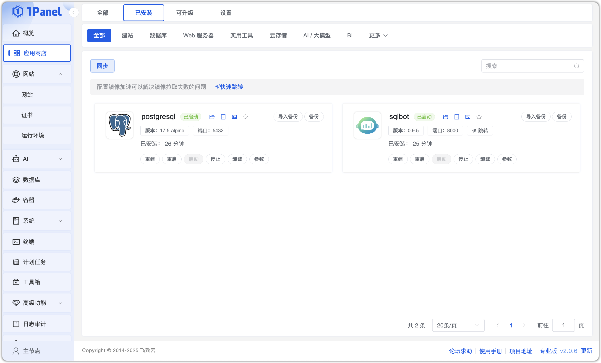

## 1 安装 1Panel

!!! Abstract ""

    关于 1Panel 的安装部署与基础功能介绍，请参考 [**1Panel 官方文档**](https://1panel.cn/docs/) 。完成 1Panel 的安装部署后，根据提示网址打开浏览器进入 1Panel，界面如下。    



### 2 安装 PostgreSQL 数据库

!!! Abstract ""
    在安装 SQLBot 之前，需要先在 1Panel 上安装好所需的数据库 PostgreSQL。在应用商店中选择 PostgreSQL 点击安装，选择 17.5 版本。



!!! Abstract ""
    进行参数设置，设置完成后，点击确认。

    * 名称：创建的 PostgreSQL 应用的名称。
    * 用户密码：安装的 PostgreSQL 应用的 root 用户和密码。
    * 端口：PostgreSQL 应用的服务端口。
    * 容器名称：PostgreSQL 应用容器名称。
    * CPU 限制：PostgreSQL 应用可以使用的 CPU 核心数。
    * 内存限制：PostgreSQL 应用可以使用的内存大小。



!!! Abstract ""
    点击安装，完成后页面自动跳转到已安装应用列表，等待安装的 PostgreSQL 应用状态变为已启动。




## 3 安装 SQLBot

!!! Abstract ""
    安装好 PostgreSQL 后，进入应用商店应用列表，找到 SQLBot 应用进行安装。


!!! Abstract ""
    在应用详情页选择最新的 SQLBot 版本进行安装，进行相关参数设置。

    * 名称：要创建的 SQLBot 应用的名称。
    * 数据库服务：SQLBot 应用使用的数据库应用，支持下拉选择已安装的数据库应用，1Panel 会自动配置 SQLBot 使用 PostgreSQL 数据库。
    * 数据库名：SQLBot 应用使用的数据库名称，SQLBot 会在选中的数据库中自动创建这个数据库。
    * 数据库用户：SQLBot 应用使用的数据库用户名，SQLBot 会在选中的数据库中自动创建这个用户，并添加对应的数据库授权。
    * 数据库用户密码：SQLBot 应用使用的数据库用户密码，SQLBot 会在选中的数据库中自动为上一步创建的用户配置该密码。
    * 管理员：SQLBot 应用初始化创建的超级管理员用户名。
    * 管理员密码：SQLBot 应用初始化创建的超级管理员密码（后续登录系统可以更改）。
    * 端口：SQLBot 应用的服务端口设置为 8000。
    * 图片服务器地址：**http://xx.xx.xx.xxx:8000/images/**
    * 端口外部访问：SQLBot 应用可以使用 IP:PORT 进行访问（SQLBot 应用必须打开外部端口访问）。



!!! Abstract ""
    点击开始安装后，页面自动跳转到已安装应用列表，等待安装的 SQLBot 应用状态变为已启动。


## 4 访问 SQLBot

!!! Abstract ""
    安装成功后即可通过浏览器访问地址 `http://目标服务器 IP 地址:8000`，并使用默认的管理员用户和密码登录 SQLBot。

    ```
    用户名: admin

    密码: SQLBot@123456
    ```


