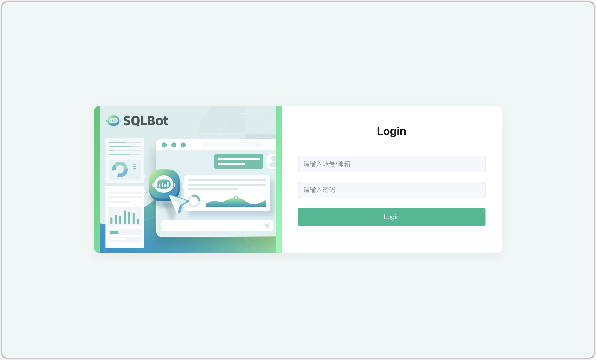

## 1 环境要求


!!! Abstract ""

    **部署服务器要求：**

    * 操作系统：Ubuntu 22.04 / CentOS 7（内核版本要求 ≥ 3.10）
    * CPU/内存: 4 核 8 G
    - 磁盘空间: 100G

##  端口要求

!!! Abstract ""

    在线部署 SQLBot 需要开通的访问端口说明如下：

| 端口   | 作用       | 说明                        |
|------|:---------|:--------------------------|
| 22   | SSH      | 安装、升级及管理使用                |
| 8000 | Web 服务端口 | 默认 Web 服务访问端口，可根据实际情况进行更改 |
| 8001 | MCP 服务端口 | 默认 MCP 服务访问端口，可根据实际情况进行更改 |    


## 3 安装部署

!!! Abstract ""
    在配置 Docker 环境的操作系统中，进行以下操作：

    ```
    docker run -d \
        --name sqlbot \
        --restart unless-stopped \
        -p 8000:8000 \
        -p 8001:8001 \
        -v ./data/sqlbot/excel:/opt/sqlbot/data/excel \
        -v ./data/sqlbot/images:/opt/sqlbot/images \
        -v ./data/sqlbot/logs:/opt/sqlbot/logs \
        -v ./data/postgresql:/var/lib/postgresql/data \
        dataease/sqlbot:v1.1.1
    ```

# 4 登录访问

!!! Abstract ""

    安装成功后即可通过浏览器访问地址 `http://目标服务器 IP 地址:8000`，并使用默认的管理员用户和密码登录 SQLBot。

    ```
    用户名：admin

    默认密码：SQLBot@123456
    ```


