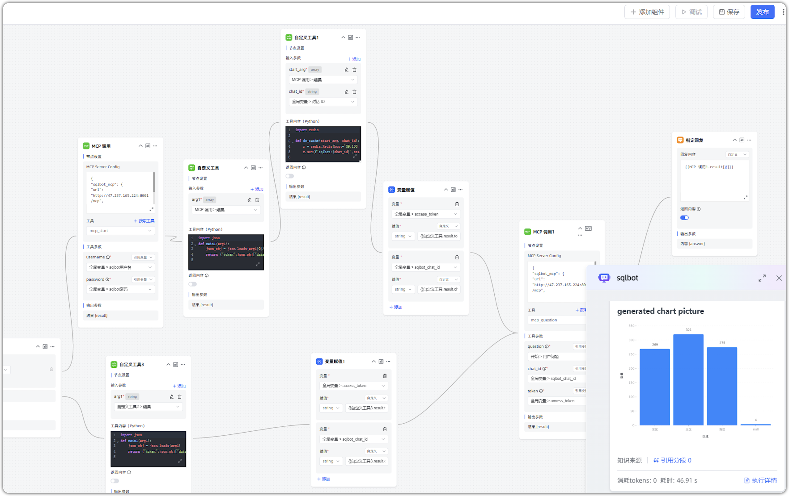
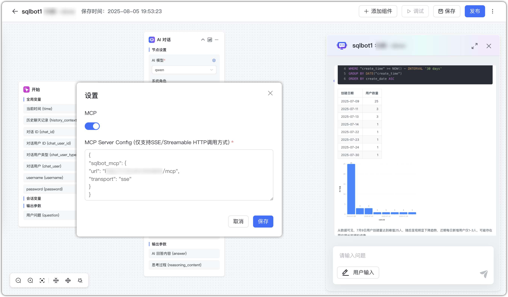
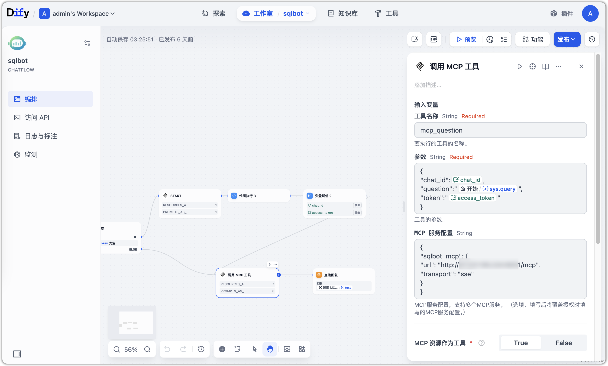
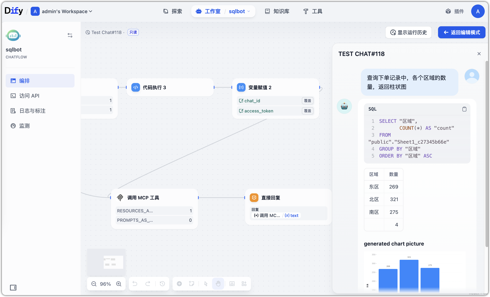

!!! Tip ""
    SQLBot 支持通过 MCP 进行服务端图表渲染与智能问数处理。

## 1 服务配置
!!! Tip ""
    SQLBot MCP Server 默认监听端口为 8001，使用 SSE 协议进行通信。基本配置如下：

    ```
    {
       "sqlbot_mcp": {
           "url": "http://<your-server-ip>:8001/mcp", // 将 IP 替换为部署机器的地址
           "transport": "sse"
        }
    }
    ```

!!! Tip ""
    修改 SQLBot 的 .env 配置文件：

    ```
    # MCP 服务图片路径，默认路径
    MCP_IMAGE_PATH=/opt/sqlbot/images

    # MCP 后端图表渲染服务地址
    MCP_IMAGE_HOST=http://localhost:3000

    # 图片访问 URL：{MCP 服务地址}/images/
    SERVER_IMAGE_HOST=https://<your-server-ip>/images/

    ```
## 2 MCP 工具说明
!!! Tip ""
    SQLBot 的 MCP Server 提供两个内置工具：mcp_start 和 mcp_question，分别用于初始化对话和提交问题。

### 2.1 mcp_start 工具
!!! Tip ""
    用于启动一次智能问数对话，获取 access_token 和 chat_id。

    | 参数名      | 说明          |
    | --------    | ----------- |
    | username | SQLBot 用户名   |
    | password |  SQLBot 用户密码 |


    返回示例：
    ```
    {
        "code": 0,
        "data": {
            "access_token": "<JWT_TOKEN>",
            "chat_id": 1330
        },
        "msg": null
    }
    ```
     - access_token：身份验证使用；

     - chat_id：唯一对话上下文 ID，后续问数保持一致可维持上下文状态。


### 2.2 mcp_question 工具
!!! Tip ""
    用于在已初始化的问数上下文中提交用户问题，并返回对应 SQL、可视化结果及图表图片地址。
    
| 参数名      | 说明                             |
    | -------- | ------------------------------ |
    | token    |  `mcp_start` 返回的 `access_token` |
    | chat\_id | `mcp_start` 返回的 `chat_id`      |
    | question |  用户的提问问题 |

!!! Tip ""
    返回结果示例（Markdown 格式）：

    ```
    ```sql SELECT "s"."区域", COUNT(*) AS "count" FROM "public"."Sheet1_c27345b66e" "s" GROUP BY "s"."区域" ORDER BY "s"."区域" ``` | 区域 | 数量 | |:-----|-----:| | 东区 | 269 | | 北区 | 321 | | 南区 | 275 | | | 4 | ### generated chart picture 
    ```
### 2.3 对接流程说明
!!! Tip ""
    对接步骤：

    - 步骤 1：调用 mcp_start 工具。 获取初始化问数所需的 access_token 和 chat_id。
    - 步骤 2：调用 mcp_question 工具使用上一步返回的 access_token 和 chat_id，传入用户自然语言问题 question，提交问题请求。

    建议：

    - 每次调用 mcp_start 会生成新的 chat_id；
    - 对话过程中保持 chat_id 一致，才能维持上下文；
    - 建议缓存 access_token 和 chat_id，在一次对话中只调用一次 mcp_start。

## 3 使用示例

###  3.1 MaxKB 集成示例




###  3.2 Dify 集成示例


