!!! Tip ""
    SQLBot 支持通过 MCP 进行服务端图表渲染与智能问数处理。

## 1 服务配置
!!! Tip ""
    SQLBot MCP Server 默认监听端口为 8001，使用 SSE 协议进行通信。基本配置如下：

    ```
    {
       "sqlbot_mcp": {
           "url": "http://<your-server-ip>:8001/mcp", // 将 IP 替换为部署机器的地址
           "transport": "sse"
        }
    }
    ```

!!! Tip ""
    SQLBot 运行方式不同，对应的 MCP 参数 SERVER_IMAGE_HOST 的配置方式不同，注意该参数中的 IP 是 SQLBot 服务器的 IP 地址，端口是 MCP 服务的端口，默认情况下，服务端口是 8001（切记不是 3000 端口）。另外，注意跨域 、https 、http协议安全等可能导致图片无法加载。

    - 安装包安装方式
        - 确认 SQLBot 的 .env 配置文件(默认位置 /opt/sqlbot/.env)中的 SQLBOT_SERVER_IMAGE_HOST：
        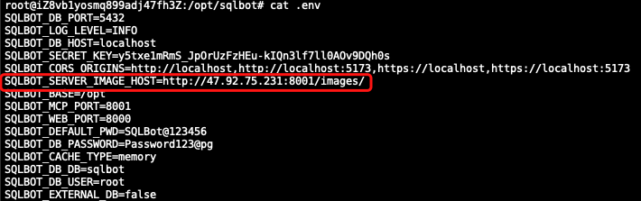
        - 确认 SQLBot 运行配置文件(默认位置 /opt/sqlbot/conf/sqlbot.conf)中的 SERVER_IMAGE_HOST：
        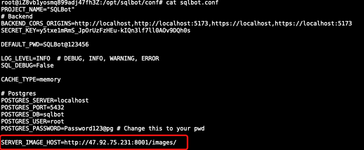
            
            若参数并非实际的 IP 和端口，请修改完上述两个配置参数后，重启一下 SQLBot 服务：
            ```shell
            sctl restart
            ```
    - 1Panel 运行方式
        - 确认相关参数是否正确，若与实际情况部分，请修改后重启 SQLBot 服务：
        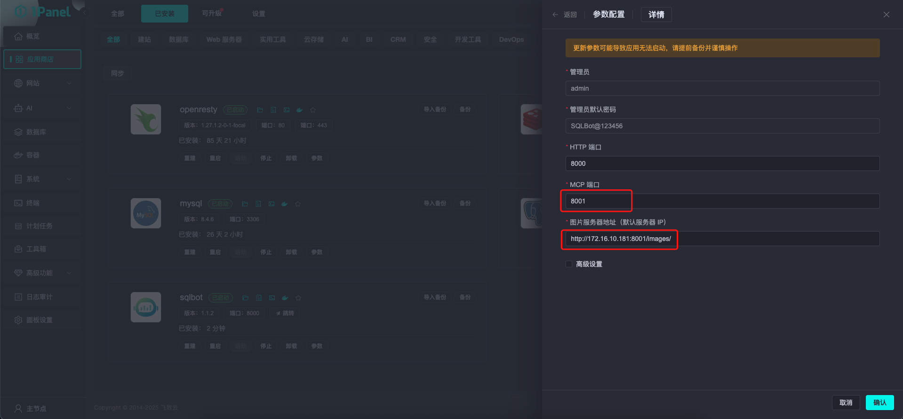
    - docker 一键运行方式
        - 若之前运行方式没有加上 SERVER_IMAGE_HOST 参数，或者参数值不对，则停止 SQLBot 服务并删除容器
        - 修改 MCP 运行参数 SERVER_IMAGE_HOST，注意将 IP 和端口替换成自己的实际 IP 和端口：
            ```shell
            docker run -d \
                --name sqlbot \
                --restart unless-stopped \
                -p 8000:8000 \
                -p 8001:8001 \
                -e SERVER_IMAGE_HOST=http://47.92.75.231:8001/images/ \
                -v data/sqlbot/excel:/opt/sqlbot/data/excel \
                -v ./data/sqlbot/file:/opt/sqlbot/data/file \
                -v data/sqlbot/images:/opt/sqlbot/images \
                -v data/sqlbot/logs:/opt/sqlbot/logs \
                -v data/postgresql:/var/lib/postgresql/data \
                --privileged=true \
                dataease/sqlbot
            ```
    - docker-compose 一键运行方式
        - 若之前运行方式没有加上 SERVER_IMAGE_HOST 参数，或者参数值不对，则停止 SQLBot 服务并删除容器
        - 修改 docker-compose.yml 文件中的 MCP 参数 SERVER_IMAGE_HOST，注意将 IP 和端口替换成自己的实际 IP 和端口：
            ```yml
            services:
              sqlbot:
                image: dataease/sqlbot:v1.1.0
                container_name: sqlbot
                restart: always
                networks:
                  - sqlbot-network
                ports:
                  - 8000:8000
                  - 8001:8001
                environment:
                # Database configuration
                  POSTGRES_SERVER: localhost
                  POSTGRES_PORT: 5432
                  POSTGRES_DB: sqlbot
                  POSTGRES_USER: root
                  POSTGRES_PASSWORD: Password123@pg
                  # Project basic settings
                  PROJECT_NAME: "SQLBot"
                  DEFAULT_PWD: "SQLBot@123456"
                  # MCP settings
                  SERVER_IMAGE_HOST: http://47.92.75.231:8001/images/
                  # Auth & Security
                  SECRET_KEY: y5txe1mRmS_JpOrUzFzHEu-kIQn3lf7ll0AOv9DQh0s
                  # CORS settings
                  BACKEND_CORS_ORIGINS: "http://localhost,http://localhost:5173,https://localhost,https://localhost:5173"
                  # Logging
                  LOG_LEVEL: "INFO"
                  SQL_DEBUG: False
                volumes:
                  - data/sqlbot/excel:/opt/sqlbot/data/excel
                  - data/sqlbot/file:/opt/sqlbot/data/file
                  - data/sqlbot/images:/opt/sqlbot/images
                  - data/sqlbot/logs:/opt/sqlbot/logs
                  - data/postgresql:/var/lib/postgresql/data

            networks:
              sqlbot-network:
            ```

## 2 MCP 工具说明
!!! Tip ""
    SQLBot 的 MCP Server 提供两个内置工具：mcp_start 和 mcp_question，分别用于初始化对话和提交问题。

### 2.1 mcp_start 工具
!!! Tip ""
    用于启动一次智能问数对话，获取 access_token 和 chat_id。

    | 参数名      | 说明          |
    | --------    | ----------- |
    | username | SQLBot 用户名   |
    | password |  SQLBot 用户密码 |


    返回示例：
    ```
    {
        "code": 0,
        "data": {
            "access_token": "<JWT_TOKEN>",
            "chat_id": 1330
        },
        "msg": null
    }
    ```
     - access_token：身份验证使用；

     - chat_id：唯一对话上下文 ID，后续问数保持一致可维持上下文状态。


### 2.2 mcp_question 工具
!!! Tip ""
    用于在已初始化的问数上下文中提交用户问题，并返回对应 SQL、可视化结果及图表图片地址。
    
| 参数名      | 说明                             |
    | -------- | ------------------------------ |
    | token    |  `mcp_start` 返回的 `access_token` |
    | chat\_id | `mcp_start` 返回的 `chat_id`      |
    | question |  用户的提问问题 |

!!! Tip ""
    返回结果示例（Markdown 格式）：

    ```
    ```sql SELECT "s"."区域", COUNT(*) AS "count" FROM "public"."Sheet1_c27345b66e" "s" GROUP BY "s"."区域" ORDER BY "s"."区域" ``` | 区域 | 数量 | |:-----|-----:| | 东区 | 269 | | 北区 | 321 | | 南区 | 275 | | | 4 | ### generated chart picture 
    ```
### 2.3 对接流程说明
!!! Tip ""
    对接步骤：

    - 步骤 1：调用 mcp_start 工具。 获取初始化问数所需的 access_token 和 chat_id。
    - 步骤 2：调用 mcp_question 工具使用上一步返回的 access_token 和 chat_id，传入用户自然语言问题 question，提交问题请求。

    建议：

    - 每次调用 mcp_start 会生成新的 chat_id；
    - 对话过程中保持 chat_id 一致，才能维持上下文；
    - 建议缓存 access_token 和 chat_id，在一次对话中只调用一次 mcp_start。

## 3 使用示例

###  3.1 MaxKB 集成示例

!!! Tip ""
    [下载完整示例文件](https://resource-fit2cloud-com.oss-cn-hangzhou.aliyuncs.com/sqlbot/SQLBot.mk)

!!! Tip ""

    步骤⼀： 创建或进入一个高级编排类型的应用。

    步骤二： 在「基本信息」里添加两个用户输入，分别是 username 和 password，添加两个会话变量，分别是 sqlbot_token 和 sqlbot_chat_id

    步骤三： 添加条件判断，在开始节点后添加条件分支（IF）。判断条件：会话变量>sqlbot_token 是否为空。为空：执行登录逻辑，添加 MCP 调用，调用 MCP 工具 mcp_start。    

    步骤四： 配置 MCP 登录配置：

    添加 MCP 调用节点

    - MCP Server Config 服务配置：
        ```
        {
            "sqlbot_mcp": {
                "url": "http://<SQLBot_MCP_IP>:8001/mcp",
                "transport": "sse"
            }
        }
        ```
    - 工具配置：
        点击「获取工具」，选择 mcp_start
    - 工具参数配置：
        username 从全局变量里选择 username；password 从全局变量里选择 password。

    步骤五： 配置自定义工具：

    - MCP 调用后添加「自定义工具」。
    MCP 工具返回包含 sqlbot_chat_id 和 sqlbot_token 的 JSON。添加输入参数，将 MCP 调用结果赋值给参数“arg1”。此外，再添加工具节点（Python）来解析 JSON，工具内容：
    ```
    import json
    def main1(arg1):
    json_obj = json.loads(data[0])
    return {"token":json_obj["data"]["sqlbot_token"], "sqlbot_chat_id":json_obj["data"]["chat_id"]}
    ```
    
    步骤六： 变量赋值
    添加变量赋值节点，将 sqlbot_chat_id 和 sqlbot_token 存储为会话变量，供后续 MCP 调用使用。
    
    步骤七： 问数 MCP 调用配置
    添加 MCP 调用节点，配置问数调用

    - MCP Server Config 服务配置：
    ```
    {
        "sqlbot_mcp": {
            "url": "http://<SQLBot_MCP_IP>:8001/mcp",
            "transport": "sse"
        }
    }
    ```
    - 工具配置：
    点击「获取工具」，选择 mcp_question
    - 工具参数配置：
    question 选择「开始>用户问题」，chat_id 选择「会话变量>sqlbot_chat_id」，token 选择「会话变量>sqlbot_token」。

    步骤八：在流程末尾添加指定回复节点，将 MCP 的输出结果作为回复内容。输入有效的 username 与 password 测试登录及 MCP 功能调用是否正常。

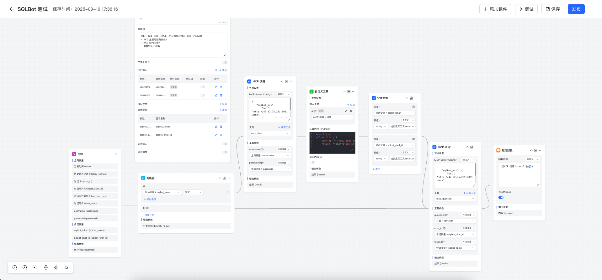

###  3.2 Dify 集成示例

!!! Tip ""
    [下载完整示例文件](https://resource-fit2cloud-com.oss-cn-hangzhou.aliyuncs.com/sqlbot/dify.yml)

!!! Tip ""
    步骤⼀： 进入需要配置的工作空间，创建一个 Chatflow 类型的应用；

    步骤二： 在开始节点中定义输入变量： username（必填） 、password（必填）；

    步骤三： 添加会话变量 chat_id（Number）和 access_token（String）；

    步骤四： 添加条件分支，在开始节点后添加条件分支（IF）。判断条件：access_token 是否为空。为空：执行登录逻辑，调用 MCP 工具 mcp_start；

    步骤五： 在 marketplace 中搜索 “MCP”，添加工具 “MCP SSE / StreamableHTTP”，添加 MCP 调用。工具名称为 mcp_start

    配置 MCP 工具参数（以 mcp_start 为例）：

    - 输入参数：
    ```
    {
    "username": "{{开始节点的username}}",
    "password": "{{开始节点的password}}"
    }
    
    ```
    - MCP 服务配置：
    ```
    {
        "sqlbot_mcp": {
            "url": "http://<SQLBot_MCP_IP>:8001/mcp",
            "transport": "sse"
        }
    }
    ```

    步骤六：解析 chat_id 和 access_token

    - 添加输入变量 “arg1”，选择 “mcp_start 的 text”

    - MCP 工具返回包含 chat_id 和 access_token 的 JSON。解析返回值，添加 代码执行 节点（Python）来解析 JSON：
    ```
    import json
    
    def main(arg1: str) -> dict:
    json_obj = json.loads(arg1)
    return {
    "chat_id": json_obj["data"]["chat_id"],
    "access_token": json_obj["data"]["access_token"]
    }

    ```

    - 添加输出变量 access_token（String）和 chat_id（Number）

    步骤七： 变量赋值
    
    添加变量赋值节点，将 chat_id 和 access_token 存储为全局变量，供后续 MCP 调用使用。

    步骤八： 执行 MCP 调用

    调用 MCP 工具 mcp_question，工具名称为 mcp_question

    - 参数设置
        ```
        {
            "chat_id":{{#conversation.chat_id#}}, 
            "question":"{{#sys.query#}}",
            "token":"{{#conversation.access_token#}}"
        }
        ```
    - 执行后续 MCP 业务调用

        ```
        {
            "sqlbot_mcp": {
                "url": "http://<SQLBot_MCP_IP>:8001/mcp",
                "transport": "sse"
            }
        }
        ```

    步骤九：在流程末尾添加回答节点，将 MCP 返回的内容回复给用户。输入有效的 username 与 password 测试登录及 MCP 功能调用是否正常。


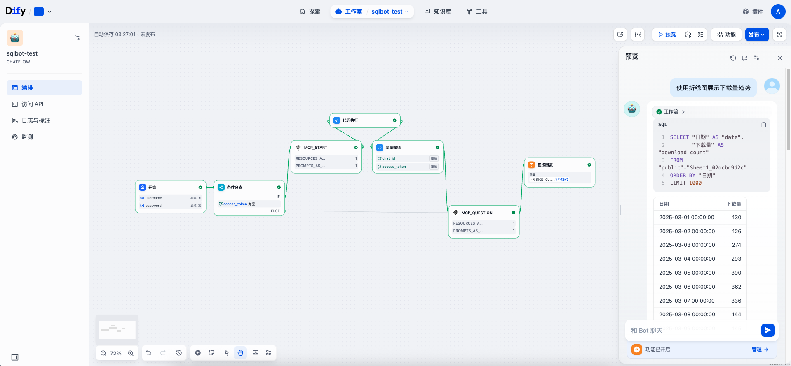

###  3.3 Coze 集成示例
!!! Tip ""
    方式一：

    步骤⼀：进入工作空间，创建一个新的应用或进入已有应用。

    步骤二：在开始节点中设置输入变量： username（必填） 、password（必填）；

    步骤三：在开始节点后添加文本处理节点（文本处理节点用于字符串拼接），传入 username 和 password，编辑表达式如下：
    ```
    {"username":"{{String1}}","password":"{{String2}}"}
    ```
    步骤四：调用 MCP 工具 mcp_start。在文本处理节点后添加 MCP SSE Client 工具节点，设置如下：

    - 输入变量：文本处理节点输出

    - 工具名称：mcp_start

    - SSE URL：`http://SQLBot_MCP_IP:8001/mcp`

    步骤五：MCP 将返回包含 chat_id 和 access_token 的 JSON。添加 Python 代码节点，解析 MCP 返回的 JSON，示例代码如下：
    ```
    import json
    
    def main(args) -> dict:
    # 从args获取params字典
    params = args.params
    
    # 从params字典获取input值（这是我们需要的JSON字符串）
    input_json_str = params.get('input')
    
    # 解析JSON字符串
    json_obj = json.loads(input_json_str)
    
    # 获取data部分
    data = json_obj.get('data')
    
    # 提取所需字段
    chat_id = data.get('chat_id')
    access_token = data.get('access_token')
    
    return {
     "chat_id": chat_id,
     "access_token": access_token
    }
    ```
    设置输出：返回 access_token（String）和 chat_id（String）。

    步骤六：添加文本处理节点，将代码节点返回的 access_token 和 chat_id 与开始节点的 question 变量进行拼接，表达式如下：
    ```
    {"token":"{{String1}}","chat_id":"{{String2}}","question":"{{String3}}"}
    ```
    步骤七：调用 MCP 工具 mcp_question。在文本处理节点后添加 MCP SSE Client 工具节点，设置如下：

    - 输入变量：文本处理节点输出

    - 工具名称：mcp_question

    - SSE URL：http://<host>:8001/mcp
    
    步骤八：在结束节点将 MCP 返回的内容回复给用户。输入有效的 username、password 以及 question，即可测试登录及 MCP 功能调用是否正常。


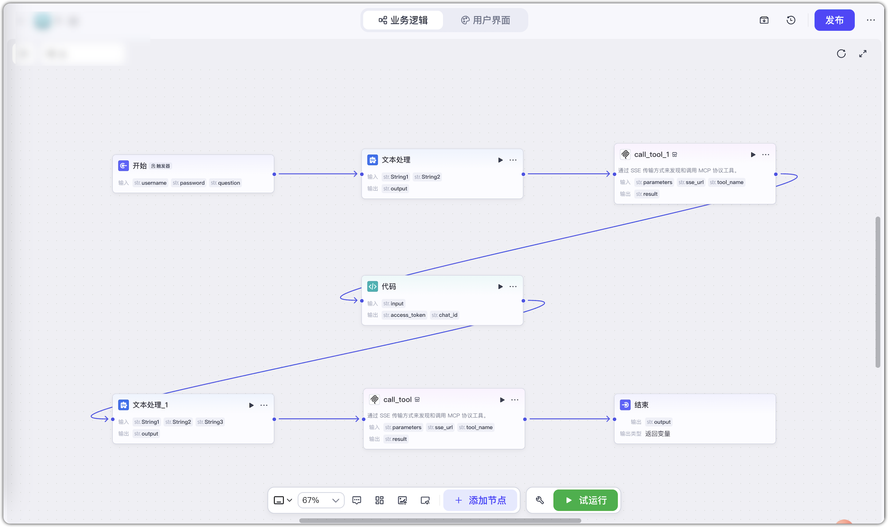

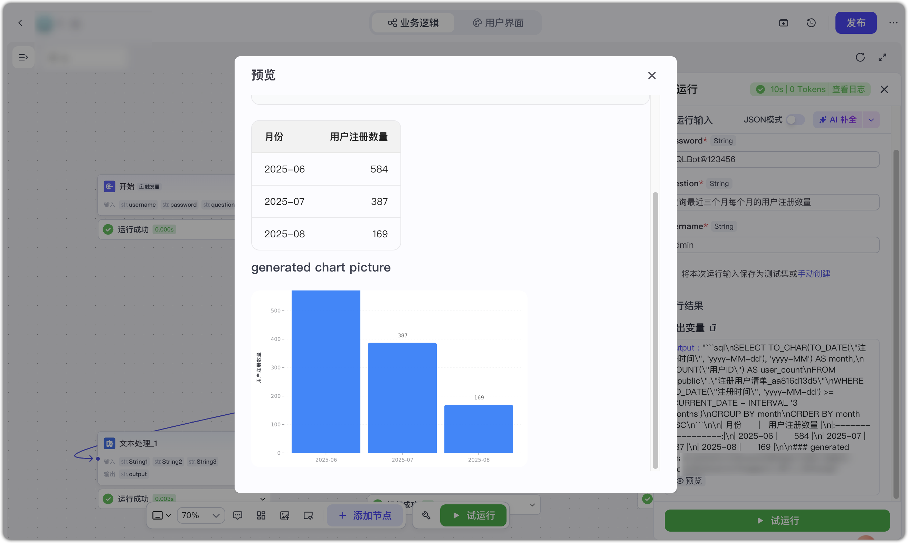

!!! Tip ""
    方式二：

    步骤⼀：进入工作空间，创建一个新的应用或进入已有应用。

    步骤二：定义输入变量。在开始节点中设置以下必填输入变量：username、password、question。

    步骤三：添加大模型节点，选择合适的模型。添加技能：MCP Compatible/call_tool。配置输入参数如下：
    ```
    {
    "sqlbot_mcp": {
    "uri": "http://<SQLBot_MCP_IP>:8001/mcp",
    "transport": "sse"
    }
    }
    ```
    传入开始节点的 username 、 password 以及 question 参数，添加系统提示词。提示词参考：
    ```
    # 回答要求：
    按需调用 mcp_start 和 mcp_question 工具获取信息回答问题。
    
    mcp_start 账号密码：
    {{username}}
    {{password}}
    
    工具调用逻辑：
    首先调用 mcp_start 工具，获取 access_token 和 chat_id ，帮我记住这两个参数，之后不要重复调用 mcp_start，直接使用即可；然后再调用 mcp_question 工具，其中 token 和 chat_id 参数是调用 mcp_start 工具返回，question 是用户提问。
    
    
    # 用户提问：
    {{question}}
    
    # 输出要求
    - 如果 mcp_question 中有图片，请直接返回图片
    - 请将 mcp_question 的执行结果中的数据、SQL以及图片内容展示
    - 请将 mcp_question 的执行过程在结尾进行总结

    # 限制
    - 不要输出MCP详细执行过程
    - 生成内容不要放在 mcp_question 执行过程中
    - 严格按照输出要求输出内容，不要输出MCP调用过程
    ```

    步骤四：添加结束节点，将大模型返回的内容回复给用户。输入有效的 username 与 password 以及输入 question，测试登录及 MCP 功能调用是否正常。


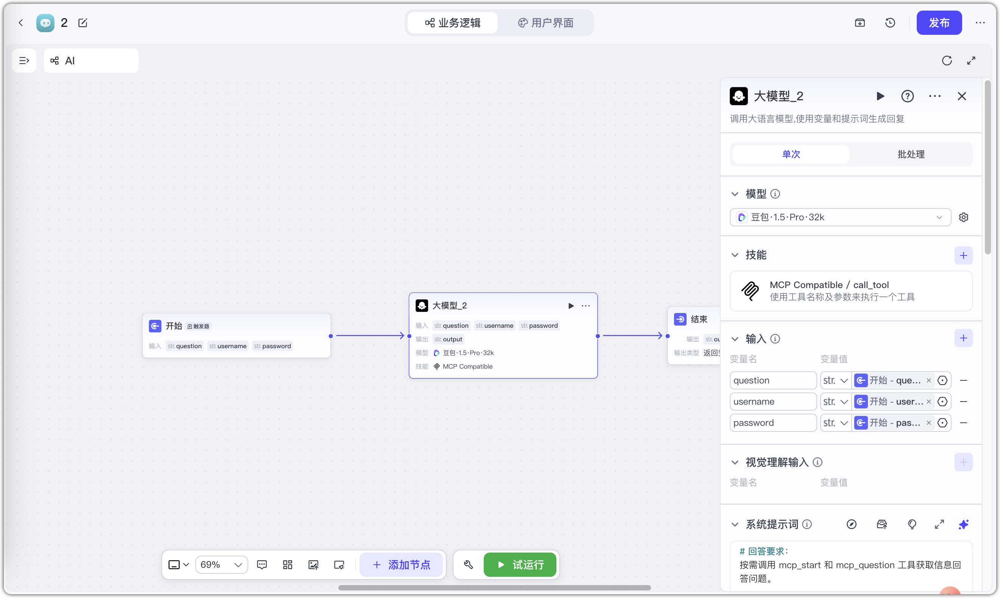

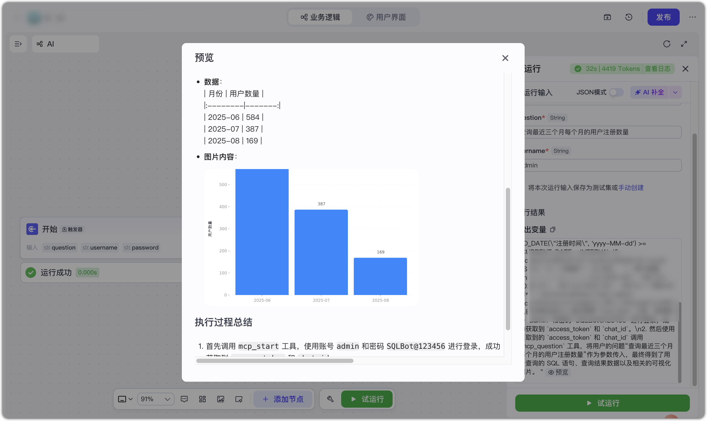


###  3.4 n8n 集成示例

!!! Tip ""
    方式一：

    步骤⼀：进入 My project，创建或进入一个 workflow。

    步骤二：添加表单触发器节点，节点中定义表单元素： username（必填） 、password（必填）、question（必填）。

    步骤三：添加 AI Agent 节点，编辑提示词，提示词参考如下：
    ```
    # 回答要求：
    按需调用 mcp_start 和 mcp_question 工具获取信息回答问题。
    
    mcp_start 账号密码：
    username:{{ $json.username }}
    password:{{ $json.password }}
    
    工具调用逻辑：
    首先调用 mcp_start 工具，获取 access_token 和 chat_id ，帮我记住这两个参数，之后不要重复调用 mcp_start，直接使用即可；然后再调用 mcp_question 工具，其中 token 和 chat_id 参数是调用 mcp_start 工具返回，question 是用户提问。
    
    
    # 用户提问：
    {{ $json.question }}
    
    # 输出要求
    - 如果 mcp_question 中有图片，请直接返回图片
    - 请将 mcp_question 的执行结果中的数据、SQL以及图片内容展示
    - 请将 mcp_question 的执行过程在结尾进行总结
    
    # 限制
    - 不要输出MCP详细执行过程
    - 生成内容不要放在 mcp_question 执行过程中
    - 严格按照输出要求输出内容，不要输出MCP调用过程
    ```
    步骤四：添加 model 节点，配置 AI 模型，填写 api key。 

    步骤五：调用 MCP Clien 工具，在 Parameters 的 Endpoint 填入 SQLBot 填入 MCP 服务地址：`http://SQLBot_MCP_IP:8001/mcp`。

    点击【Execute workflow】输入有效的 username 与 password 以及输入 question，测试登录及 MCP 功能调用是否正常。

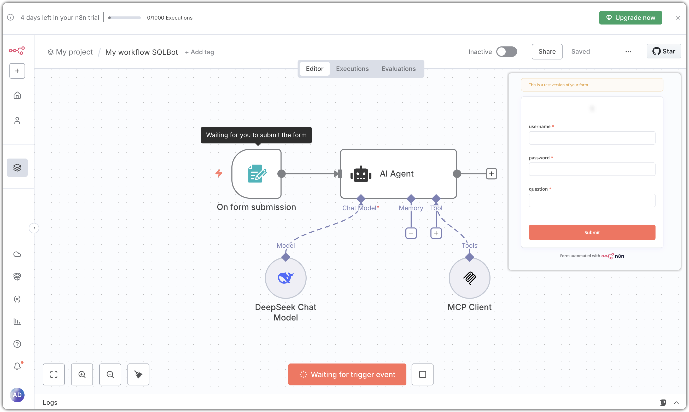

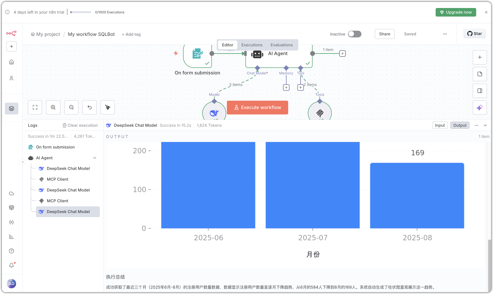

!!! Tip ""
    方式二：

    步骤⼀：进入 My project，创建或进入一个 workflow。

    步骤二：添加聊天触发器节点。

    步骤三：添加 AI Agent 节点，编辑提示词，提示词参考如下：
    ```
    # 回答要求：
    按需调用 mcp_start 和 mcp_question 工具获取信息回答问题。
    
    mcp_start 账号密码：
    username:admin
    password:SQLBot@123456
    
    工具调用逻辑：
    首先调用 mcp_start 工具，获取 access_token 和 chat_id ，帮我记住这两个参数，之后不要重复调用 mcp_start，直接使用即可；然后再调用 mcp_question 工具，其中 token 和 chat_id 参数是调用 mcp_start 工具返回，question 是用户提问。
    
    
    # 用户提问：
    {{ $json.chatInput }}
    
    # 输出要求
    - 如果 mcp_question 中有图片，请直接返回图片
    - 请将 mcp_question 的执行结果中的数据、SQL以及图片内容展示
    - 请将 mcp_question 的执行过程在结尾进行总结

    # 限制
    - 不要输出MCP详细执行过程
    - 生成内容不要放在 mcp_question 执行过程中
    - 严格按照输出要求输出内容，不要输出MCP调用过程
    ```
    步骤四：添加 model 节点，配置 AI 模型，填写 api key。

    步骤五：调用 MCP Clien 工具，在 Parameters 的 Endpoint 填入 SQLBot 填入 MCP 服务地址：`http://SQLBot_MCP_IP:8001/mcp`。

    点击【Execute workflow】，测试登录及 MCP 功能调用是否正常。


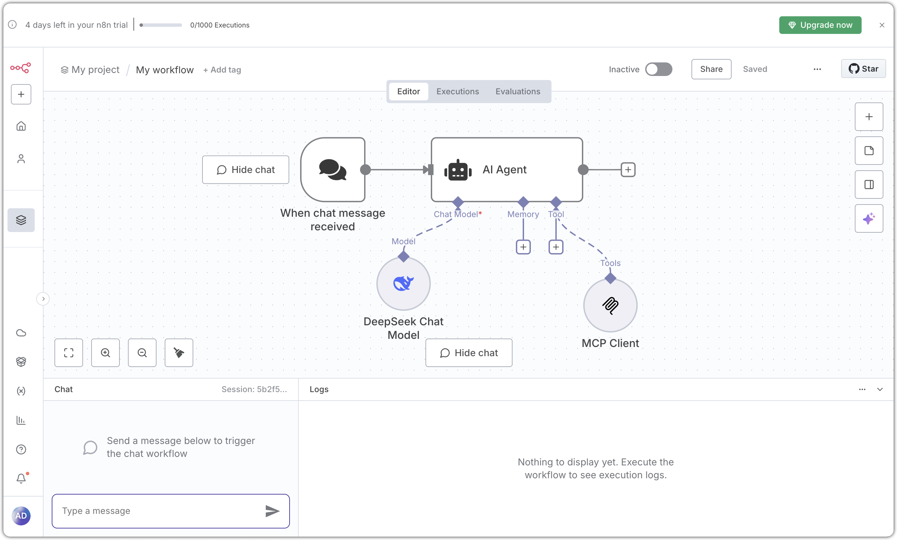

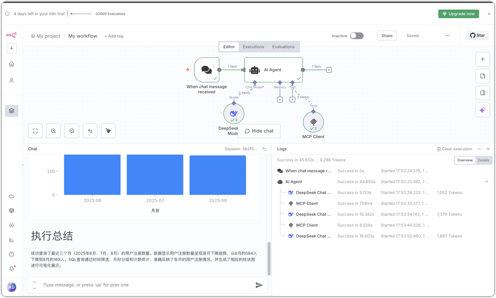
    