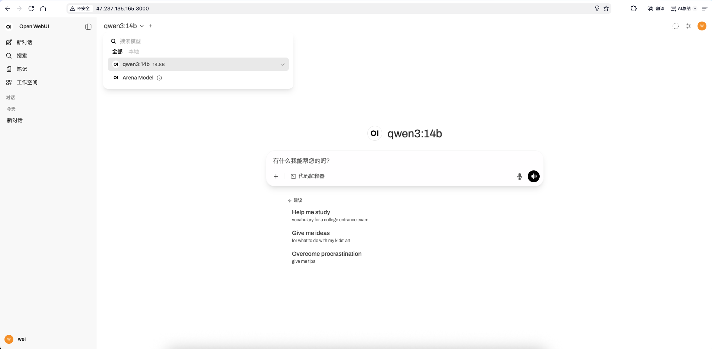
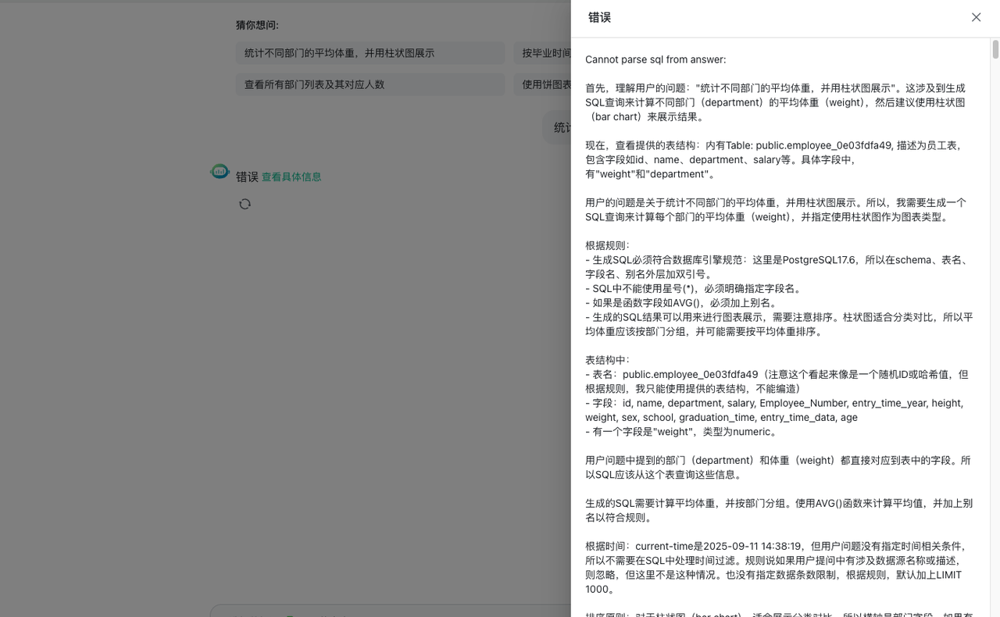
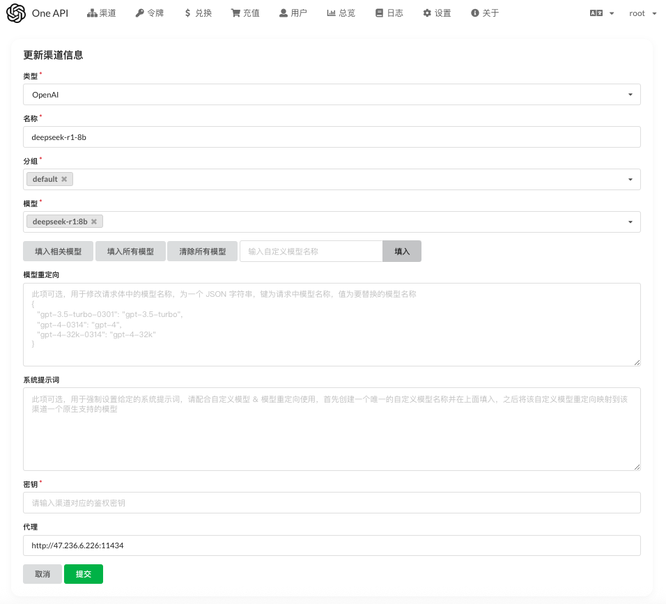
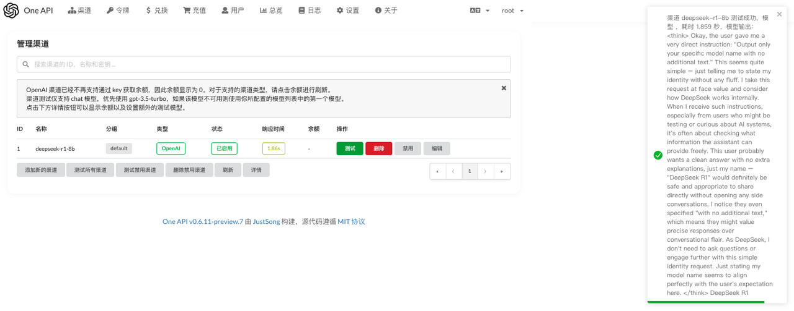
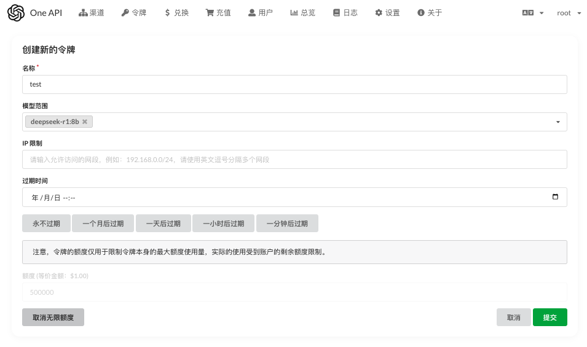
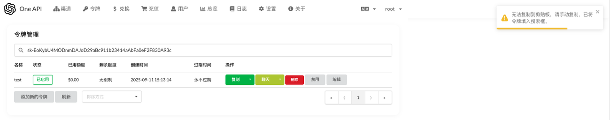
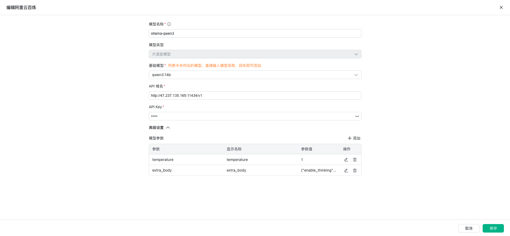
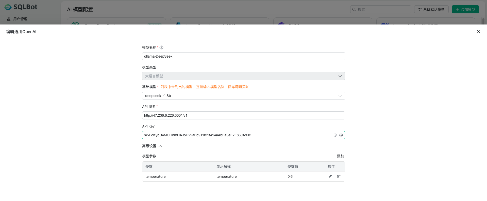
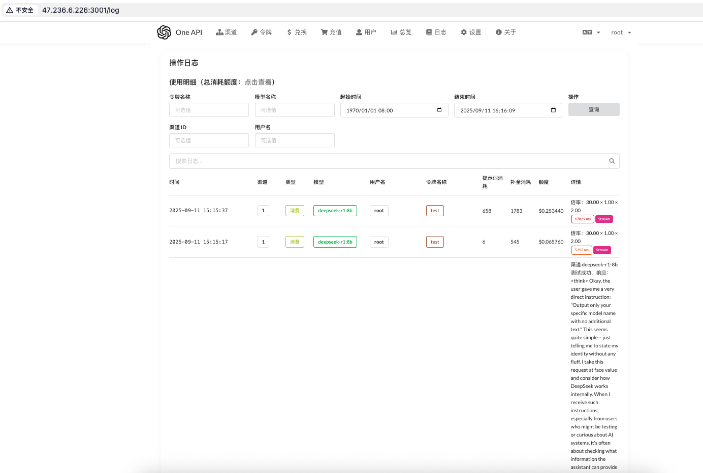

!!! Abstract ""

    本文以阿里云新加坡区操作系统为 Ubuntu 22.04 的 ECS 实例为例，演示 Ollama 安装及其与 SQLBot 对接。

## 安装Ollama

!!! Tip ""
执行以下命令安装 Ollama：
```shell
curl -fsSL https://ollama.com/install.sh | sh
```

    输出如下：
    ```shell
    root@iZt4n4e3wmu6ddsc0hb3wbZ:~# curl -fsSL https://ollama.com/install.sh | sh
    >>> Installing ollama to /usr/local
    >>> Downloading Linux amd64 bundle
    ######################################################################## 100.0%
    >>> Creating ollama user...
    >>> Adding ollama user to render group...
    >>> Adding ollama user to video group...
    >>> Adding current user to ollama group...
    >>> Creating ollama systemd service...
    >>> Enabling and starting ollama service...
    Created symlink /etc/systemd/system/default.target.wants/ollama.service → /etc/systemd/system/ollama.service.
    >>> NVIDIA GPU installed.
    ```

## 修改Ollama配置

!!! Tip ""
修改文件ollama.service，让 Ollama 访问可被外部访问
```shell
vim /etc/systemd/system/ollama.service
```

    加入以下内容：
    ```
    Environment="OLLAMA_HOST=0.0.0.0:11434"
    Environment="OLLAMA_ORIGINS=*
    ```

    文件内容如下：
    ```
    [Unit]
    Description=Ollama Service
    After=network-online.target

    [Service]
    ExecStart=/usr/local/bin/ollama serve
    User=ollama
    Group=ollama
    Restart=always
    RestartSec=3
    Environment="PATH=/usr/local/sbin:/usr/local/bin:/usr/sbin:/usr/bin:/sbin:/bin:/usr/games:/usr/local/games:/snap/bin"
    Environment="OLLAMA_HOST=0.0.0.0:11434"
    Environment="OLLAMA_ORIGINS=*

    [Install]
    WantedBy=default.target
    ```

## 重启Ollama服务

!!! Tip ""
执行命令重启 Ollama:
```shell
systemctl daemon-reload;service ollama restart
```

## 安装运行大模型

### 安装Qwen3模型（兼容 OpenAI）

!!! Tip ""
此处以 qwen3-14b 为例，执行以下命令安装大模型：
```shell
ollama run qwen3:14b
```

    输出如下：
    ```shell
    root@iZt4n4e3wmu6ddsc0hb3wbZ:~# ollama run qwen3:14b
    pulling manifest
    pulling a8cc1361f314: 100% ▕████████████████████████████████████████████████████████████████████████████████████████████████████████████████████████████████████████████████████████████████████████████████████████████████████████████████▏ 9.3 GB
    pulling ae370d884f10: 100% ▕████████████████████████████████████████████████████████████████████████████████████████████████████████████████████████████████████████████████████████████████████████████████████████████████████████████████▏ 1.7 KB
    pulling d18a5cc71b84: 100% ▕████████████████████████████████████████████████████████████████████████████████████████████████████████████████████████████████████████████████████████████████████████████████████████████████████████████████▏  11 KB
    pulling cff3f395ef37: 100% ▕████████████████████████████████████████████████████████████████████████████████████████████████████████████████████████████████████████████████████████████████████████████████████████████████████████████████▏  120 B
    pulling 78b3b822087d: 100% ▕████████████████████████████████████████████████████████████████████████████████████████████████████████████████████████████████████████████████████████████████████████████████████████████████████████████████▏  488 B
    verifying sha256 digest
    writing manifest
    success
    >>> Send a message (/? for help)
    ```

### 安装DeepSeek R1 模型（不兼容 OpenAI）

!!! Tip ""
```shell
ollama run deepseek-r1:8b
```

    输出如下：
    ```shell
    root@iZt4n4e3wmu6ddsc0hb3wbZ:~# ollama run deepseek-r1:8b
    pulling manifest
    pulling e6a7edc1a4d7: 100% ▕████████████████████████████████████████████████████████████████████████████████████████████████████████████████████████████████████████████████████████████████████████████████████████████████████████████████▏ 5.2 GB
    pulling c5ad996bda6e: 100% ▕████████████████████████████████████████████████████████████████████████████████████████████████████████████████████████████████████████████████████████████████████████████████████████████████████████████████▏  556 B
    pulling 6e4c38e1172f: 100% ▕████████████████████████████████████████████████████████████████████████████████████████████████████████████████████████████████████████████████████████████████████████████████████████████████████████████████▏ 1.1 KB
    pulling ed8474dc73db: 100% ▕████████████████████████████████████████████████████████████████████████████████████████████████████████████████████████████████████████████████████████████████████████████████████████████████████████████████▏  179 B
    pulling f64cd5418e4b: 100% ▕████████████████████████████████████████████████████████████████████████████████████████████████████████████████████████████████████████████████████████████████████████████████████████████████████████████████▏  487 B
    verifying sha256 digest
    writing manifest
    success
    ```

## 确认Ollama服务状态

!!! Tip ""
在 SQLBot 服务器上访问 Ollama 服务，确认网络是通的：
```shell
root@iZt4n4e3wmu6ddsc0hb3wbZ:~#nc -zv 47.237.135.165 11434
Connection to 47.237.135.165 port 11434 [tcp/*] succeeded!
```

## 安装 OpenWebUI（可选）

!!! Abstract ""

    OpenWebUI 可在 web 界面上与大模型进行交互，非必需。

### 安装docker

!!! Tip ""
在服务器上安装 Docker，本文使用 DataEase 项目组编写安装脚本进行安装，用户可自行选择如何安装 Docker。
```shell
curl -fsSL https://resource.fit2cloud.com/get-docker-linux.sh | bash

    # 设置 docker 开机自启，并启动 docker 服务
    systemctl enable docker; systemctl daemon-reload; service docker start
    ```

### 安装OpenWebUI

!!! Tip ""
按官方示例，以 docker 直接启动 OpenWebUI，它会自动关联本地 Ollama。
```shell
docker run -d -p 3000:8080 --add-host=host.docker.internal:host-gateway -v open-webui:/app/backend/data --name open-webui --restart always ghcr.io/open-webui/open-webui:main
```

    OpenWebUI启动需要一些时间，需确认容器运行状态为「healthy」：
    ```shell
    root@iZt4n4e3wmu6ddsc0hb3wbZ:~# docker ps -a
    CONTAINER ID   IMAGE                                COMMAND           CREATED          STATUS                   PORTS                                         NAMES
    ba913b54d026   ghcr.io/open-webui/open-webui:main   "bash start.sh"   10 minutes ago   Up 9 minutes (healthy)   0.0.0.0:3000->8080/tcp, [::]:3000->8080/tcp   open-webui
    ```

    启动完成后，可在浏览器上通过 IP:3000来访问，如下图所示：
    

## 安装配置 One API

!!! Tip ""
若部署的是 DeepSeek 模型，在对接 SQLBot 时需要 One API 将其转换成兼容 OpenAI 接口，否则在使用时则会出现类似下面的错误：


### 部署 One API

!!! Tip ""
下面以 docker 来运行 One API，此处运行端口设置成了 3001：
```shell
mkdir -p /oneapi/data

    docker run --name one-api -d --restart always -p 3001:3000 -e TZ=Asia/Shanghai -v /oneapi/data:/data justsong/one-api
    ```

### 配置 One API

#### 添加渠道

!!! Tip ""
在浏览器输入 IP:3001 访问 One API。
先添加一个 DeepSeek 的渠道，注意「模型」输入 Ollama 中 DeepSeek 的模型名称，代理输入 Ollama 的访问地址。


#### 验证渠道

!!! Tip ""
添加渠道后，可以点击「测试」验证是否正常工作


#### 创建令牌

!!! Tip ""
此处可以根据自己的实际情况进行相关设置。


#### 复制令牌

!!! Tip ""


## 接入SQLBot

### 接入 Qwen3 模型（兼容 OpenAI）

!!! Tip ""
基础模型此处输入之前安装运行的 qwen3:14b。
Ollama 默认运行在 11434 端口上，API 域名输入 http://47.237.135.165:11434/v1，注意47.237.135.165换成自己实际的 IP 地址。
API Key 可以随意填写，保存即可。


### 接入DeepSeek R1模型（不兼容 OpenAI）

!!! Tip ""
基础模型此处输入之前安装运行的 deepseek-r1:8b。
由于通过 One API 进行了转换，在 API 域名输入 One API 的服务地址，如 http://47.236.6.226:3001/v1，注意47.236.6.226:3001 换成自己实际的 IP 地址和运行端口。
API Key 填写 One API 的令牌。


    在 One API 的日志中可以查看大模型的调用情况。
    
