## 1 快速部署

!!! Tip ""
    可以通过 1Panel 应用商店快速安装 SQLBot：

    ```
    http://目标服务器 IP 地址:8000

    用户名：admin

    默认密码：SQLBot@123456
    ```
    
    注意：需要先在 1Panel 中安装好所需的 PostgreSQL 数据库（17.5 版本）。

## 2 界面介绍

!!! Tip ""
    SQLBot 到主界面导航栏，包含四大核心模块：【智能问数】、【数据源】、【仪表板】和【设置】。

    左侧为功能导航区域支持模块间的快速切换，并显示当前所在的工作空间,若用户拥有多个空间权限，还可在此处进行空间切换。


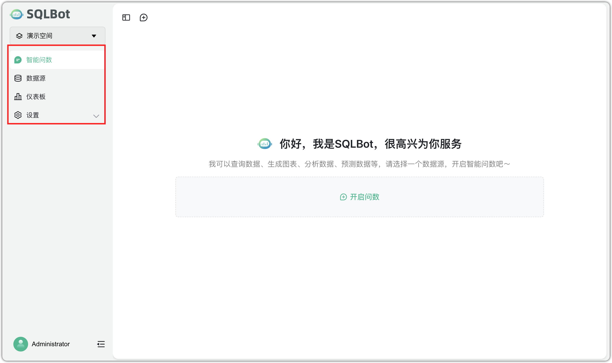


!!! Tip ""

    === "智能问数"

        支持用户通过自然语言提问的方式，与 AI 模型进行对话，自动分析并返回可视化图表。

        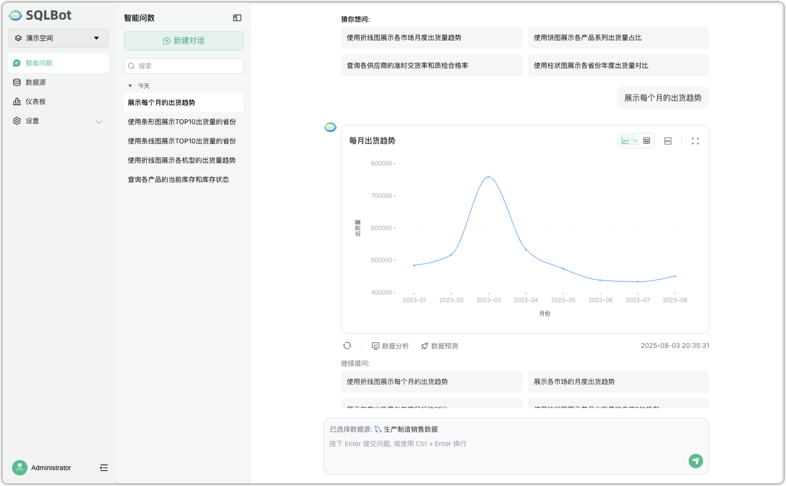


    === "数据源"

        支持配置并管理数据来源，可对接 Excel/CSV、数据库等多种类型。

        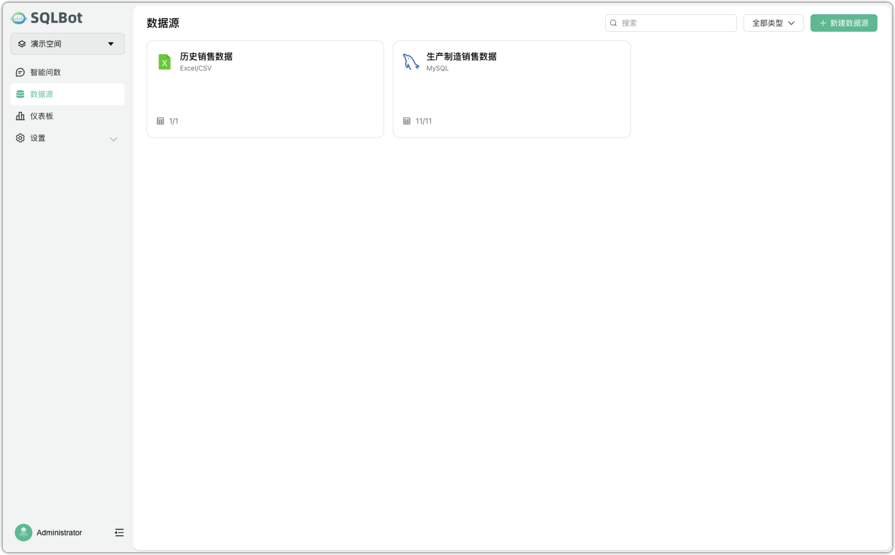

    === "仪表板"

        支持构建自定义可视化数据看板，将对话中的图表整合布局，进行业务展示与数据监控。

         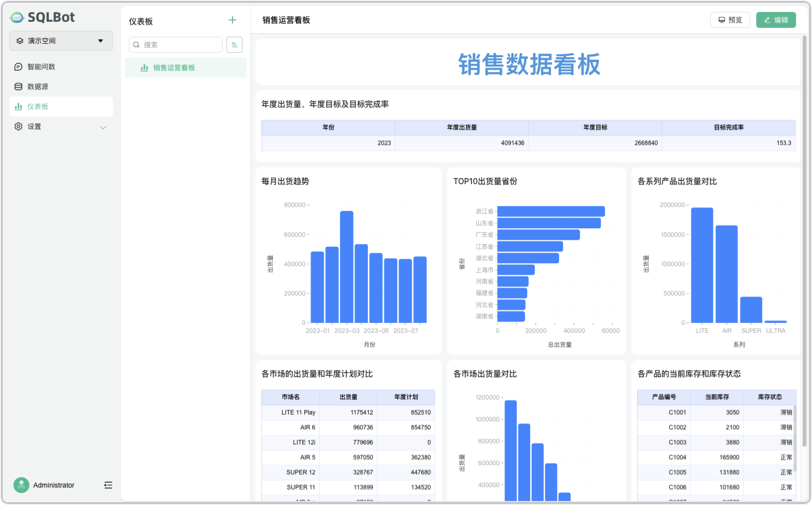

    === "设置"

        支持管理员进行成员管理、权限配置管理功能（仅管理员可见）。

         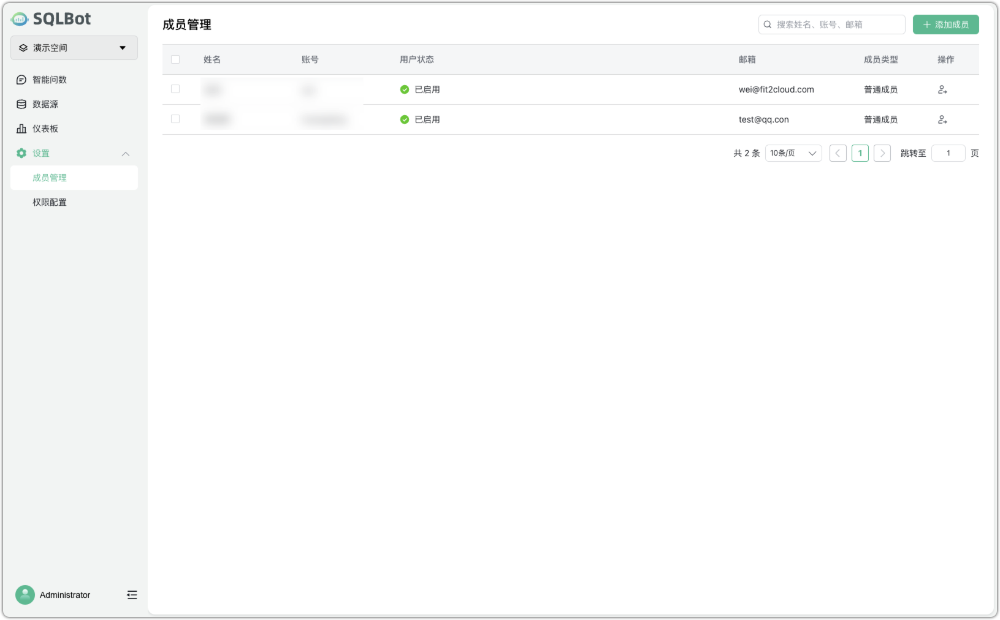

## 3 快速上手

!!! Abstract ""
    SQLBot 是一款基于大语言模型的智能问数系统，用户只需配置模型和数据源，即可通过自然语言提问，快速获取可视化数据结果。下面是核心功能配置和使用。


### 3.1 配置 AI 模型

!!! Abstract ""
    以 admin 用户登录后，进入【系统管理】→【AI 模型配置】，点击【添加模型】选择模型供应商，填写模型相关参数后点击【保存】。如有多个模型，可设置默认使用的模型。

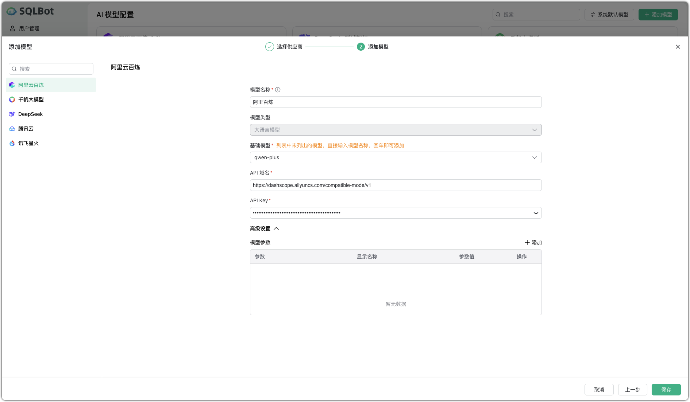

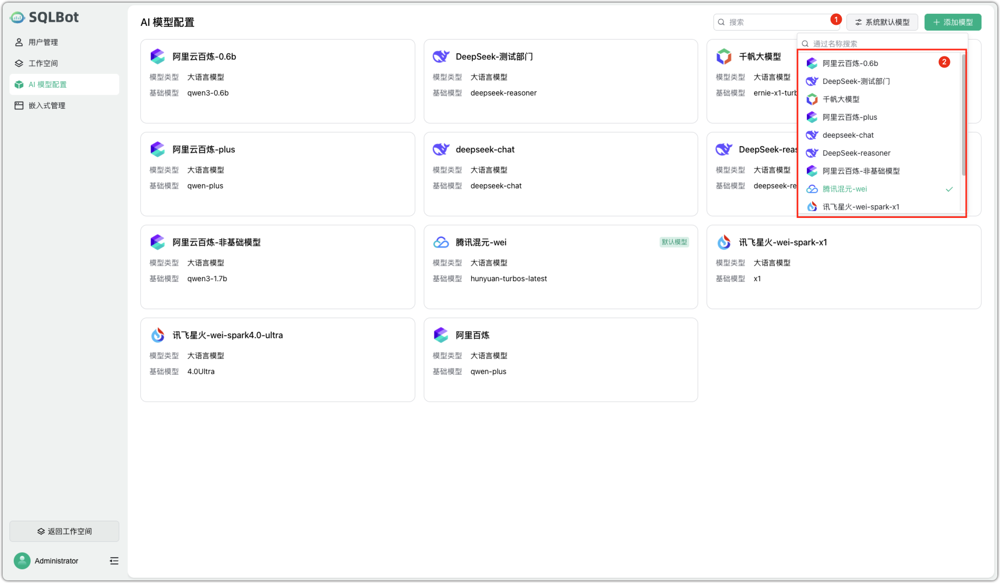

### 3.2 创建数据源

!!! Abstract ""

    切换到数据源菜单，新建一个数据源链接。

    如类型选择 "MySQL"，名称为 "生产制造销售数据"，主机名 "10.123.22.252"，数据库名 "zizhaoye"，用户名 "root"，密码 "Password123@mysql" 检验通过后点击保存即可。

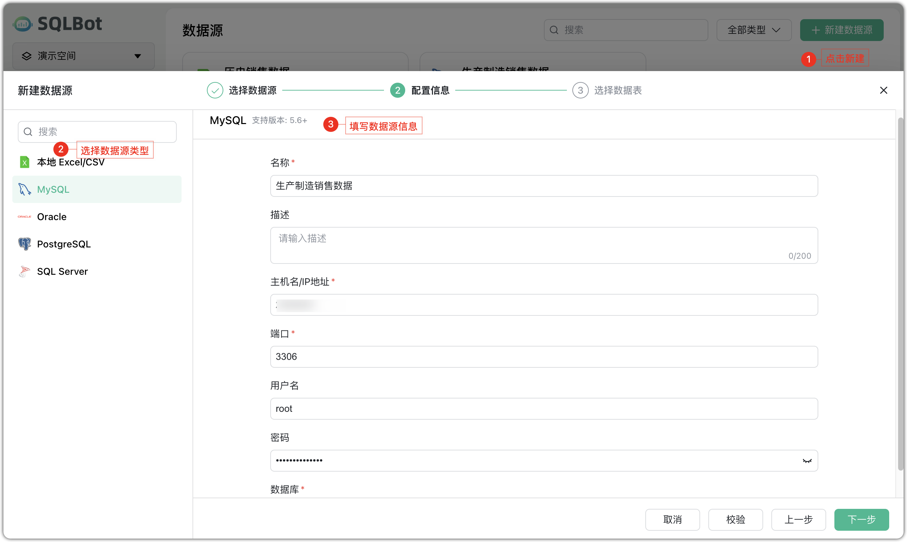


### 3.3 开启智能问数

!!! Abstract ""
    可以在数据源卡片上点击【开启问数】，或者切换到智能问数菜单。

    可选择推荐问题或直接输入问题。模型生成图表后，可查看明细数据和 SQL 查询语句，支持继续提问、进行数据分析或预测，也可更换图表类型或重新生成图表。

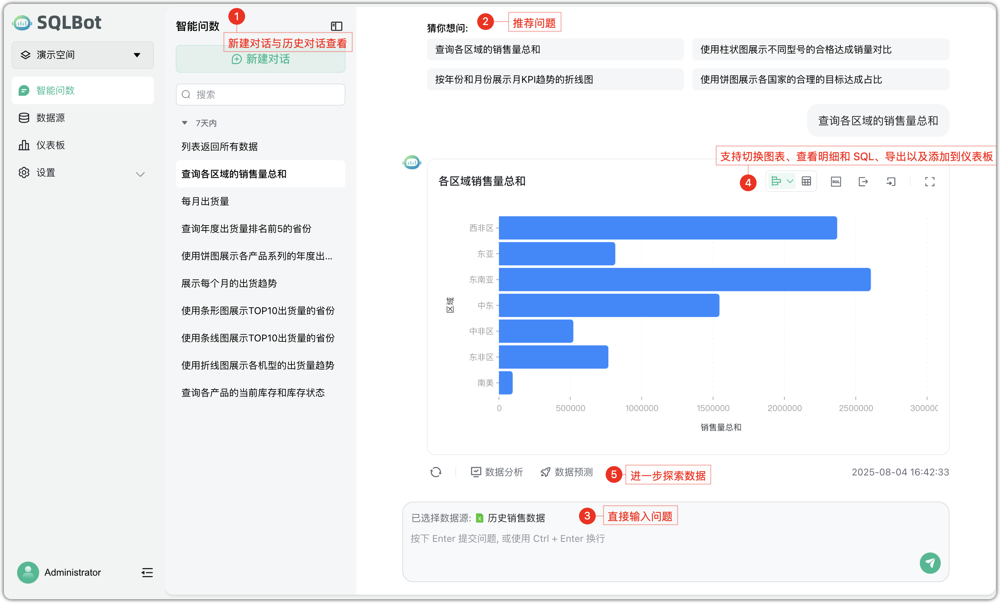


### 3.4 搭建仪表板

!!! Abstract ""
    将问数对话中生成的图表整理成一个仪表板，支持自由拖动、调整大小，方便集中查看。

    新建仪表板时，可添加图表、文字说明或 Tab 组件，实现信息的清晰展示和查看。

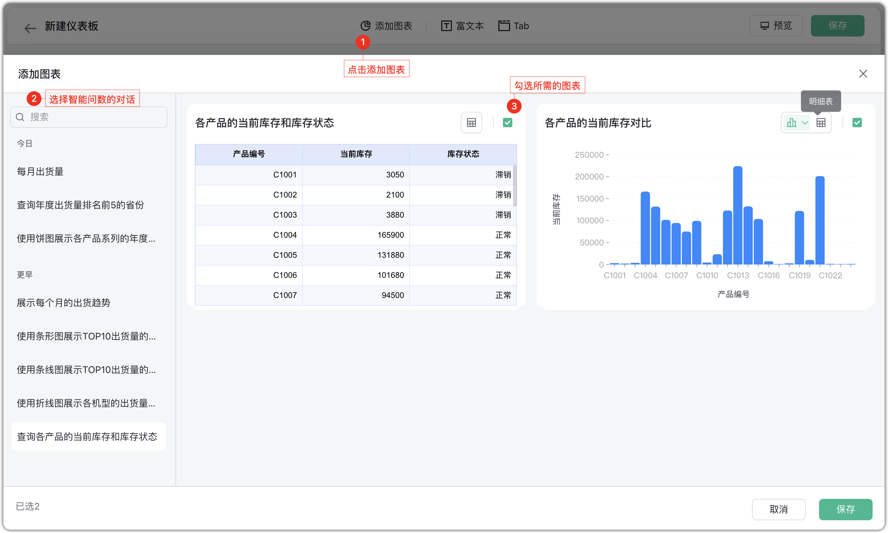

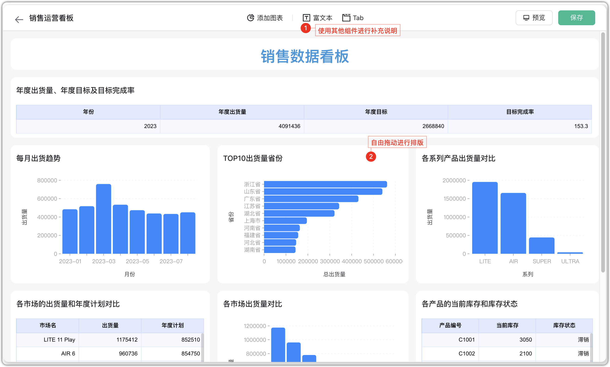


    


