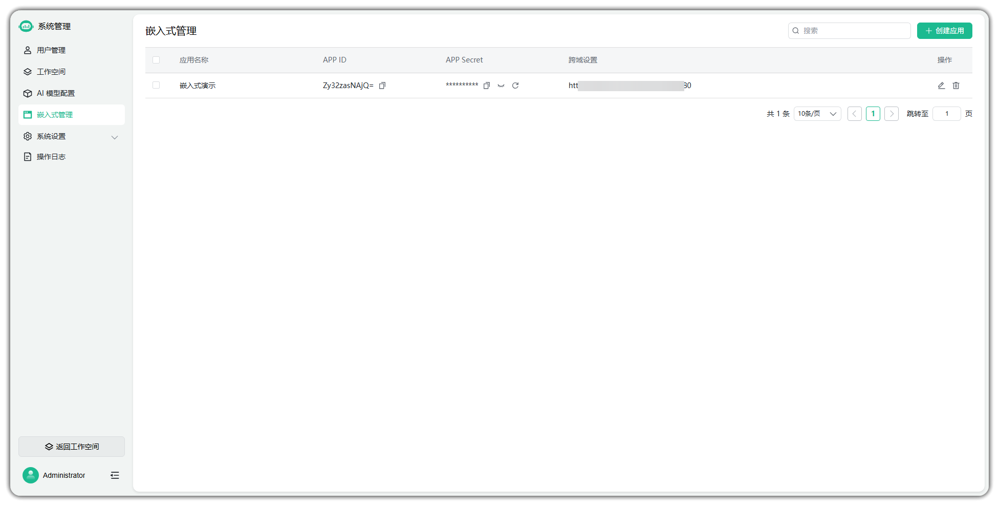
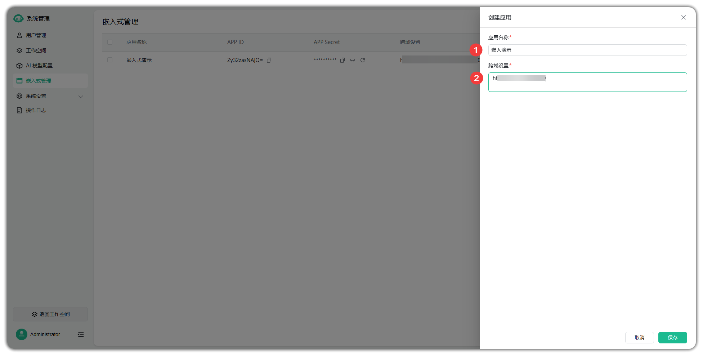
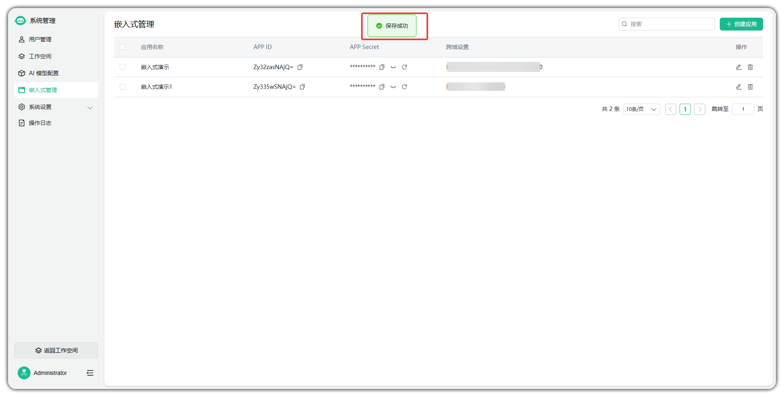

!!! Abstract ""
    嵌入式管理创建嵌入式应用。

!!! Abstract ""
    创建嵌入式应用配置项如下：

    - 【序号 1】应用名称：自定义；
    - 【序号 2】跨域设置：在使用嵌入式时遇到跨域问题时，可以通过设置目标系统的域名进行跨域设置。

!!! Abstract ""
    创建完嵌入式应用后，可以获取到该应用对应的 APP ID 和 APP Secret（**嵌入式对接时需要用到**）。
