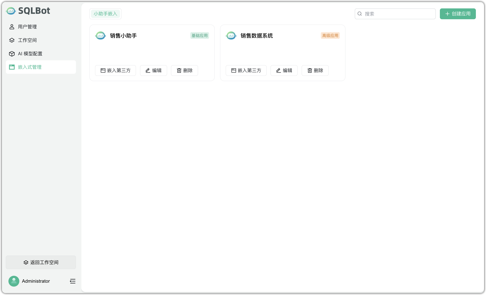
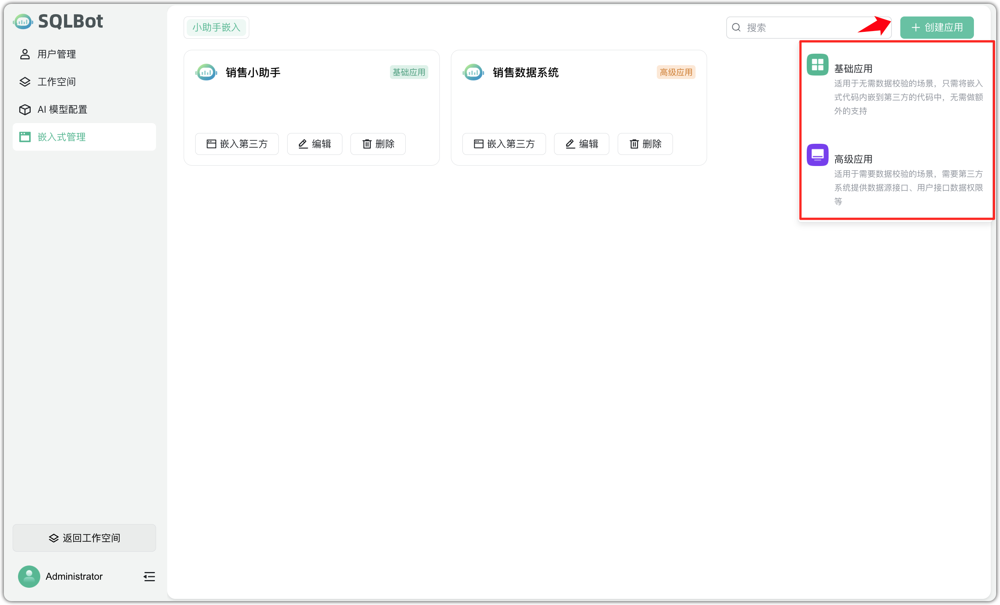
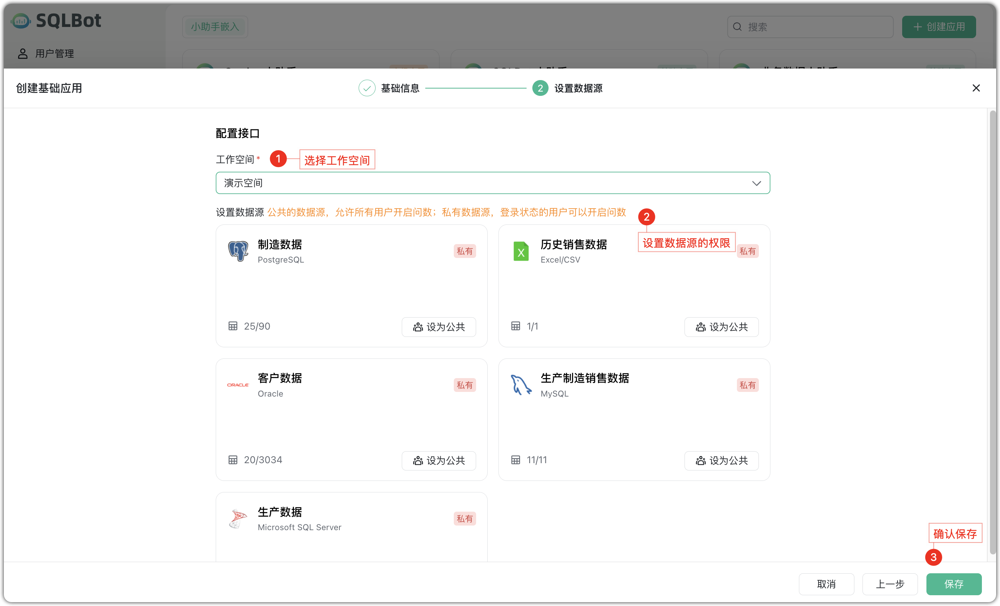
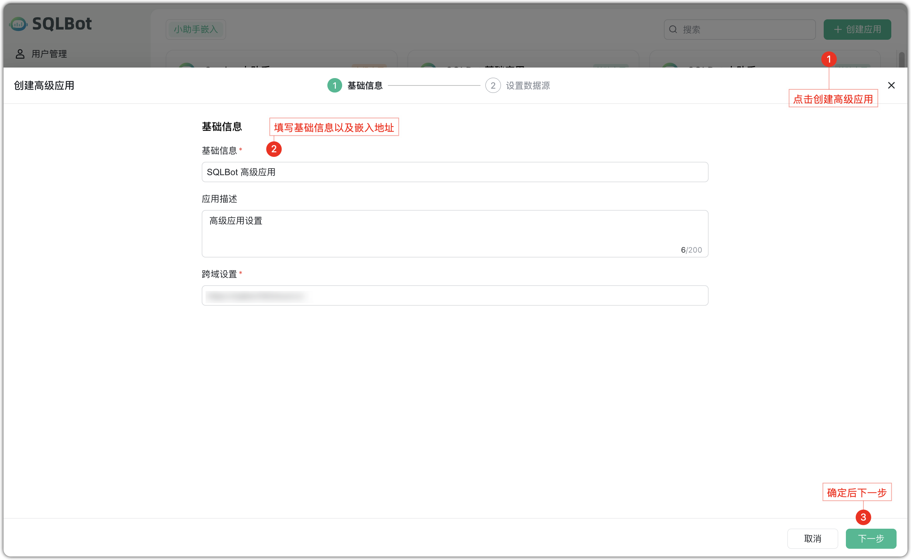
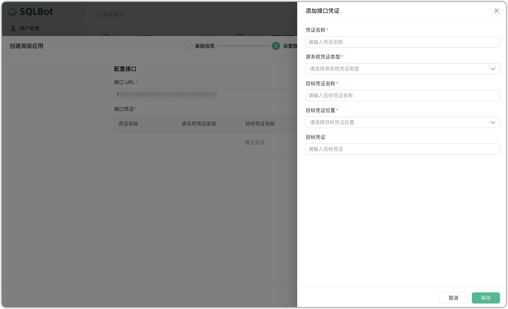
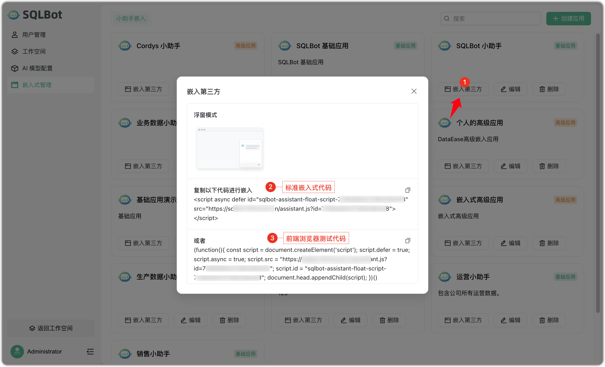
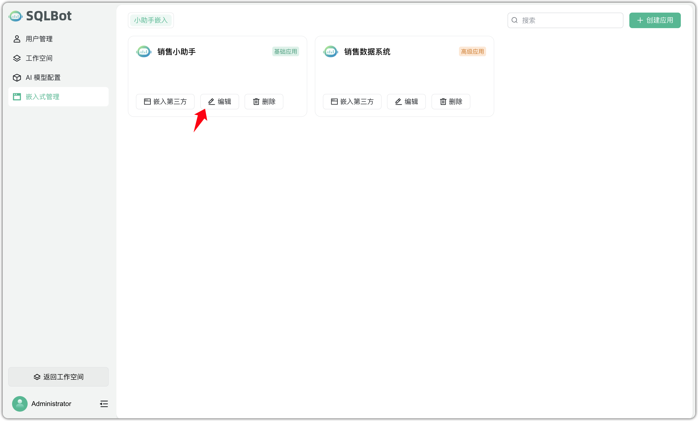
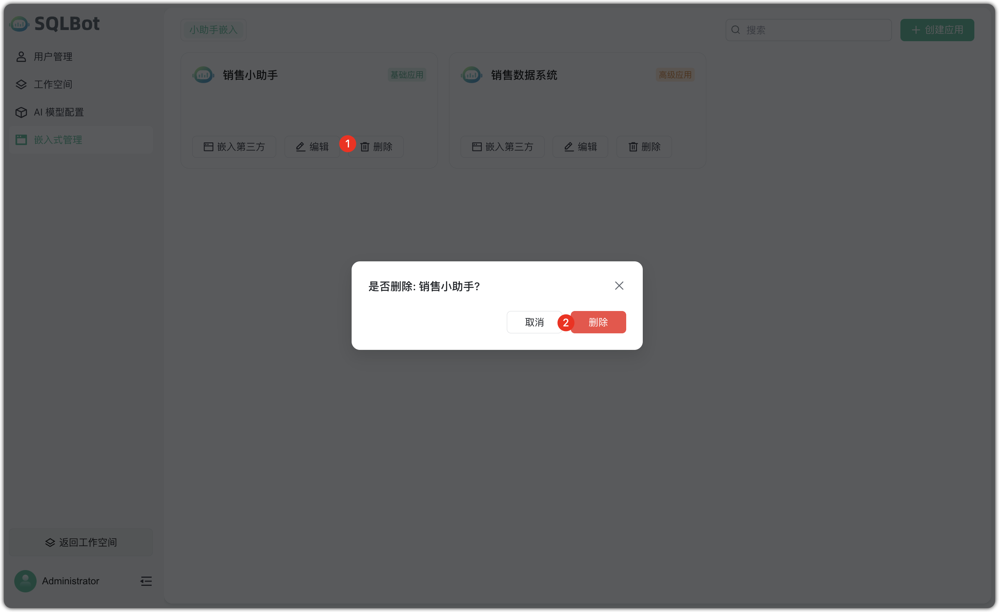
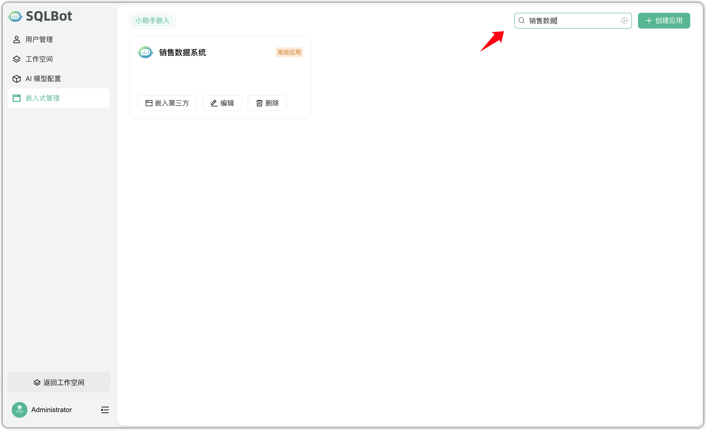

## 1 功能概述

!!! Abstract ""
    SQLBot 支持通过【小助手】的方式将智能问数能力嵌入到外部系统页面中，用户可直接在嵌入页面中，通过自然语言提问并获取基于业务数据的实时分析结果。

    系统提供【基础应用】与【高级应用】两类嵌入模式，满足从快速部署到精细权限管控的不同集成需求。

## 2 应用类型与配置

### 2.1 基础应用
!!! Abstract ""
    基础应用支持快速嵌入 SQLBot 功能：

    - 免后端对接：无需业务系统提供接口；

    - 数据权限设置简单：通过配置“公共数据源”或“私有数据源”进行资源隔离；

    适用场景：数据权限要求不高的页面，如运营看板、知识库、内网主页等。

### 2.2 高级应用
!!! Abstract ""
    高级应用适用于数据权限需由业务系统严格控制的复杂场景：

    接入模式：SQLBot 向业务系统传递用户标识，业务系统返回用户可访问的数据源列表；

    适用场景：企业管理系统、客户门户、需要按用户数据隔离的 B2B 系统等。

### 2.3 嵌入代码获取
!!! Abstract ""
    每个应用创建成功后，系统会自动生成可嵌入前端的 JavaScript 代码：

    - 标准嵌入代码：供业务系统开发者将问数小助手嵌入至目标页面；

    - 浏览器测试代码：支持在浏览器控制台快速运行测试，验证集成效果。

## 3 应用管理功能
!!! Abstract ""
    在应用上点击【编辑】按钮，可进入应用详情页，修改名称、描述、跨域设置、数据源配置等内容。保存后立即生效。

!!! Abstract ""
    点击【删除】按钮后，系统将弹出确认框。确认后，该应用将被彻底移除，嵌入代码失效。

!!! Abstract ""
    在页面右上角的搜索栏中输入应用名称关键词，系统将筛选展示符合条件的应用，支持快速定位和管理。

