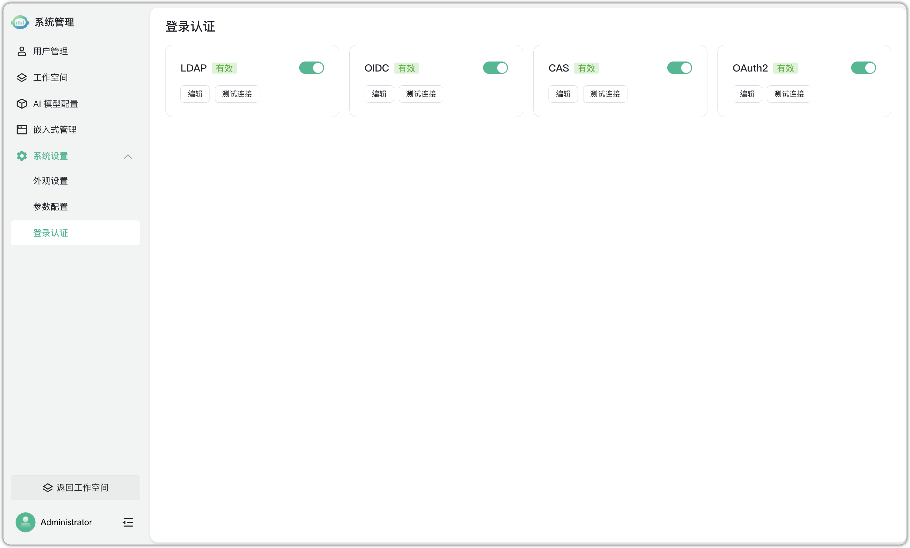
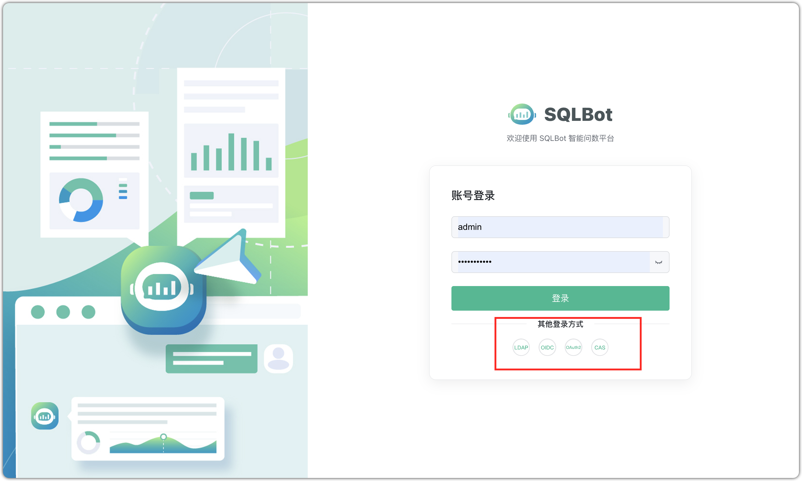
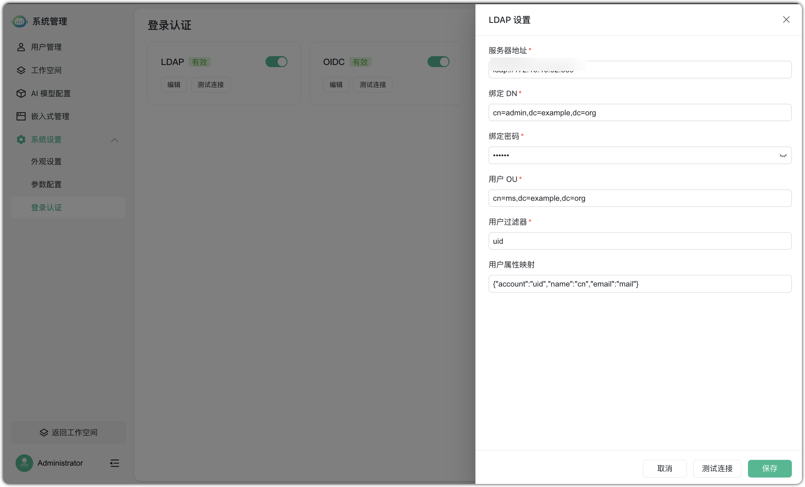
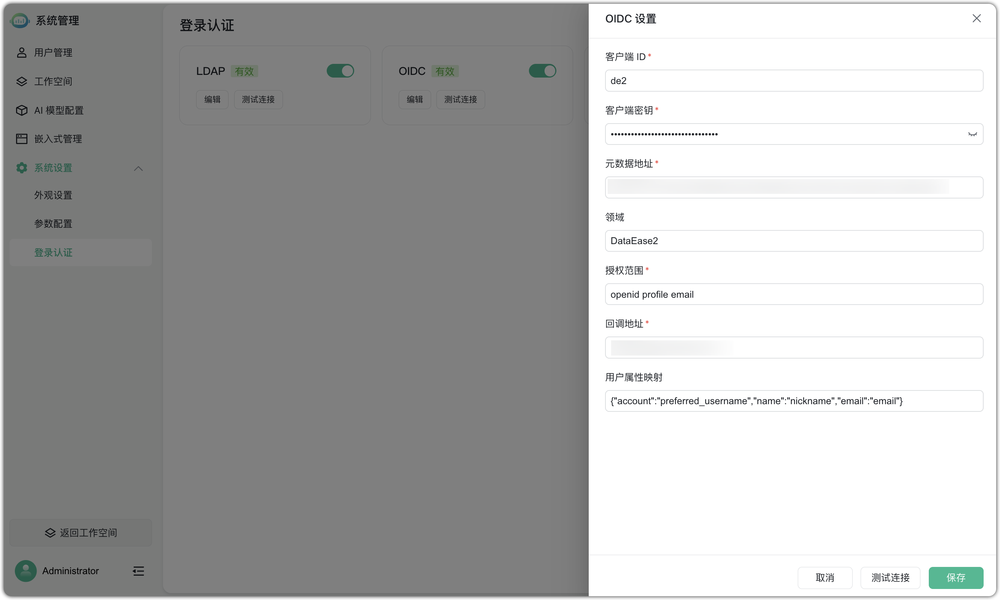
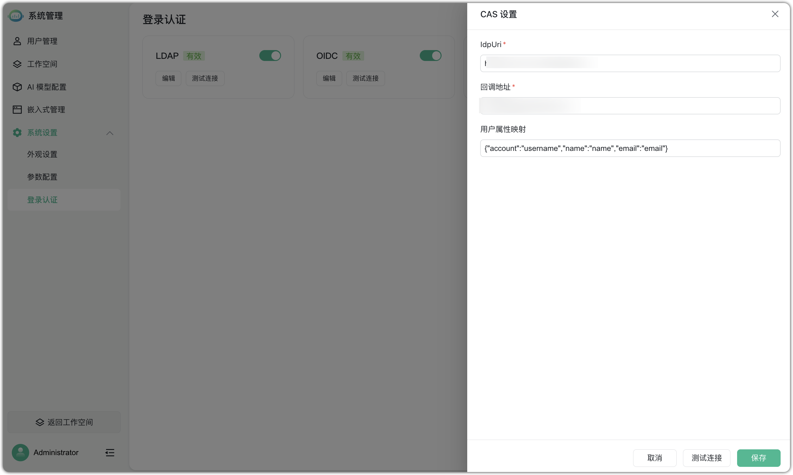
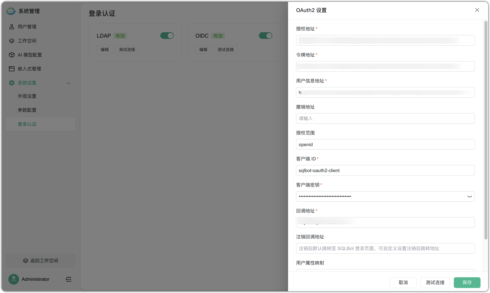

# 登录认证

!!! Abstract ""
    支持在系统设置中进行 LDAP、OIDC、CAS、OAuth2 配置，开启此功能跳转到登录页面即可使用相应方式登录。

!!! Abstract ""
    LDAP 配置信息。

!!! Abstract ""
    OIDC 配置信息。

!!! Abstract ""
    CAS 配置信息。

!!! Abstract ""
    OAuth2 配置信息。

