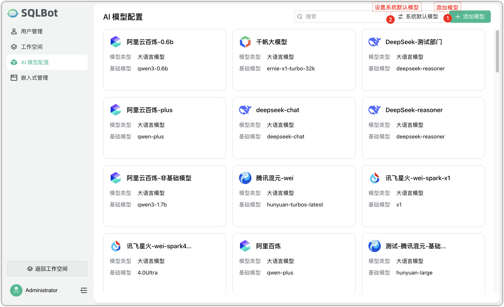
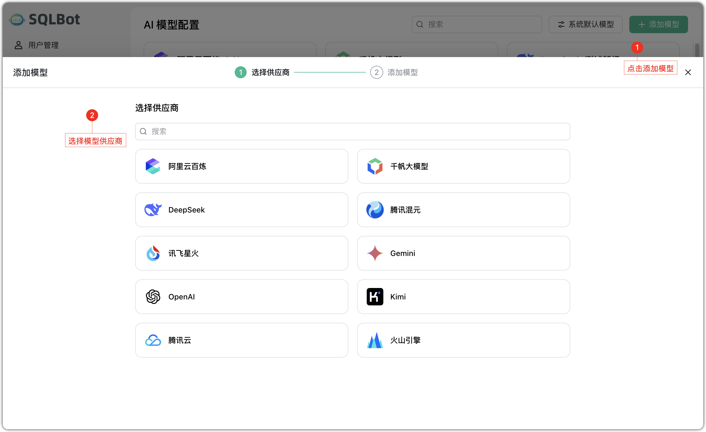
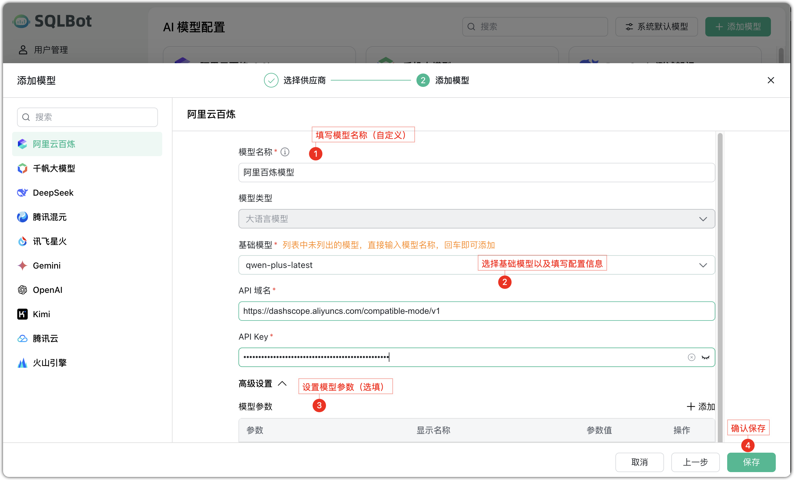
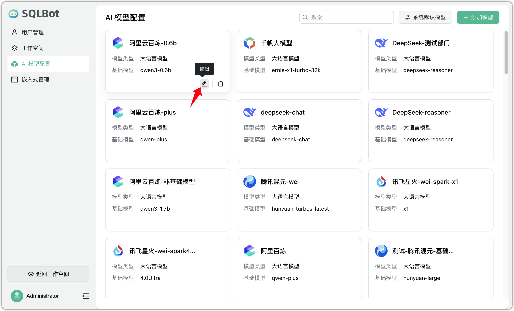
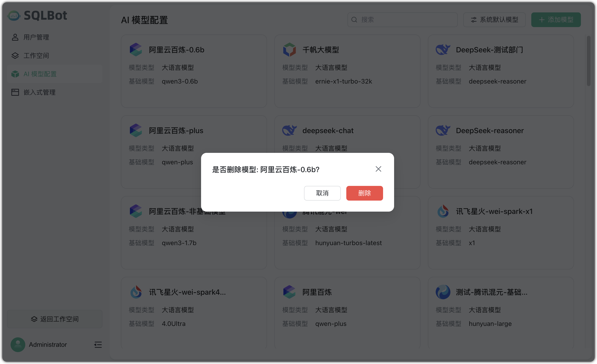
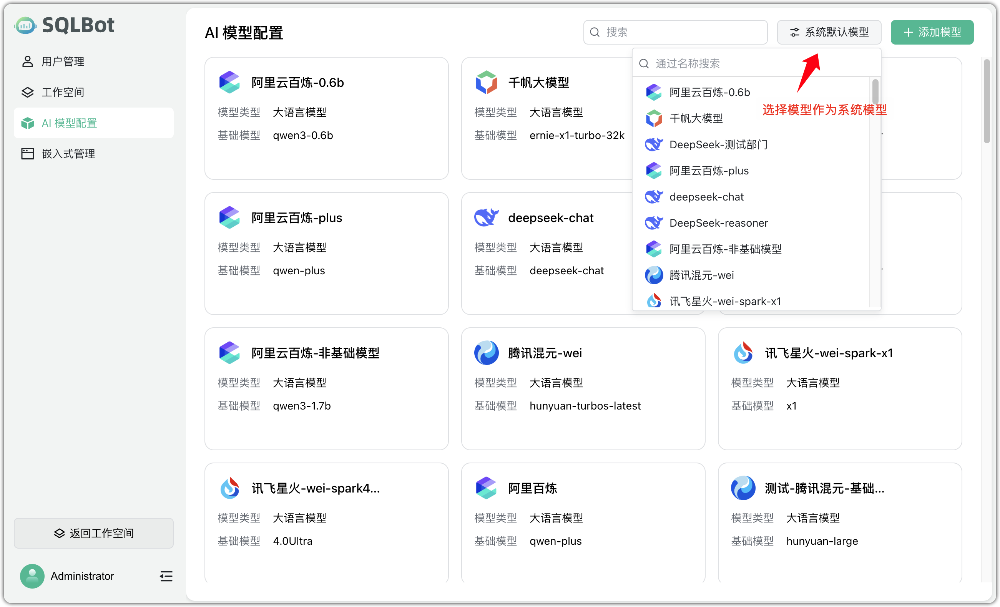

# AI 模型配置

## 1 功能概述

!!! Abstract ""
    SQLBot 支持集成主流大语言模型（LLM），如 DeepSeek、阿里云百炼、百度千帆等，用户可在系统中配置模型接入信息，实现基于自然语言的智能问数能力。

    模型配置集中在【AI 模型配置】页面进行管理，支持添加、编辑、删除模型，以及设置默认模型，用于控制智能问数时的底层模型调用逻辑。

## 2 模型管理

### 2.1 添加模型

!!! Abstract ""
    点击【添加模型】，可选择模型提供商（如 DeepSeek、阿里云百炼等），填写模型名称、基础模型类型、API 地址、Key、模型参数（如温度、最大响应长度等）后保存，即可完成配置。

    模型参数需与所接入平台保持一致，确保调用成功。

### 2.2 编辑模型
!!! Abstract ""
    已配置的模型支持随时调整参数，点击【编辑】可修改模型名称、API Key、地址及模型参数等信息，保存后生效。

    建议在不影响当前业务使用的情况下进行编辑操作。

### 2.3 删除模型

!!! Abstract ""
    如某模型已废弃或不再使用，点击【删除】确认后移除。删除后该模型将不可被问数功能调用。

### 2.4 系统默认模型

!!! Abstract ""
    当系统配置了多个模型时，可在页面右上角点击【系统默认模型】，从下拉列表中选择一个模型作为默认使用模型。

    默认模型将作为 SQLBot 智能问数时的首选调用对象，直接影响问数结果表现。切换默认模型后立即生效，建议结合模型质量与稳定性做出选择。

