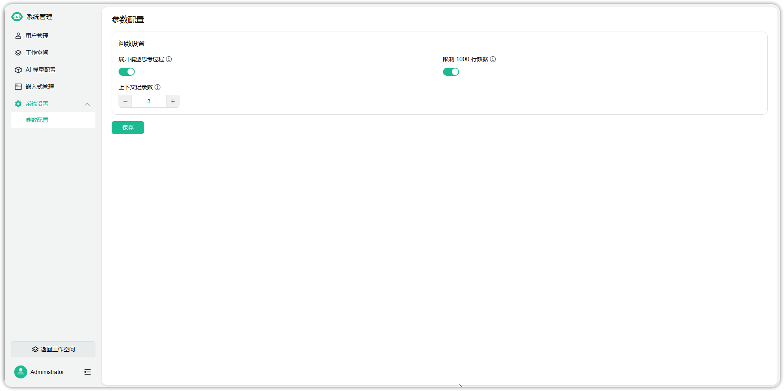
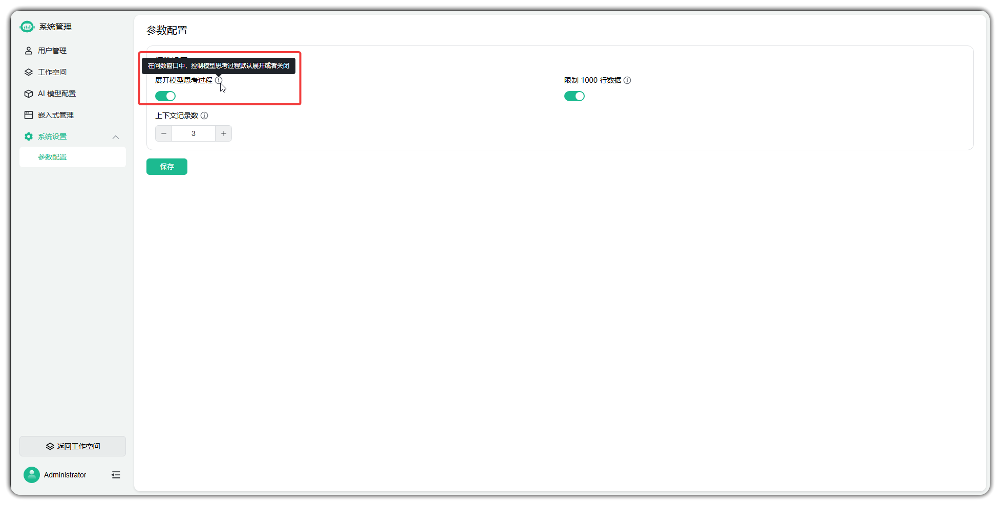
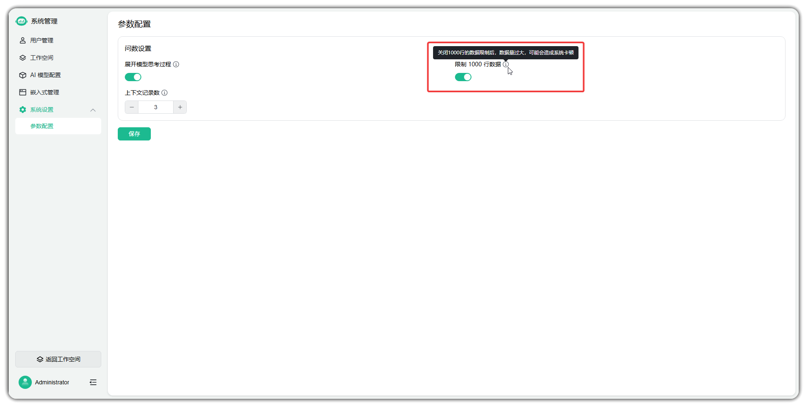
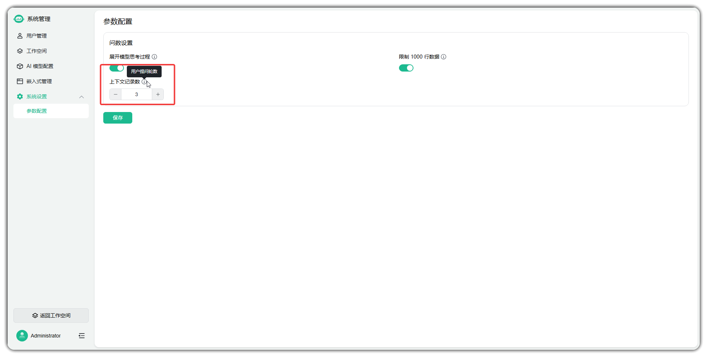

# 参数设置

!!! Abstract ""
    在系统设置中，参数设置用于统一管理与 SQLBot 运行相关的全局参数，
    以 `admin` 管理员账号登录平台后，依次点击【设置】 → 【系统管理】 → 【系统设置】 → 【参数设置】进入功能页面。

###  问数设置

!!! Abstract ""
    问答设置用于控制 SQLBot 在对话问答时的行为，包括是否展示思考过程、上下文记忆条数以及单次返回的数据量限制。

    - 在问数窗口中，控制模型思考过程默认展开或者关闭；

    - 支持关闭1000行的数据限制；

    - 更改上下文记录数,控制用户上下文记录轮数；

