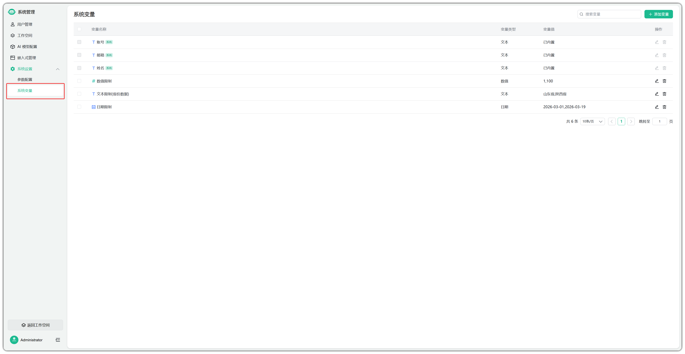
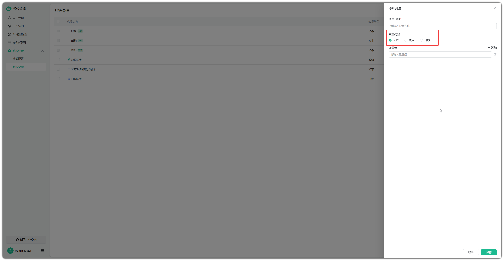
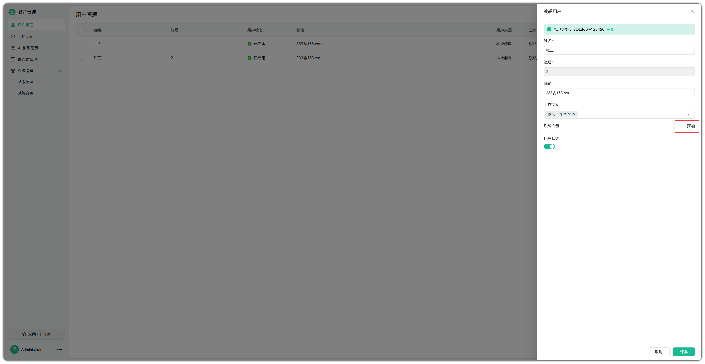
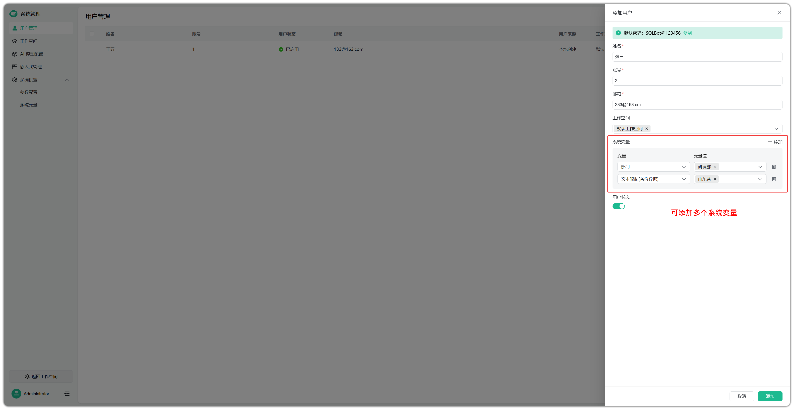
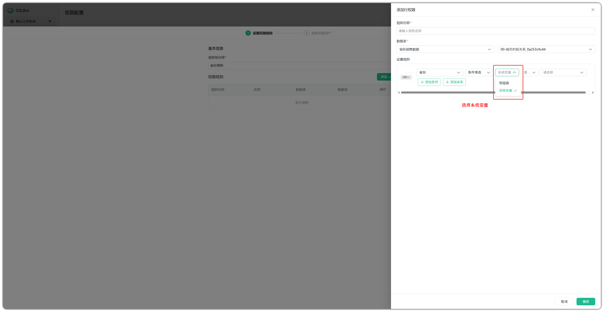
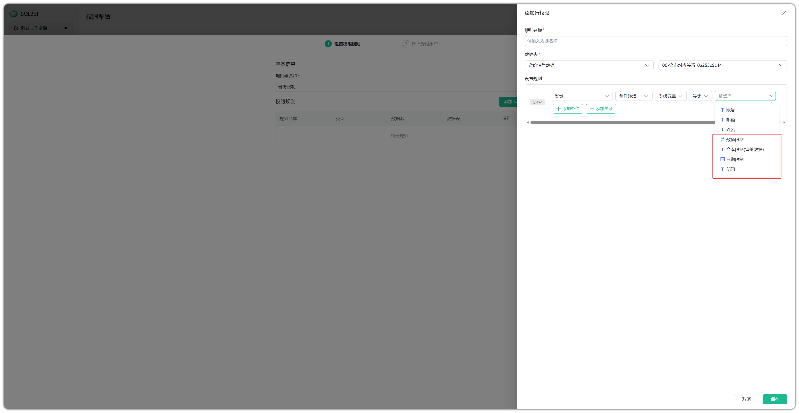

!!! Abstract ""
    系统管理员可以使用【系统变量】模块，在该模块中为全局添加自定义变量。

!!! Abstract ""
    变量分为三种类型：

    - 文本
    - 数值
    - 日期

    系统管理员可以为文本型变量添加可选值，为数值和日期类型变量设置范围值。

!!! Abstract "" 
    系统管理员设置好系统变量后，可以为管理员与成员配置这些系统变量。

!!! Abstract "" 
    系统管理员与管理员在权限配置的行权限时，除了系统内置的变量外，可以使用这些自定义的系统变量。

