## 1 功能概述

!!! Abstract ""
    SQLBot 支持通过【小助手】的方式将智能问数能力嵌入到外部系统页面中，用户可直接在嵌入页面中，通过自然语言提问并获取基于业务数据的实时分析结果。

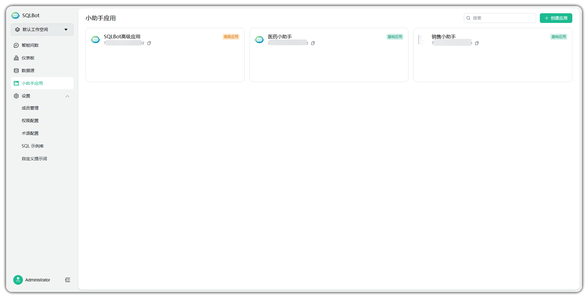

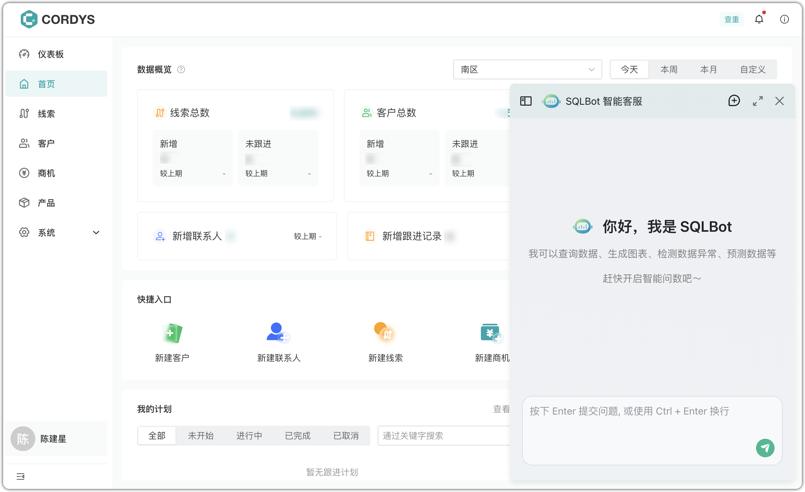

## 2 应用类型与配置
!!! Abstract ""
    系统提供【基础应用】与【高级应用】两类嵌入模式，满足从快速部署到精细权限管控的不同集成需求。

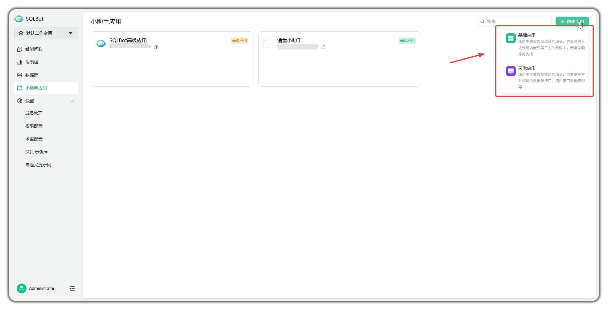

### 2.1 基础应用
!!! Abstract ""
    基础应用支持快速嵌入 SQLBot 功能：

    - 免后端对接：无需业务系统提供接口；

    - 数据权限设置简单：通过配置“公共数据源”或“私有数据源”进行资源隔离；

    适用场景：数据权限要求不高的页面，如运营看板、知识库、内网主页等。

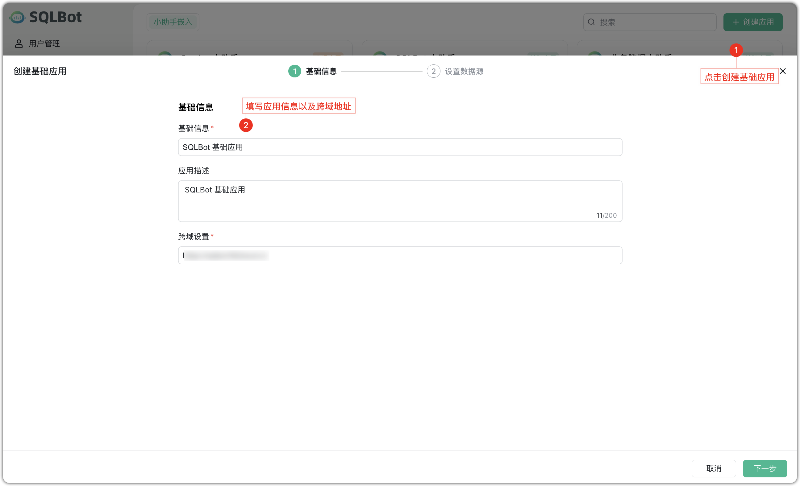

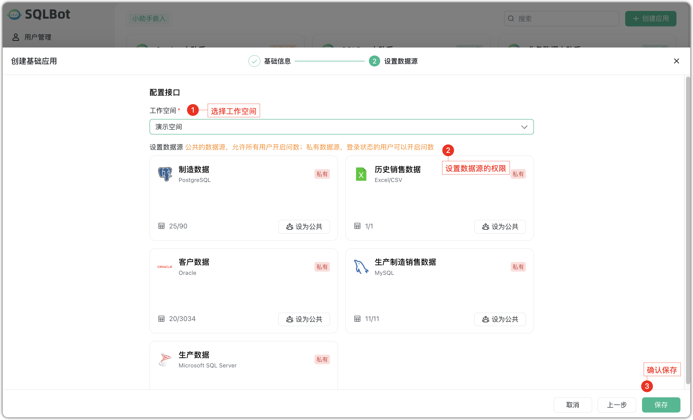

### 2.2 高级应用
!!! Abstract ""
    高级应用适用于数据权限需由业务系统严格控制的复杂场景：

    接入模式：SQLBot 向业务系统传递用户标识，业务系统返回用户可访问的数据源列表；

    适用场景：企业管理系统、客户门户、需要按用户数据隔离的 B2B 系统等。

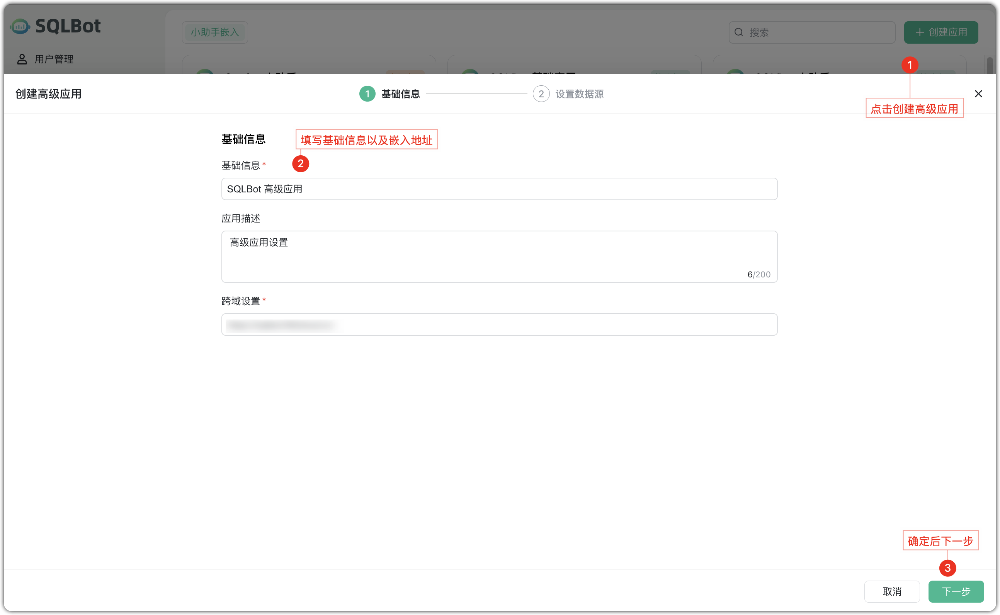

!!! Abstract ""
    在接口地址配置完成后，点击【添加接口凭证】，进入如下配置窗口。

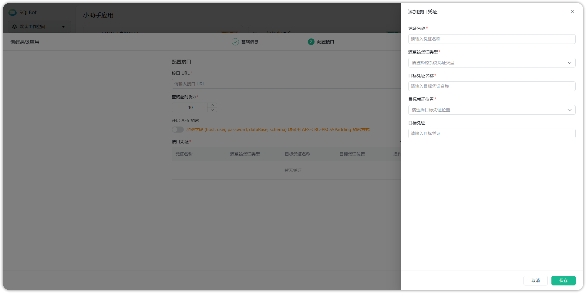

!!! Abstract ""
    配置流程：

    - 输入接口 URL：用于配置外部系统提供的接口地址。通过接口获取数据源信息、表的元数据信息、数据的过滤规则和虚拟表信息等。

    - 查询超时: 接口调用超时时间，单位为秒。

    - 开始 AES 加密：是否对接口返回的数据进行 AES 加密。

    - 添加接口凭证：
        - 凭证名称：自定义命名，用于标识该凭证，方便后续管理和使用。
        - 源系统凭证类型：获取目标系统认证信息的方式，如localstorage、custom、cookie 等，用于接口调用时的身份认证。
        - 目标凭证名称：目标系统中认证信息的名称，例如 "sessionId" 等。
        - 目标凭证位置：获取的认证信息在请求中的放置的位置，如 Header、Cookie、Param。
        - 目标凭证：具体的凭证值，填写后系统会根据配置在请求时自动带上，一般无需填写，系统自动按类型获取。

### 2.3 嵌入代码获取
!!! Abstract ""
    每个应用创建成功后，系统会自动生成可嵌入前端的 JavaScript 代码：

    - 标准嵌入代码：供业务系统开发者将问数小助手嵌入至目标页面；

    - 浏览器测试代码：支持在浏览器控制台快速运行测试，验证集成效果。

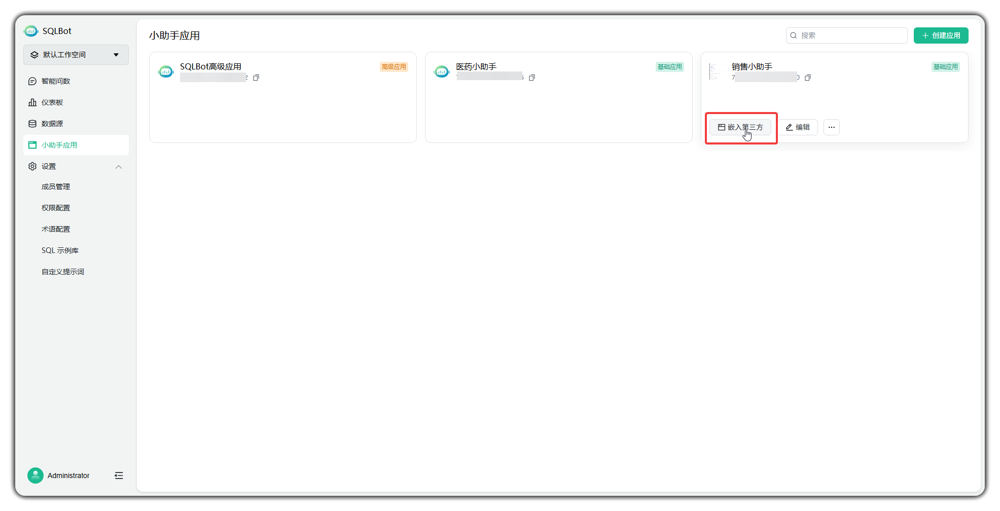

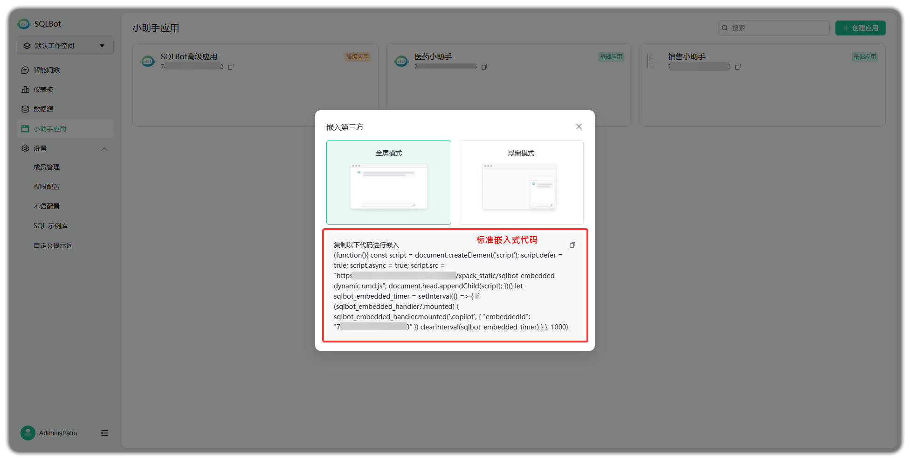

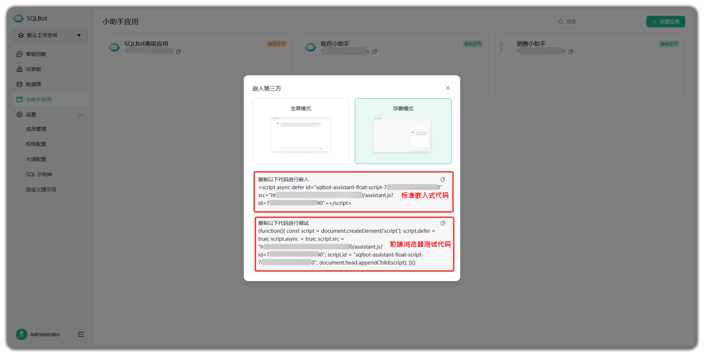

## 3 应用管理功能
!!! Abstract ""
    在应用上点击【编辑】按钮，可进入应用详情页，修改名称、描述、跨域设置、数据源配置等内容。保存后立即生效。

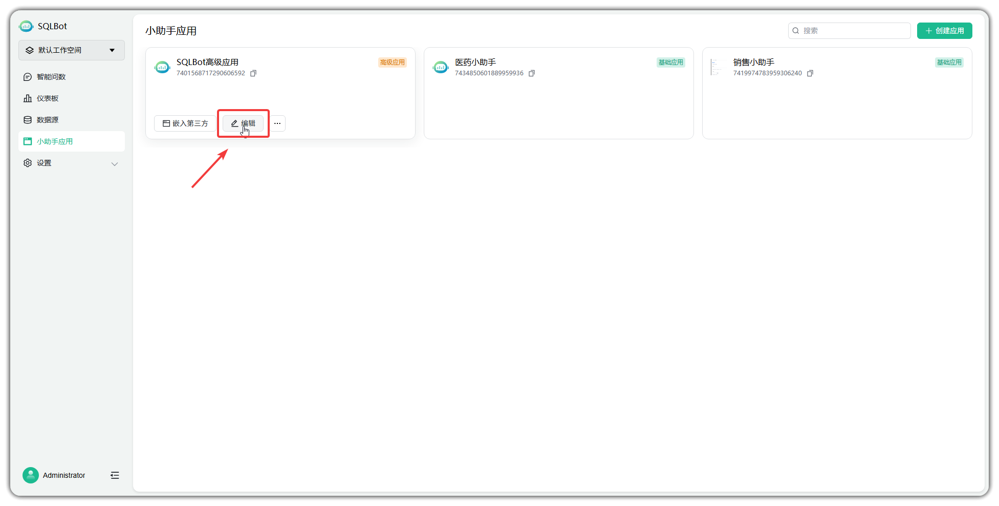

!!! Abstract ""
    点击【显示设置】按钮后，系统将弹出显示设置界面。可以对嵌入小助手界面进行样式更改。

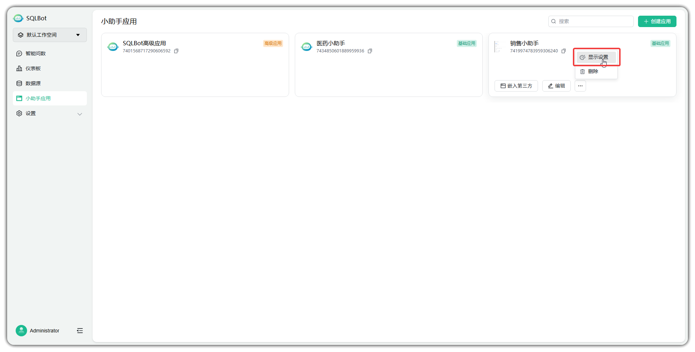
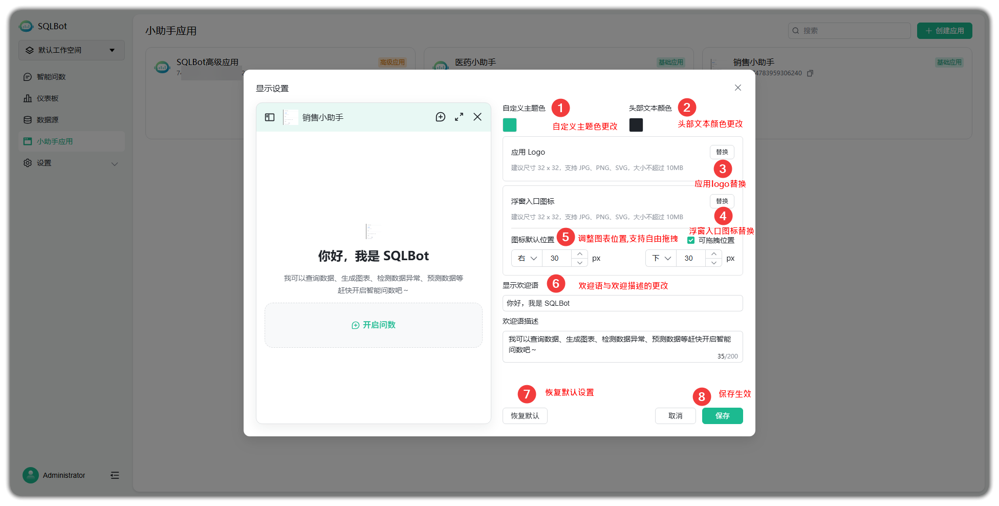

!!! Abstract ""
    点击【删除】按钮后，系统将弹出确认框。确认后，该应用将被彻底移除，嵌入代码失效。

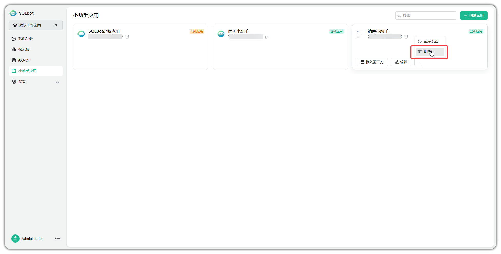
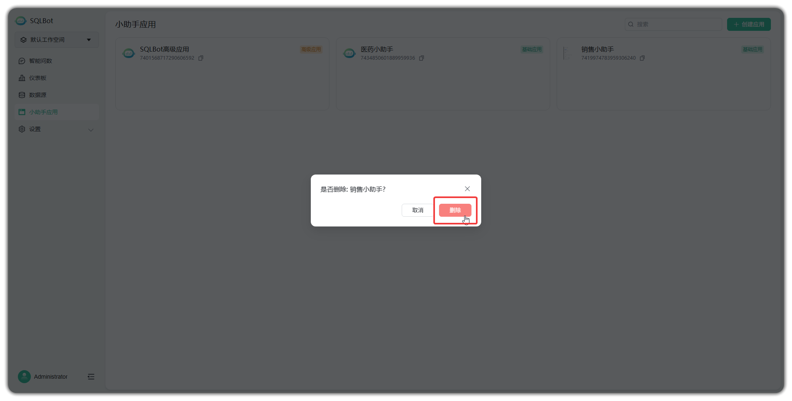

!!! Abstract ""
    在页面右上角的搜索栏中输入应用名称关键词，系统将筛选展示符合条件的应用，支持快速定位和管理。

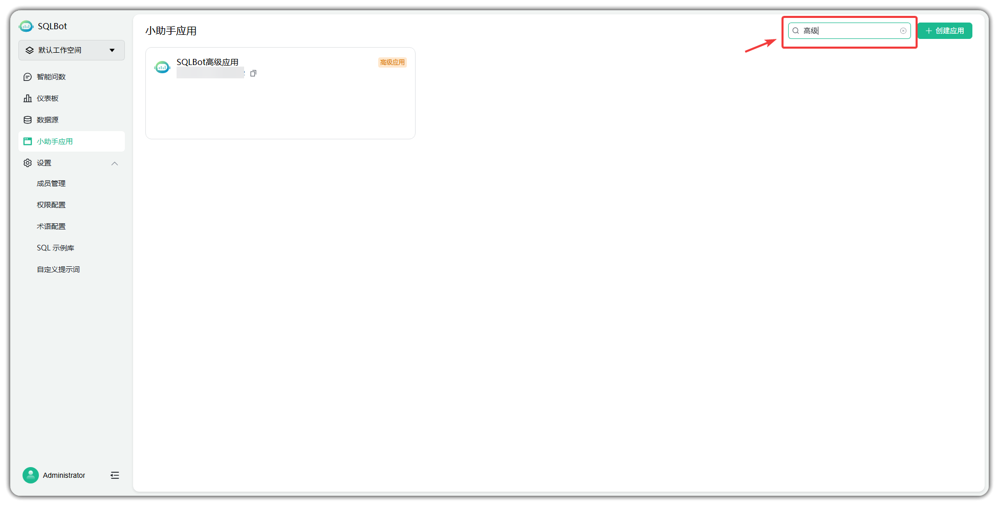

