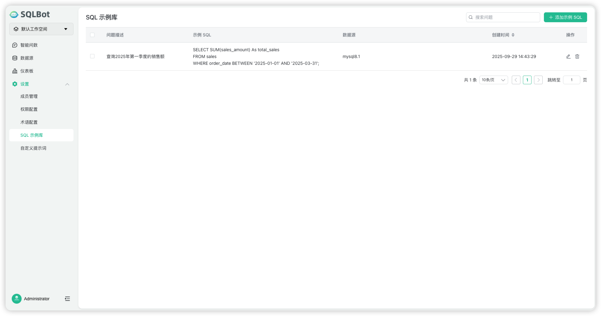
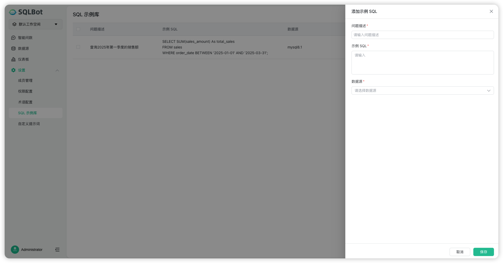

#  SQL示例库

!!! Tip ""
    通过添加问题，以及该问题的 sql 和说明。当用户发起问数请求时，如果问题匹配到该【SQL 示例】，将问题和 【SQL 示例】一起发送给大语言模型，辅助大语言模型生成符合预期的 SQL 语句，从而提升问数的准确度。管理员可在系统中添加、编辑和维护【SQL 示例】，包含以下要素：

    - 问题描述：问题的详细描述，当用户发送问题进行问数时，用于和用户问题进行匹配。

    - 示例 SQL ：可添加 SQL 语句和说明，发送给大语言模型作为重要参考，提升问数结果的准确度。

    - 数据源： 当用户发起问数请求时，只能匹配当前数据源下的 【SQL 示例】。

!!! Tip ""
    进入【SQL 示例库】页面：在系统导航栏点击【设置】>【SQL 示例库】。

!!! Tip ""
    点击【添加示例 SQL】按钮，输入问题描述、【示例 SQL】，并选择数据源，进行新建【SQL 示例】，填写完成后点击【保存】，【SQL 示例】创建成功。

