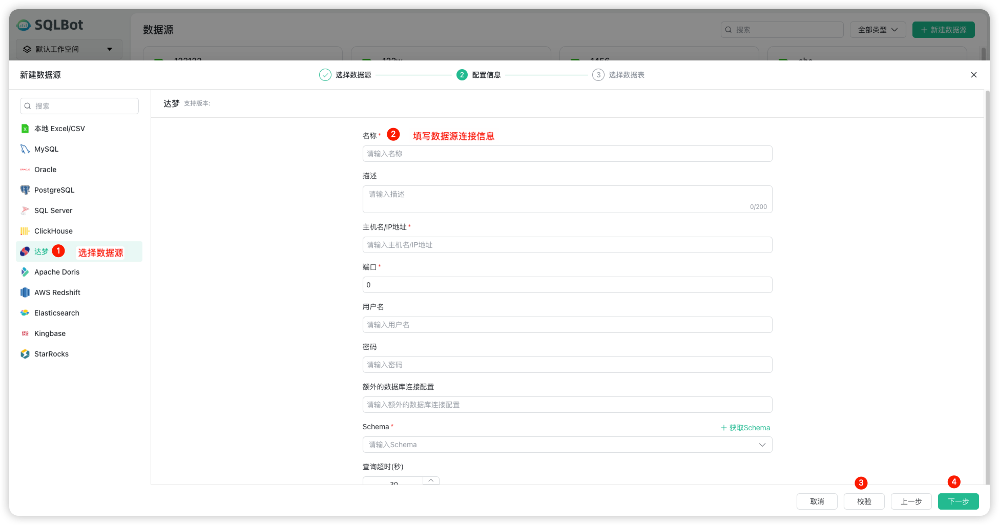
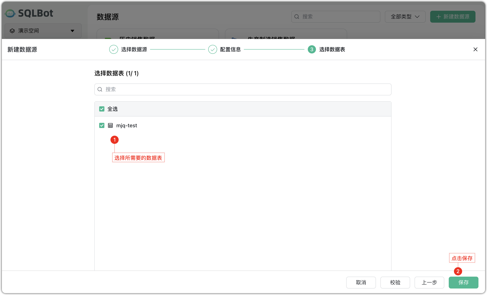
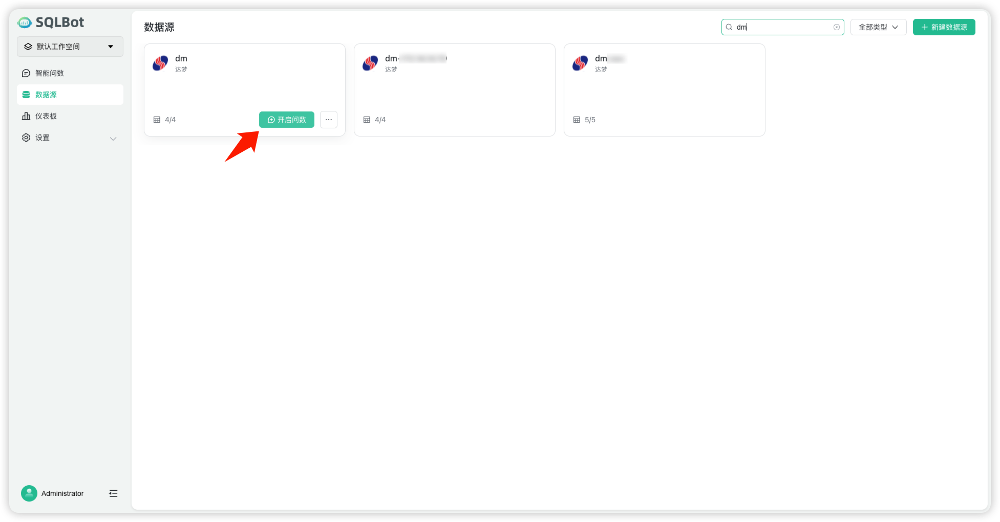

# 配置 SQL Server 数据源
## 1 前提条件
!!! Tip ""
    在配置达梦数据源 之前，请确保以下准备工作已完成，以避免连接失败或数据读取异常：

    - 达梦数据库版本：没有限制；
    - 网络连通：SQLBot 所在环境可直连达梦数据库主机，确保网络通畅、端口开放；
    - 账号权限：提供的用户名需具备查询权限；

## 2 配置数据源链接步骤
!!! Tip ""
    以下是将达梦数据库作为数据源接入的详细流程：

!!! Tip ""
    步骤一：选择数据源类型。在【新建数据源】页面选择 “达梦” 作为数据源类型。

!!! Tip ""
    步骤二：填写连接与认证信息。进入【配置信息】页后，填入收集的 IP 、端口、数据库等相关的信息。数据源检验，校验成功后即可进行下一步。

    **注意：若数据库连接失败，请参考文档：https://dataease.cn/sqlbot/v1/faq/datasource/。**

!!! Tip ""
    步骤三：选择数据表，系统会拉取该库下所有表/视图并以列表形式展示：

    - 搜索：可在顶部搜索框输入关键词快速过滤；
    - 全选/反选：点击表名左侧复选框，支持批量选择；
    
    数据量过大可能会导致操作超时或者无响应，在勾选的数据表数量超过 30 张时，系统会在【保存】前弹出二次确认。

!!! Tip ""
    对创建完成的达梦数据源对可直接开启智能问数。

