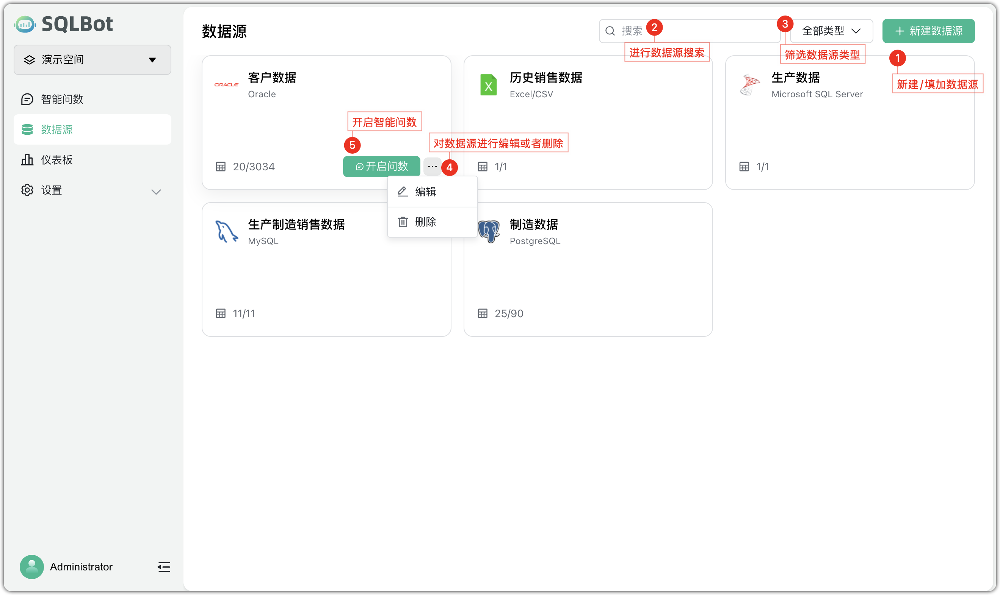
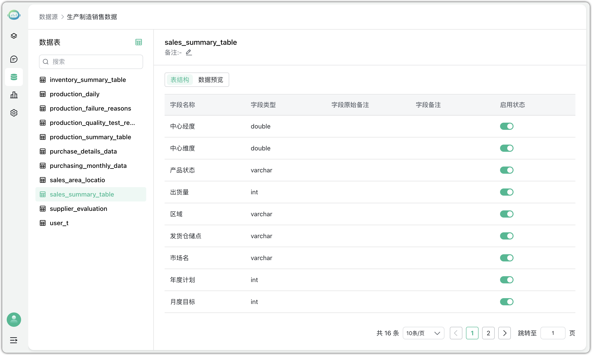
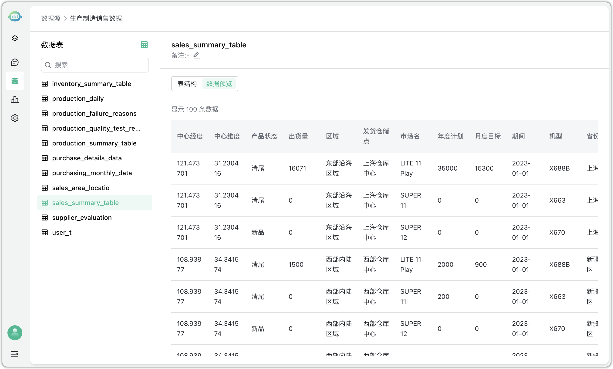

# 数据源概览
## 1 功能概述

!!! Tip ""
    【数据源】用来管理各类数据连接信息，是后续的智能问数和数据分析中数据的来源。
    在数据源管理页面中，提供如下核心功能： 
    
    - 新建/填加数据源：点击右上角绿色按钮可新建数据源，支持多种类型； 
    - 数据源搜索：顶部搜索框支持按名称关键字快速查找数据源；
    - 数据源类型筛选：下拉选择筛选当前展示的数据源类型（如 MySQL、Oracle 等）；
    - 数据源操作：点击数据源卡片右下角，可进行编辑或删除操作；
    - 开启智能问数：对数据源可直接点击按钮启用；
    

## 2 支持的数据源类型

!!! Tip ""
    - **OLTP 型数据库：** MySQL、SQL Server、Oracle、PostgreSQL
    - **数据文件：** Excel/CSV

## 3 数据源预览与字段结构

!!! Tip ""
    点击某个数据源卡片可进入该数据源详情页面。 在左侧展示该数据源下的所有数据表，可查看字段结构，包括字段名称、字段类型、备注信息及启用状态。  
    例如，点击"生产制造销售数据"数据源下的`sales_summary_table` 表，可以查看该表的字段结构：

    - 中心经度、中心纬度（类型：double）
    
    - 产品状态、区域、市场名（类型：varchar）
    
    - 出货量、年度计划、月度目标（类型：int）
    
    字段支持按需启用或禁用，后续智能问数时仅识别已启用字段。

