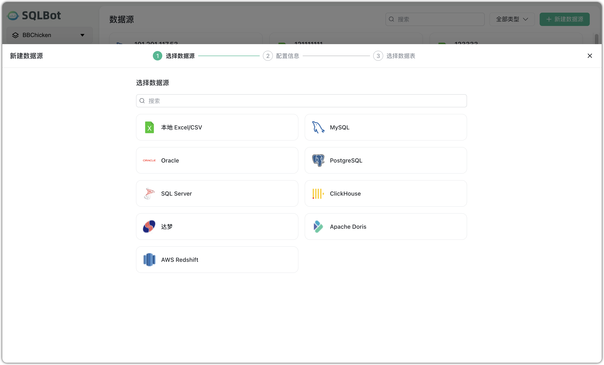
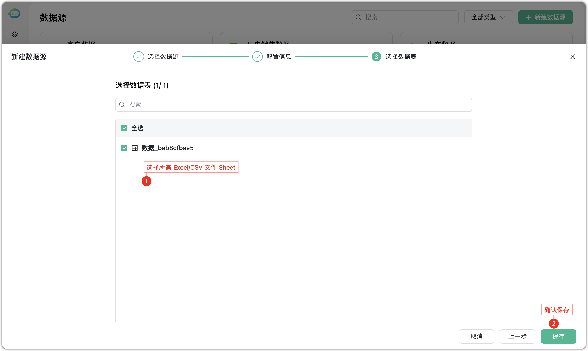
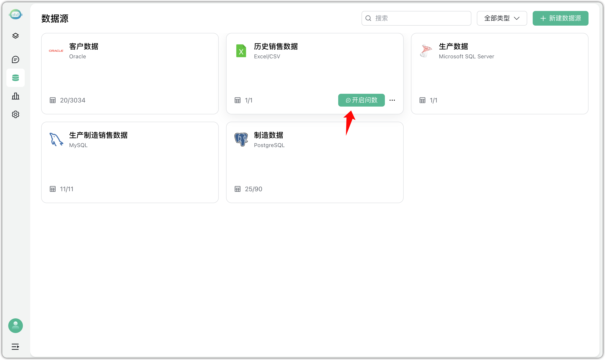

# 配置 Excel/CSV 数据

## 1 前提条件
!!! Tip ""
    在上传 Excel/CSV 数据表之前，请确保以下准备工作已完成，以避免导入失败或数据识别异常：

    - 数据质量检查：确认无空表头、合并单元格、乱码、严重缺失值或格式异常；
    - 格式标准化：
        - 日期字段统一格式（建议使用 `yyyy-mm-dd`）；
        - 百分比转为数值（如"75%"转为"0.75"）；
        - 文件首行为字段名（表头），不能为空；
    - 文件大小限制：单个 Excel/CSV 文件建议不超过 100MB。

## 2 配置数据源链接步骤
!!! Tip ""
    以下是将本地 Excel/CSV 文件作为数据源导入的详细流程：

!!! Tip ""
    步骤一：选择数据源类型。在【新建数据源】页面选择 "本地 Excel/CSV" 作为数据源类型。

!!! Tip ""
    步骤二：上传文件并填写配置信息。进入【配置信息】页后，完成以下操作：

    - 上传文件：点击上传区域，选择本地 `.xlsx` 或 `.csv` 文件；
    - 输入数据源名称（必填）：该名称将用于数据源管理页面中显示；
    - 可选填写描述信息：用于补充说明数据内容、来源或用途。

    文件上传成功后，将显示文件名与大小信息，可点击“重新上传”更换文件。

!!! Tip ""
    步骤三：配置完文件与基本信息后，进入【选择数据表】步骤。

    若上传文件中包含多个工作表，下一步将展示可选的工作表列表供选择；若为 CSV 文件，则自动进入字段预览页。

!!! Tip ""
    对创建完成的 Excel/CSV 数据源对可直接开启智能问数。

