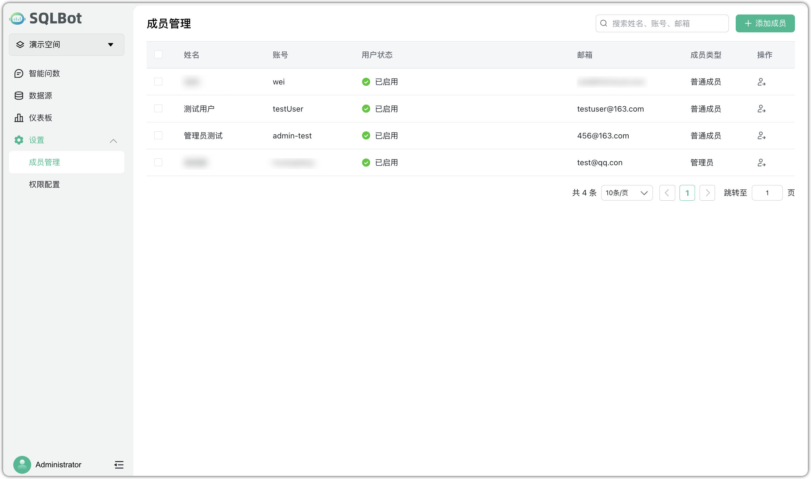
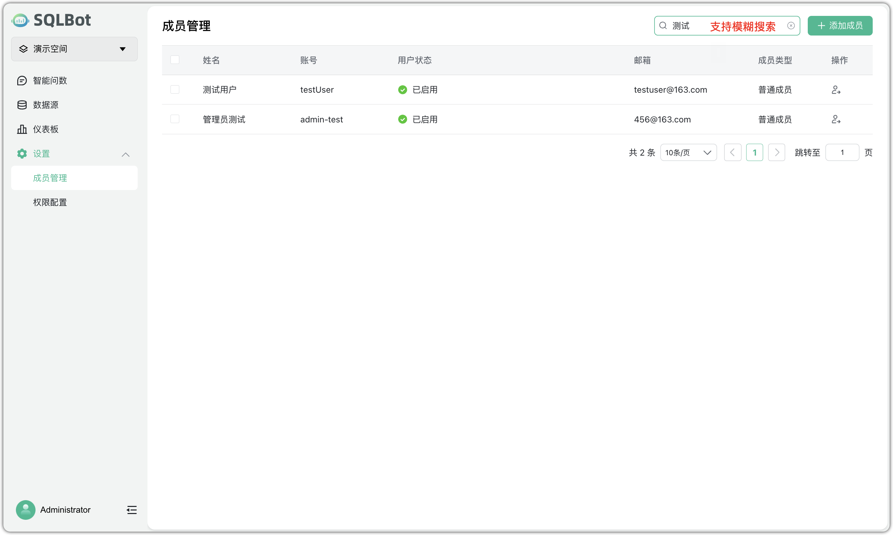
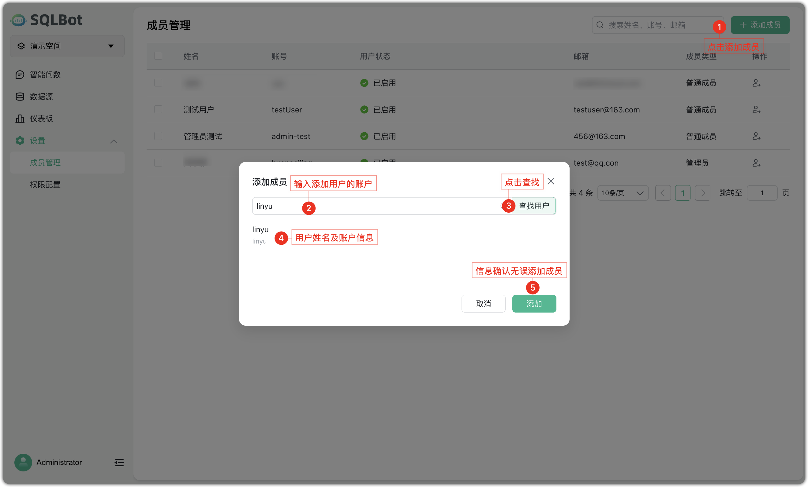
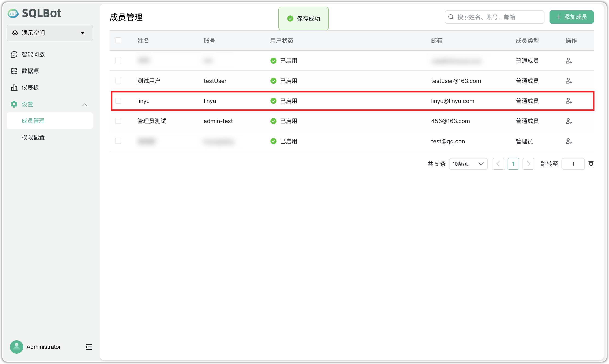
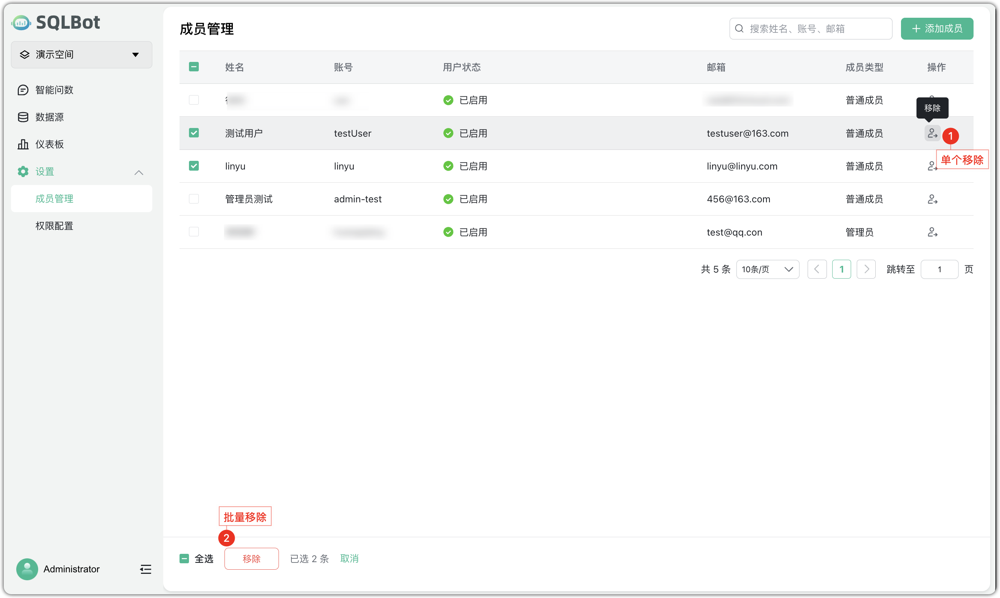
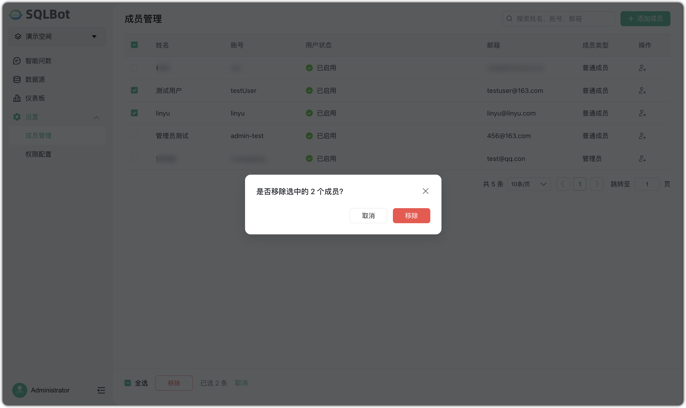

#  成员管理

!!! Tip ""
    用于管理当前工作空间下的使用成员，包括添加、移除、搜索、批量操作等。

    每个用户可加入多个工作空间，但每个成员在不同空间下的访问权限是独立管理的。

## 1 成员概览
!!! Tip ""
    【成员管理】页面中，展示了当前工作空间下的所有成员列表，包含：

    - 成员姓名
    - 账号信息
    - 用户状态
    - 邮箱信息
    - 角色（管理员 / 普通成员）

!!! Tip ""
    在顶部搜索框中输入关键词，支持按以下字段模糊搜索成员：

    - 姓名
    - 用户名
    - 邮箱

    支持拼音首字母、模糊匹配、大小写不敏感搜索。

## 2 添加成员
!!! Tip ""
    工作管理员/管理员可执行成员添加操作。

    操作步骤：

    - 点击页面右上角【添加成员】；
    - 输入用户账号（邮箱/用户名）；
    - 点击【查找用户】，系统自动匹配结果；
    - 点击【添加】将其加入当前工作空间。

    添加成功后，用户即可访问当前工作空间资源（如智能问数、数据源、仪表板）。

## 3 移除成员

!!! Tip ""
    工作管理员/管理员可移除不再需要访问权限的成员，管理员不可移除其他管理员。

    - 单个移除：点击成员行右侧的【移除】按钮；
    - 批量移除：勾选多个成员后点击【批量移除】。

    成员被移除后，立即失去该工作空间的访问权限。该成员账号仍存在，不影响其在其他工作空间的使用。

