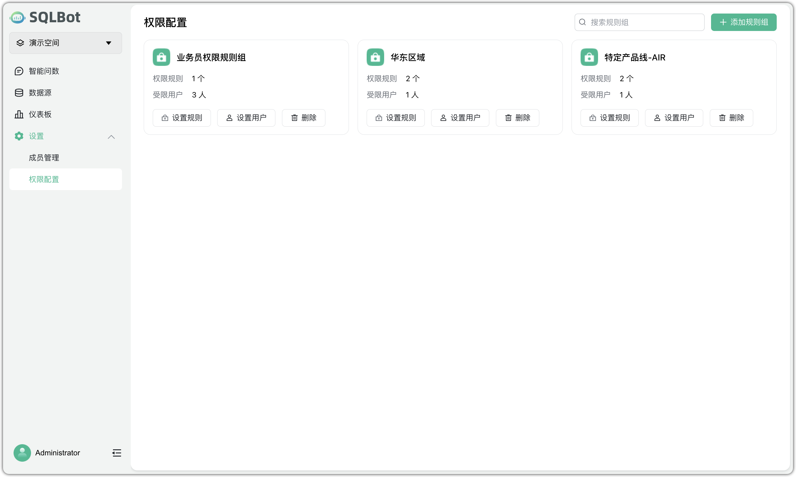
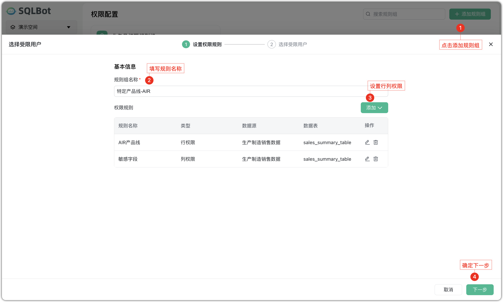
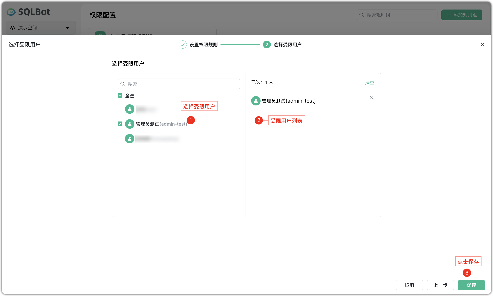
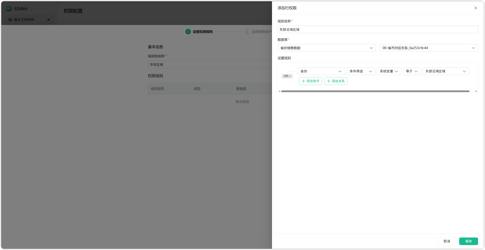
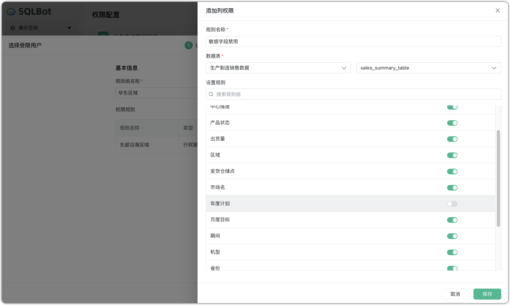
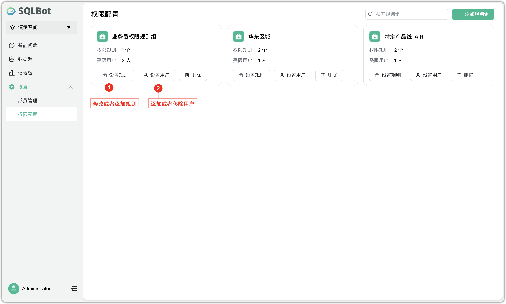
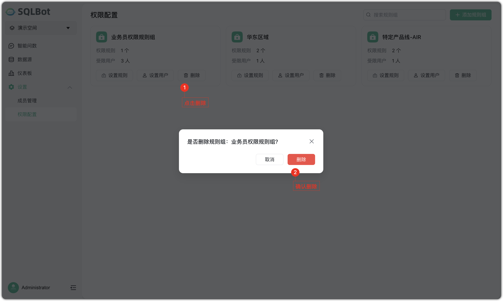

#  权限配置

!!! Tip ""
    权限配置用于对工作空间内数据源的数据访问权限进行精细化管理。通过设置行权限与列权限，可实现不同成员间的数据隔离，保障数据安全，防止越权访问。

    权限说明：

    - 权限控制以【规则组】为单位；
    - 每个规则组可包含多个权限规则（行/列规则）；
    - 每个规则组可绑定一个或多个用户（即受限用户）；
    - 权限规则仅作用于当前工作空间中的数据源。

## 1 创建规则组
!!! Tip ""
    创建规则组后，可针对不同成员配置差异化的数据访问权限。进入【权限配置】页面，点击右上角【添加规则组】。操作步骤：

    - 输入规则组名称；
    - 添加权限规则（支持行权限与列权限）；
    - 选择需要限制的成员（可多选）；
    - 点击【保存】，完成规则组创建。

!!! Tip ""
    在添加权限规则时，系统支持以下两种类型：

    - 行权限：限制成员只能查看特定条件下的数据行（如仅查看所属区域、部门的数据）；
    - 列权限：限制成员只能查看部分字段，隐藏敏感信息（如联系方式、工资等）。

      设置步骤如下：

    - 选择规则类型（行权限或列权限）；
    - 指定适用的数据源及数据表；
    - 配置筛选条件（如：`系统变量 = '东部沿海区域'`）；
    - 保存规则。

    每个规则组下可添加多条权限规则，以满足更复杂的权限控制需求。

## 2 编辑权限组
!!! Tip ""
    规则组创建后，可对其内容进行修改，调整适用规则或成员。

    支持的操作：

    - 设置规则：新增、修改或删除行/列权限；
    - 设置用户：添加或移除受限用户；

## 3 删除规则组
!!! Tip ""
    如某规则组已废弃，点击规则组的【删除】 。弹窗中点击确认，即可移除该规则组。

    **注意：删除规则组后，该组中所有权限规则将立即失效，绑定成员将恢复对相关数据的完整访问权限。**

