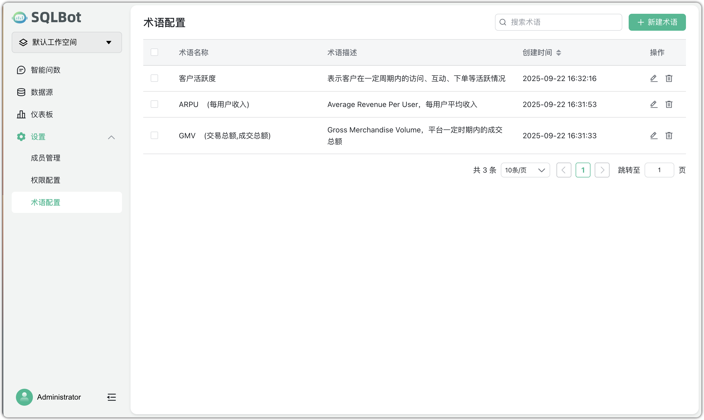
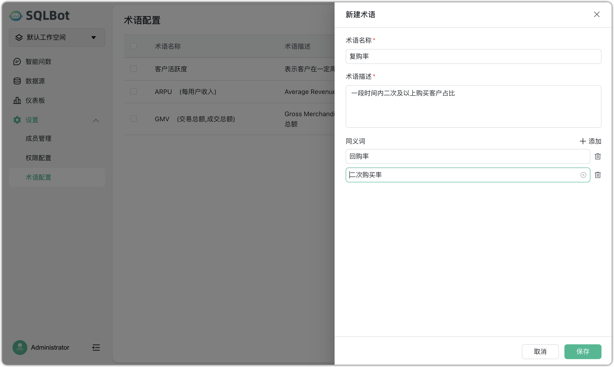

#  术语配置

!!! Tip ""
    术语配置用于统一管理业务领域内的专有名词或高频用语，提升 SQLBot 智能问数的准确性与可理解度。管理员可在系统中添加、编辑和维护术语，包含以下要素：

    - 术语名称：核心词条，代表业务或数据领域的标准用语。

    - 术语描述：对术语的详细解释或业务背景说明，帮助大语言模型理解其含义和上下文。

    - 同义词：可添加多个同义词或常用别称，便于用户用不同的表达方式提问时仍能准确匹配到同一概念。

!!! Tip ""
    进入术语配置页面：在系统导航栏点击【设置】>【术语配置】。

    点击【新增术语】按钮，输入术语名称、描述和同义词进行新建术语。填写完成后点击【保存】。系统会自动更新语义匹配规则，新的术语即时生效。

